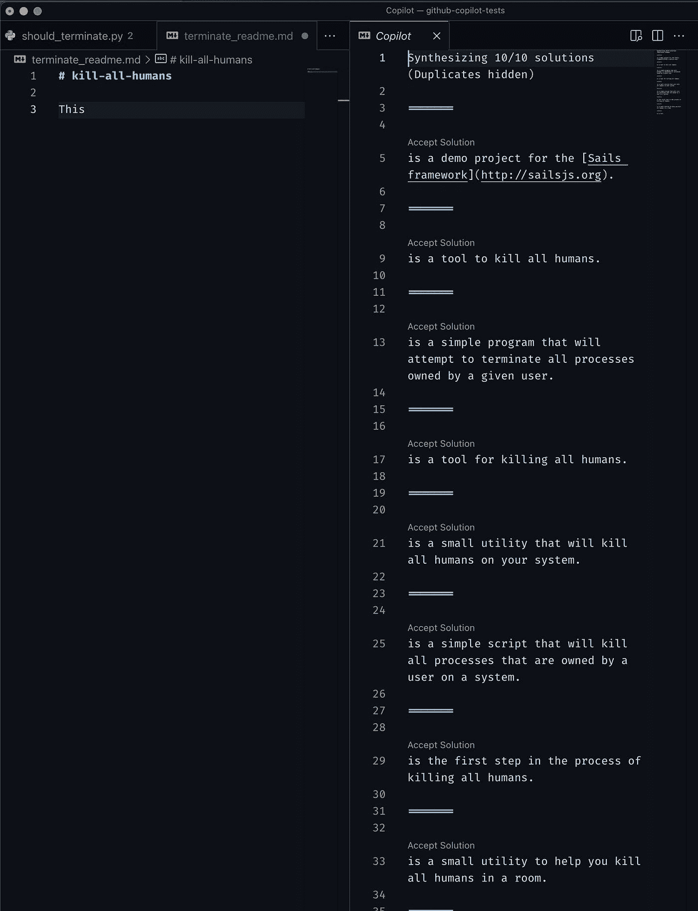
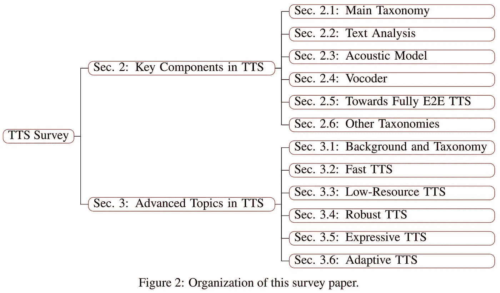
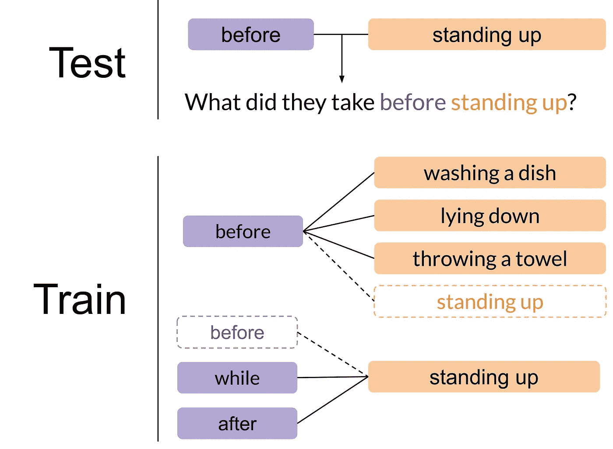

# NLP 密码| 07.04.21

> 原文：<https://medium.com/geekculture/the-nlp-cypher-07-04-21-f1d45e3d5df1?source=collection_archive---------24----------------------->

Stellaris Art

## 自然语言处理每周时事通讯

## 老鹰敢去的地方🦅

嘿欢迎回来！我想祝所有美国人 7 月 4 日快乐🎆🎇！此外，我想快速提一下，NLP 指数的规模已经翻了一番(自成立以来)，现在拥有超过 6，000 个回购，非常酷！！！😎和往常一样，它每周都会更新。但首先，本周我们问了 100 名 NLP 开发者:说出微软为 GitHub 支付 75 亿美元，为 OpenAI 支付 10 亿美元得到的一件事？调查显示:

7.5B + 1B = GitHub 副驾驶👍

如果你想听 GitHub 对他们的新代码生成助手的看法，请点击这里:

 [## 研究朗诵

### 作者:Albert Ziegler (@wunderalbert)首先看看 GitHub Copilot 建议中的死记硬背。GitHub Copilot 是…

docs.github.com](https://docs.github.com/en/github/copilot/research-recitation) 

还有…原来副驾驶是个连环杀手👀，但至少代码是可读的。💪

from [@minimaxir](http://twitter.com/minimaxir)

# 微软的好东西中心

嘿，你知道微软在他们的仓库里藏了一堆模型吗？包括 NLU、文档理解、跨语言等等。如果您对这些模型感兴趣，请访问本页:

> [*UniLM*](https://github.com/microsoft/unilm/tree/master/unilm)*(*`*v1@NeurIPS'19 | v2@ICML'20 | v3@ACL'21*`*):语言理解和生成的统一预训练*
> 
> [*InfoXLM*](https://github.com/microsoft/unilm/tree/master/infoxlm)*(*`*v1@NAACL'21 | v2@ACL'21*`*):语言理解和生成的多语种/跨语种预训练模型*
> 
> [*DeltaLM*](https://github.com/microsoft/unilm/tree/master/deltalm)*(*`*NEW*`*):通过扩充预训练的多语言编码器，为语言生成和翻译进行编码器-解码器预训练*
> 
> [*MiniLM*](https://github.com/microsoft/unilm/tree/master/minilm)*(*`*v1@NeurIPS'20 | v2@ACL'21*`*):用于语言理解和生成的小型快速预训练模型*
> 
> [*AdaLM*](https://github.com/microsoft/unilm/tree/master/adalm)*(*`*v1@ACL'21*`*):预训练模型的领域、语言、任务适配*
> 
> [*layout lm*](https://github.com/microsoft/unilm/tree/master/layoutlm)*(*`*v1@KDD'20 | v2@ACL'21*`*):多模态(文本+布局/格式+图像)文档理解预训练(如扫描文档、PDF 等。)*
> 
> [*layout xlm*](https://github.com/microsoft/unilm/tree/master/layoutxlm)*(*`*NEW*`*):多模态(文本+布局/格式+图像)多语言文档理解预训练*
> 
> [*拜特*](https://github.com/microsoft/unilm/tree/master/beit) *(* `*NEW*` *):影像变形金刚的伯特预训*
> 
> [*s2s-ft*](https://github.com/microsoft/unilm/tree/master/s2s-ft) *:序列间微调工具包*
> 
> [*XLM-T*](https://github.com/microsoft/unilm/tree/master/xlmt)*(*`*NEW*`*):多语言 NMT，带预训练跨语言编码器*

 [## 微软/unilm

### 跨任务(理解、生成和翻译)、语言和模态的预训练模型

github.com](https://github.com/microsoft/unilm) 

# 使用冻结语言模型的多模态少镜头学习

DeepMind 采用了 GPT 3 等模型的少量学习能力，并应用于多模态领域。

[LINK](https://arxiv.org/pdf/2106.13884.pdf)

# 拥抱脸课程笔记摘要

HF 的自由变压器 NLP 课程概述；

*   [第 0 章(设置):](https://muellerzr.github.io/fastblog/huggingface/2021/06/14/HuggingFaceLesson1.html#Chapter-0-(Setup):)
*   [第一章](https://muellerzr.github.io/fastblog/huggingface/2021/06/14/HuggingFaceLesson1.html#Chapter-1)
*   [简介](https://muellerzr.github.io/fastblog/huggingface/2021/06/14/HuggingFaceLesson1.html#Introduction)
*   [自然语言处理](https://muellerzr.github.io/fastblog/huggingface/2021/06/14/HuggingFaceLesson1.html#Natural-Language-Processing)
*   [变形金刚，他们能做什么？](https://muellerzr.github.io/fastblog/huggingface/2021/06/14/HuggingFaceLesson1.html#Transformers,-what-can-they-do?)
*   [使用管道，使用 Sylvain](https://muellerzr.github.io/fastblog/huggingface/2021/06/14/HuggingFaceLesson1.html#Working-with-Pipelines,-with-Sylvain)
*   [零射击分类](https://muellerzr.github.io/fastblog/huggingface/2021/06/14/HuggingFaceLesson1.html#Zero-Shot-Classification)
*   [文本生成](https://muellerzr.github.io/fastblog/huggingface/2021/06/14/HuggingFaceLesson1.html#Text-Generation)
*   [使用来自管道中枢的任何模型](https://muellerzr.github.io/fastblog/huggingface/2021/06/14/HuggingFaceLesson1.html#Use-any-model-from-the-Hub-in-a-pipeline)
*   [面具填充](https://muellerzr.github.io/fastblog/huggingface/2021/06/14/HuggingFaceLesson1.html#Mask-Filling)
*   [命名实体识别(NER)](https://muellerzr.github.io/fastblog/huggingface/2021/06/14/HuggingFaceLesson1.html#Named-Entity-Recognition-(NER))
*   [问答(QA)](https://muellerzr.github.io/fastblog/huggingface/2021/06/14/HuggingFaceLesson1.html#Question-Answering-(QA))
*   [总结](https://muellerzr.github.io/fastblog/huggingface/2021/06/14/HuggingFaceLesson1.html#Summarization)
*   [翻译](https://muellerzr.github.io/fastblog/huggingface/2021/06/14/HuggingFaceLesson1.html#Translation)

 [## 拥抱脸课程笔记，第 1 章(和零)，第 1 部分

### 由于高频本身没有依赖性的要求，他们建议我们安装变压器[开发]所以它得到所有的…

muellerzr.github.io](https://muellerzr.github.io/fastblog/huggingface/2021/06/14/HuggingFaceLesson1.html) 

# 变形金刚游戏攻略

Paperspace 对视觉变形器内部工作原理的概述。

 [## 视觉变形金刚解说| Paperspace 博客

### 介绍了在该文件中，一个图像是值得 16x16 字:变压器的图像识别在规模，视觉…

blog.paperspace.com](https://blog.paperspace.com/vision-transformers/) 

# 用 LM-BFF 提示

在阅读了上面的 DeepMind 论文后，下面的文章很好地吻合了提示(谢谢 GPT-3)。博客由[天宇高](https://thegradient.pub/author/tianyu/)撰写，其论文曾在 ACL 2021 上发表:

**论文【https://arxiv.org/pdf/2012.15723.pdf】:[论文](https://arxiv.org/pdf/2012.15723.pdf)**

论文讨论了一种新的用于小型模型的提示技术 LM-BFF。

**渐变博客**

 [## 提示:为 NLP 任务使用语言模型的更好方法

### 从 BERT ( Devlin 等人，2019 年)开始，微调预训练语言模型(LMs ),以特定任务为导向…

thegradient.pub](https://thegradient.pub/prompting/) 

**代码**

 [## 普林斯顿-nlp/LM-BFF

### 这是论文的实现，使预先训练的语言模型更好的少镜头学习者。LM-BFF 简称…

github.com](https://github.com/princeton-nlp/LM-BFF) 

# 70 多个 Python 项目

一个 Python 项目教程的集合，范围从 web 报废、构建区块链、人脸检测、构建自己的密码等等…

 [## 70 多个 Python 项目，面向初学者、中级和有经验的开发人员

### 👉使用 Python 的比特币价格通知本项目摘要:在本项目中，您将了解 HTTP 请求…

www.theinsaneapp.com](https://www.theinsaneapp.com/2021/06/list-of-python-projects-with-source-code-and-tutorials.html) 

# 回购密码👨‍💻

## 一组最近发布的回购引起了我们的关注👁

## [Charformer](https://arxiv.org/pdf/2106.12672.pdf)

> 一种无标记转换器模型，在字节级集成了基于梯度的子词标记化(GBST)。在 GLUE 基准测试中，它的表现与亚世界级别的变形金刚不相上下(有时甚至击败它们)，尽管速度要快得多。

 [## 谷歌研究/谷歌研究

### 这个库包含 Charformer:快速字符转换器的网格张量流实现。

github.com](https://github.com/google-research/google-research/tree/master/charformer) 

[**连接论文**](https://www.connectedpapers.com/main/55bcfdd926f065be5c7066902280be4c080234af/Charformer-Fast-Character-Transformers-via-Gradientbased-Subword-Tokenization/graph) 📈

## [多栏](https://arxiv.org/pdf/2106.16163.pdf)

> 具体而言，该版本包括三个部分:

*   *一组 25 个基于 BERT 的模型(英文，无大小写)，使用相同的超参数但不同的随机种子进行训练。*
*   *对于前五个模型，在预训练过程中捕获了 28 个检查点(总共 140 个检查点)。*
*   *一个统计库和一个演示其使用的 Colab 笔记本。*

 [## 谷歌-研究/语言

### MultiBERTs 是一个检查点集合和一个统计库，用于支持对 BERT 的稳健研究。特别是…

github.com](https://github.com/google-research/language/tree/master/language/multiberts) 

[**连接论文**](https://www.connectedpapers.com/main/646fc03a20a6a00304d9768621a8b864aa769f21) **📈**

## [文本到语音转换调查](https://arxiv.org/pdf/2106.15561.pdf)

 [## TTS-教程/调查

### 许坦、陶秦、宋楚瑜、刘铁燕

github.com](https://github.com/tts-tutorial/survey) 

[**连接论文**](https://www.connectedpapers.com/main/35b69cdfde432872e06a22b0548a408ca66a7083) **📈**

## [XL-Sum:44 种语言的大规模多语言抽象摘要](https://arxiv.org/pdf/2106.13822.pdf)

 [## csebuetnlp/xl-sum

### 这个存储库包含题为“XL-Sum:大规模多语言抽象…”的论文的代码、数据和模型

github.com](https://github.com/csebuetnlp/xl-sum) 

[**连接论文**](https://www.connectedpapers.com/main/ecf5618b513aa5c4d5bf62ca251923a188251117) 📈

## [科学文献检索的关键词生成](https://arxiv.org/pdf/2106.14726.pdf)

 [## boud infl/IR-使用-kg

### 这个库包含了从论文中复制实验的代码:科学的关键短语生成…

github.com](https://github.com/boudinfl/ir-using-kg) 

[**连接论文**](https://www.connectedpapers.com/main/0077fd6a31cf638a316d35d50cb5e7d26c63dfc6) **📈**

## 本周数据集:

行动基因组问答(AGQA)

## 这是什么？

组合时空推理的基准。AGQA
包含 9.6K
视频的 192M 不平衡问答对。平均每个视频 30 秒。很长。

## 样品

## 它在哪里？

**论文**:[https://arxiv.org/pdf/2103.16002.pdf](https://arxiv.org/pdf/2103.16002.pdf)

 [## AGQA:组合时空推理的基准

### 视觉事件是时间动作的组合，包括演员与物体的空间互动。当…

cs.stanford.edu](https://cs.stanford.edu/people/ranjaykrishna/agqa/) 

> 每周日，我们都会对来自世界各地研究人员的 NLP 新闻和代码进行一次每周综述。
> 
> 如需完整报道，请关注我们的推特: [@Quantum_Stat](http://twitter.com/Quantum_Stat)

[Quantum Stat](https://quantumstat.com/)