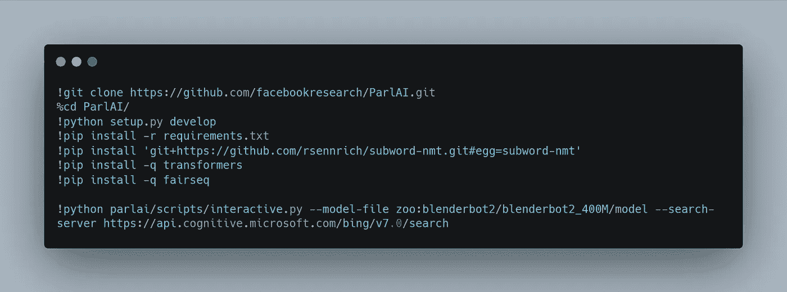
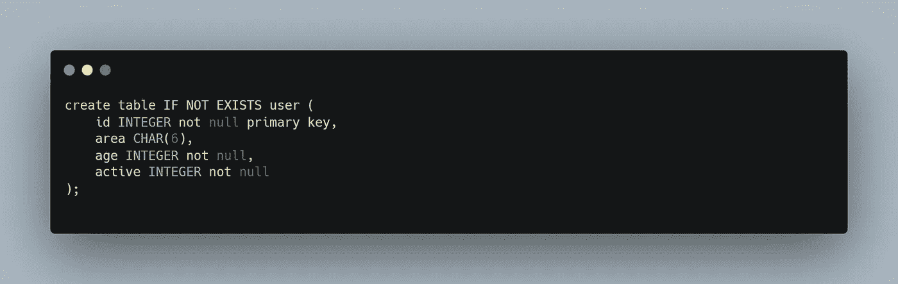
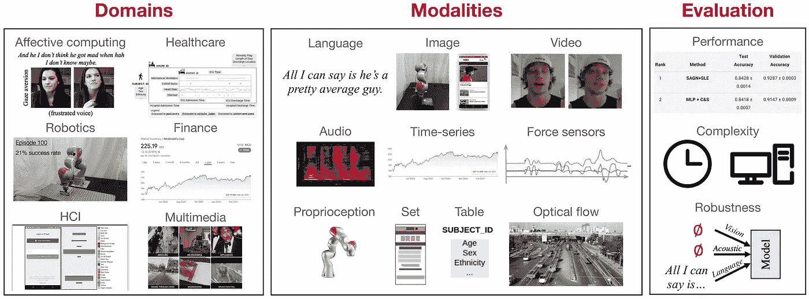

# NLP 密码| 07.18.21

> 原文：<https://medium.com/geekculture/the-nlp-cypher-07-18-21-1eb98f963812?source=collection_archive---------11----------------------->

Dali

## 自然语言处理每周时事通讯

## 塔西陀

有时候……很酷的事情会发生。本周五，脸书人工智能公司发布了一款新的聊天机器人，具有显著的特点。这款名为 [BlenderBot 2.0](https://parl.ai/projects/blenderbot2/) 的聊天机器人是他们去年推出的[机器人](https://ai.facebook.com/blog/state-of-the-art-open-source-chatbot/)的改进版。该机器人具有更好的长期记忆，可以在交谈中搜索互联网信息！与传统的机器人相比，这是一个方便的改进，因为信息不是静态的“记忆”，而是可以选择动态的，并通过互联网“保持更新”。🤯

我最近测试了这个型号，并试用了较小的 400M 型号。目前，存在两种变体:

*   BlenderBot 2.0 400m 米:`--model-file zoo:blenderbot2/blenderbot2_400M/model`
*   BlenderBot 2.0 2.7B: `--model-file zoo:blenderbot2/blenderbot2_3B/model`

ParlAI 的入门非常简单。对于这个模型，您需要指定两个参数:模型文件和搜索服务器(用于互联网查询)。仅供参考，搜索服务器的论点我还没有弄清楚。我尝试了不同的方法，比如指定一个普通的搜索 URL，比如“[**”https://www.google.com/search?**q =](https://www.google.com/search?q=.)”，甚至是一个 API URL 端点(如下面 Bing API 所示)，但是这两种方法都没有成功。ParlAI 文档没有给出一个示例 URL，所以现在我还在调试这个问题。然而，你仍然可以下载并与机器人互动，只是它不会利用互联网进行查询，而是使用它的内存。然而，至少当互联网服务器问题得到解决时，我们处于启动和运行模型的首要位置。

为了测试 400M 变体，您将需要至少 20–25GB 的 RAM 来容纳该模型的内存，并在推理时需要至少 6GB 的 VRAM 来容纳 GPU。(我的测试使用的是 V100 🥶).您将需要云中的一个虚拟机实例来让它运行，因为如果您选择使用 Colab，您很可能会遇到问题。(这一点在 ParlAI 的 GitHub issues 线程中也得到了证实)。

到目前为止，大多数机器人都很无聊，但我认为这个新的互联网搜索功能会让它们对用户更有用。在不久的将来，使用一个在互联网上查询信息的人工智能模型很可能是开放式对话的最具扩展性的解决方案。

## …谈论搜索…

有人建立了一个 StackOverflow 搜索引擎😁

[https://searchoverflow.com](https://searchoverflow.com/)

# 副驾驶互动视频

仍然有兴趣看到 GitHub Copilot 获得实时锻炼吗？观看此视频:

# HTLM 语言模型—结构是你所需要的

关于使用 HTLM 标记作为生成任务的输入提示的新论文。作者表明，通过类似 BART 的目标直接对 HTML 建模，他们可以通过在 HTML 中表示任务(如摘要)来进行结构化的零镜头提示。

[LINK](https://arxiv.org/pdf/2107.06955.pdf)

# 多语言语言模型调查

如果您使用多语言甚至低资源语言，这篇文章是必读的。调查讨论了这些类型的模型的体系结构，跨语言的传输属性，多语言与单语模型的性能和更多…

[LINK](https://arxiv.org/pdf/2107.00676.pdf)

# 基于语言模型和知识图的问答推理

当 LMs 和 kg 聚在一起回答问题时会发生什么:

 [## 基于语言模型和知识图的问答推理

### 从搜索引擎到个人助理，我们每天都使用问答系统

ai.stanford.edu](http://ai.stanford.edu/blog/qagnn/) 

# 十亿行和 SQLite

一个人试图在一分钟内(准确地说是 33 秒)在 SQLite 中插入 10 亿行。

这是使用的模式:

有了铁锈，一切皆有可能:

 [## avinassh/fast-sqlite3-inserts

### 一些测试脚本以最快的方式生成一个包含 1B 行的 SQLite 数据库

github.com](https://github.com/avinassh/fast-sqlite3-inserts/blob/bd8414f/src/bin/threaded_batched.rs) 

**博客**

 [## 一分钟内在 SQLite 中插入 10 亿行— blag

### 当前最佳:33 秒内插入 100M 行。(可以在 Github 上查看源代码)最近碰到一个…

avi.im](https://avi.im/blag/2021/fast-sqlite-inserts/) 

# FAISS 教程，带代码

对于对可扩展搜索感兴趣的人:

 [## Faiss 入门

### 脸书人工智能相似性搜索(FAISS)是最流行的高效相似性搜索实现之一，但…

www.pinecone.io](https://www.pinecone.io/learn/faiss-tutorial/) 

# 彭博和 Spotify 在 SIGIR 2021 上的绝技

对于信息提取 peeps:

**彭博**:

[https://www . techatbloomberg . com/blog/Bloomberg s-ai-researchers-engineers-publish-3-papers-at-sigir-2021](https://www.techatbloomberg.com/blog/bloombergs-ai-researchers-engineers-publish-3-papers-at-sigir-2021/)

Spotify :

 [## Spotify 对 SIGIR 2021 的贡献

### 第 44 届国际 ACM SIGIR 信息检索研发大会(SIGIR 2021)开幕…

research.atspotify.com](https://research.atspotify.com/spotifys-contributions-to-sigir-2021/) 

# 回购密码👨‍💻

## 一组最近发布的回购引起了我们的注意👁

## [FLEX:统一评估少数镜头 NLP](https://arxiv.org/pdf/2107.07170.pdf)

> 少量学习的新基准。

 [## allenai/uniview

### UniFew:统一的少数镜头学习模型这个代码的主要依赖是封装在 flex…

github.com](https://github.com/allenai/unifew) 

[**连接论文**](https://www.connectedpapers.com/main/0606d51ce63aefa0a7b9ff725dd88fb2ad769890) **📈**

## [FewCLUE:一个中国的少数镜头学习评价基准](https://arxiv.org/pdf/2107.07498.pdf)

> 中国少数人学习的标杆(土拨鼠日*😁*)。包括九个任务，从单句和句子对分类任务到机器阅读理解任务。

 [## 线索基准/少数线索

### 中文小样本学习测评基准 FewCLUE: A Chinese Few-shot Learning Evaluation Benchmark | 贡献与参与 | 如何参与项目或反馈问题|…

github.com](https://github.com/CLUEbenchmark/FewCLUE) 

[**连接论文**](https://www.connectedpapers.com/main/9dfed55bdd7b9ddd7305bf6f64267258ec759c90) **📈**

## [西班牙语车型💃🏻](https://arxiv.org/pdf/2107.07253.pdf)

> 包含西班牙语的 RoBERTa base 和大型变体。

 [## PlanTL-SANIDAD/lm-西班牙语

### 西班牙语模型和资源的官方来源@ BSC-穆特

github.com](https://github.com/PlanTL-SANIDAD/lm-spanish) 

[**连接论文**](https://www.connectedpapers.com/main/fe13c40f22f0034fe16134240827e69bfec3b02d) **📈**

## [多基准:多模态表示学习的多尺度基准](https://arxiv.org/pdf/2107.07502.pdf)

> 涵盖 15 个数据集、10 个模态、20 个预测任务和 6 个研究领域的多模态学习基准。

 [## pliang 279/多基准

### 多基准网站通信:学习多模态表示包括整合来自…

github.com](https://github.com/pliang279/MultiBench) 

[**连接论文**](https://www.connectedpapers.com/main/431edba123f3ae5e2fa8d59f6896cb36520a82bc) **📈**

## [生物贝尔](https://arxiv.org/pdf/2107.04374.pdf)

> BioALBERT 检查点在生物医学(PubMed
> 和 PubMed Central)和临床(MIMIC-III)语料库上接受培训，并针对 6 种不同的任务进行微调:

1.  [*bio ALBERT-Base v 1.0(PubMed)*](https://drive.google.com/file/d/1sCU1vvSOWoWVAkOoWGUC3ZKraItLIoXD/view?usp=sharing)*—基于 ALBERT-Base 模型*
2.  [*BioALBERT-Base v1.0(考研+ PMC)*](https://drive.google.com/file/d/1N2UekXKNqhbjQLbtipsm8rNPcaFEG-2I/view?usp=sharing) *—基于 ALBERT-Base 模型*
3.  [*bio ALBERT-Base v 1.0(PubMed+MIMIC-III)*](https://drive.google.com/file/d/1t9XUVMxEfRzVYU0M99NB9PIPSZWAFX4V/view?usp=sharing)*—基于 ALBERT-Base 模型*
4.  [*bio ALBERT-Base v 1.0(PubMed+PMC+MIMIC-III)*](https://drive.google.com/file/d/1SIBd_-GETHhMiZ7BgMdDPEUDjOjtN_bH/view?usp=sharing)*—基于 ALBERT-Base 模型*
5.  [*bio ALBERT-Large v 1.1(PubMed)*](https://drive.google.com/file/d/1uX5w8yaMyJta3Nit_3ayrL16tE-dO8Ew/view?usp=sharing)*—基于 ALBERT-Large 模型*
6.  [*生物阿尔伯特-大型 v1.1(考研+ PMC)*](https://drive.google.com/file/d/1WJp7KbWXPa-3QWpsXcN95smY6V2RRbcX/view?usp=sharing) *—基于阿尔伯特-大型模型*
7.  [*bio ALBERT-Large v 1.1(PubMed+MIMIC-III)*](https://drive.google.com/file/d/1mZeW_0iQsCSIn86cW_XduaGnVtNGGXYp/view?usp=sharing)*—基于 ALBERT-Large 模型*
8.  [*bio ALBERT-Large v 1.1(PubMed+PMC+MIMIC-III)*](https://drive.google.com/file/d/16KRtHf8Meze2Hcc4vK_GUNhG-9LY6_6P/view?usp=sharing)*—基于 ALBERT-Large 模型*

 [## 奥斯曼/生物技术公司

### 生物医学自然语言处理任务的基准测试与特定领域艾伯特这个仓库提供…

github.com](https://github.com/usmaann/BioALBERT) 

[**连接论文**](https://www.connectedpapers.com/main/dc1402d05c6a18843d1fc6b31f1bd4fcdaa8ad30) **📈**

> 每周日，我们都会对来自世界各地研究人员的 NLP 新闻和代码进行一次每周综述。
> 
> 如需完整报道，请关注我们的推特: [@Quantum_Stat](http://twitter.com/Quantum_Stat)

[Quantum Stat](https://quantumstat.com/)