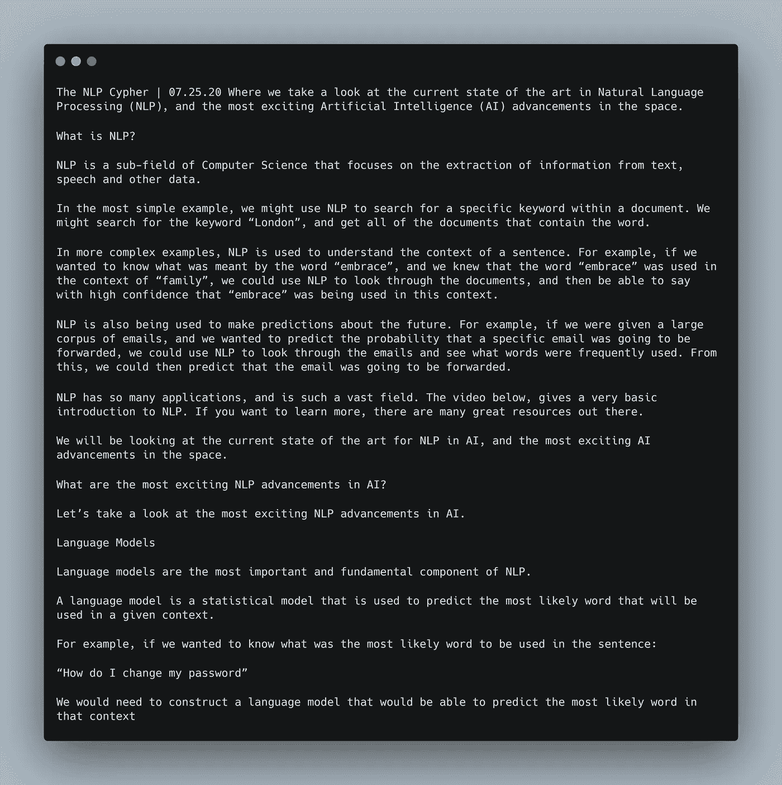

# NLP 密码| 07.25.21

> 原文：<https://medium.com/geekculture/the-nlp-cypher-07-25-21-cad9bf48f8e1?source=collection_archive---------14----------------------->

Giant Flying Mocca Cup with an Inexplicable Five Metre Appendage | Dali

## 自然语言处理每周时事通讯

## ¯\_(ツ)_/¯

欢迎回来！本周的密码会比平时短一点，这是 NLP 土地上缓慢的一周。但首先，我想告诉你 BlenderBot 2.0 的最新情况。在上周的 Cypher 上，blenderbot 推理实例化要克服的最后一个障碍是搜索服务器(它使机器人能够搜索 web 以回答仿真陈述类型的问题)。好吧，我们终于有一个搜索服务器回购工作！

 [## GitHub-Jules GM/ParlAI _ search engine:ParlAI 的 BlenderBot 项目的搜索引擎(可能还有…

### ParlAI 的 web 搜索服务器，包括 Blenderbot2。查询服务器:服务器反应正确:使用…

github.com](https://github.com/JulesGM/ParlAI_SearchEngine) 

感谢朱尔斯·加尼翁-马尔尚创建了一个精彩的 repo，它为创建自己的搜索服务器提供了与 ParlAI 库的无缝集成。甚至自带了自己的 colab，根据您获得的实例类型，您可能会也可能不会耗尽内存(结果好坏参半)，但您仍然应该尝试一下！

 [## 在 master Jules GM/ParlAI _ search engine/colab . ipynb

### ParlAI 的 BlenderBot 项目(可能还有其他项目)的搜索引擎-ParlAI _ search engine/colab . ipynb 位于…

github.com](https://github.com/JulesGM/ParlAI_SearchEngine/blob/master/colab.ipynb) 

# 帕伽索斯，不，不是那种总结

听说过飞马计划吗？如果你还没有，那么，一家总部位于以色列的名为 NSO 集团的私人承包商开发了一款移动间谍软件，可以从你的手机中提取“目标的信息、密码、联系人、照片”(The Verge)等数据，有报道称，只需一条短信就可以做到这一点。当然，考虑到这些特点加上隐藏坏人身份的能力，国家政府很快就利用了这项技术。

## 你可以在这里获得完整的摘要:

 [## 以下是我们所知道的 NSO 飞马间谍软件

### 在过去的一周里，我们看到了一个又一个关于一家名为 NSO 集团的公司和一个名为…

www.theverge.com](https://www.theverge.com/22589942/nso-group-pegasus-project-amnesty-investigation-journalists-activists-targeted) 

## 官方报告:

 [## 飞马座项目

### 新的监控国家如何控制民主和公众？

www.occrp.org](https://www.occrp.org/en/the-pegasus-project/) 

对于 CyberSec peeps，您可以从该报告中获得网络和移动设备受损的指标:

 [## 调查/2021-07-18 _ 美国国家统计局硕士项目/调查

### 该存储库包含与 NSO 集团的 Pegasus 间谍软件相关的网络和设备受损指标。这些…

github.com](https://github.com/AmnestyTech/investigations/tree/master/2021-07-18_nso) 

# 哈佛大学的伽利略计划研究不明飞行物🛸

哈佛大学的物理学家阿维·勒布(Avi Loeb)提出了一个著名的假设，即漂移到太阳系内部的 Oumuamua 物体可能是一个 UFO 人工制品，他正在准备一个研究 UFO 的项目。

 [## 活动

### 伽利略项目研究小组的目标是利用……来确定 UAP 和类似 Oumuamua 的星际物体的性质

projects.iq.harvard.edu](https://projects.iq.harvard.edu/galileo/activities) 

# 为什么体重衰减的亚当如此受欢迎

 [## AdamW 和超收敛是现在训练神经网络最快的方法

### Jeremy 的说明:欢迎来到 fast.ai 的第一位常驻学者 Sylvain Gugger。有什么更好的方式来介绍他…

www.fast.ai](https://www.fast.ai/2018/07/02/adam-weight-decay/) 

# GPT-J·科实验室|在 TPU 运行

下载依赖项和加载模型大约需要 10-15 分钟。推断大约需要 10 秒钟…

 [## 谷歌联合实验室

### 编辑描述

colab.research.google.com](https://colab.research.google.com/github/kingoflolz/mesh-transformer-jax/blob/master/colab_demo.ipynb) 

这是一个输出示例，top_p = 0.9，温度= 0.7。

prompt = " NLP 密码| 07.25.20 嘿，欢迎回来"

# 回购密码👨‍💻

## 一组最近发布的回购引起了我们的关注👁

## [WikiGraphs:维基百科文本—知识图配对数据集](https://arxiv.org/pdf/2107.09556.pdf)

> 维基百科文章的数据集，每篇文章都配有知识图，以促进条件文本生成、图形生成和图形表示学习的研究。

 [## deep mind-research/大师级 deepmind/deepmind-research

### 这个包提供了下载 WikiGraphs 数据集[1]的工具，该数据集是通过将来自…

github.com](https://github.com/deepmind/deepmind-research/tree/master/wikigraphs) 

[**连接论文**](https://www.connectedpapers.com/main/56765a17295370c70cbc510329c082ec60ed3c62) **📈**

## [基于查询的视频集锦(QVHIGHLIGHTS)数据集](https://arxiv.org/pdf/2107.09609.pdf)

> 它由超过 10，000 个 YouTube 视频组成，涵盖广泛的主题，从生活方式 vlog 视频中的日常活动和旅行到新闻视频中的社会和政治活动。数据集中的每个视频都标注有:人类编写的自由形式 NL 查询、视频中与查询相关的时刻，以及所有查询相关剪辑的五点尺度显著性分数。

 [## GitHub-jayleicn/Moment _ detr:Moment-DETR 码和 qv 高亮数据集

### QVHighlights:通过自然语言查询检测视频中的精彩瞬间和精彩片段有关数据集的详细信息，请查看…

github.com](https://github.com/jayleicn/moment_detr) 

[**连接论文**](https://www.connectedpapers.com/main/3d46dde1f9543312125e89f719262299ad7ee24e) **📈**

## [用变压器提取临床关系](https://arxiv.org/pdf/2107.08957.pdf)

> 使用转换器从临床记录中提取关系。可用型号:

*   伯特
*   XLNet
*   罗伯塔
*   艾伯特
*   德伯塔
*   长成形器

 [## GitHub-uf-hobi-informatics-lab/clinical transformer relationship extraction:一个开发…

### 这个软件包是为研究人员开发的，可以方便地使用最先进的变压器模型来提取关系…

github.com](https://github.com/uf-hobi-informatics-lab/ClinicalTransformerRelationExtraction) 

[**连接论文**](https://www.connectedpapers.com/main/95cff5366ea958fc6275dc594bde08e6d1b65c40) **📈**

## [小文本:Python 中文本分类的主动学习](https://arxiv.org/pdf/2107.10314.pdf)

> 该库为文本分类提供了最先进的主动学习，允许轻松混合和匹配许多分类器和查询策略，以构建主动学习实验或应用程序。

 [## GitHub-webis-de/small-text:Python 中文本分类的主动学习

### Python 中文本分类的主动学习。主动学习允许你有效地标记训练数据…

github.com](https://github.com/webis-de/small-text) 

[**连接论文**](https://www.connectedpapers.com/main/1f55ec80a5f628b3d9f14c51a6975e959285c98e) **📈**

> 每周日，我们都会对来自世界各地研究人员的 NLP 新闻和代码进行一次每周综述。
> 
> 如需完整报道，请关注我们的 Twitter: [@Quantum_Stat](http://twitter.com/Quantum_Stat)

[Quantum Stat](https://quantumstat.com/)