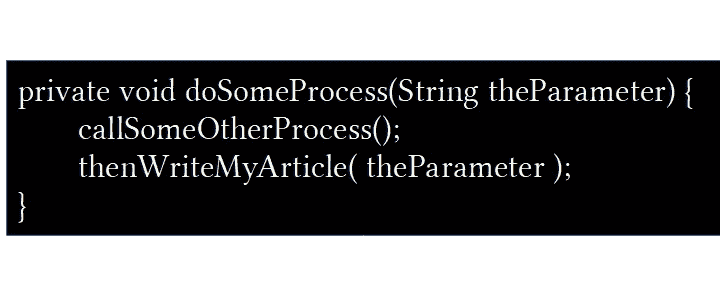

# 一行代码流程

> 原文：<https://medium.com/geekculture/the-one-line-of-code-process-353cdf3d859b?source=collection_archive---------18----------------------->

我喜欢使用一种过程改进方法来帮助减少开发团队交付软件的摩擦。因为我喜欢“只有在产品中运行才算完成”，所以减少软件投入生产的摩擦是一件非常重要的事情。所以，我分析“一行代码”的过程。

很简单的一个问题: ***把一行代码修改成产品是什么流程？*** 这当然包括编写代码行，但也包括源代码控制、构建软件、测试和部署(也可能包括其他任务)。

为了简化我与团队的对话，我只关注一行代码。我认识到，如果涉及更多的代码，这个过程可能会略有不同，但这个想法是要看到基本的步骤。每一步都有一定的成本，无论是时间、金钱还是复杂性。

这种方法相当简单。我把团队召集在一起，告诉他们从简单的代码更改到将代码部署到产品中的必要步骤。然后，我们通过这些步骤和 ***证明*** 每一个人。对于流程中的每一步，我都会提出如下问题:

*   为什么我们需要做这一步？
*   做这一步是否降低了 bug 进入生产环境的可能性？
*   这一步值不值？
*   这一步可以自动化吗？
*   如果不做这一步会怎么样？
*   执行这一步骤的最初理由是什么？它仍然是一个好理由吗？

问这些问题是因为我们的目标是潜在地做以下事情:

*   通过删除不值得的流程步骤，简化或降低流程的成本(时间、金钱和复杂性)。
*   自动化步骤以减少人为失误的机会，并减少与完成软件变更相关的摩擦。

这里有一个示例流程，它可能会捕获敏捷开发团队在对网站进行更改时通常使用的一些步骤。请注意，确定可以并行完成的步骤，以及全自动(意味着它们在没有人工交互的情况下被触发和运行)或部分自动(意味着它们被手动触发，但在没有人工交互的情况下运行)的步骤是很有帮助的。

1.  编写代码行。[手动]
2.  编写适用的单元测试来验证更改或添加。[手动]
3.  在本地开发人员的计算机上构建并手动验证更改。[手动]
4.  在源代码管理中创建一个拉请求(PR)。[手动]
5.  要求其他开发人员对 PR 进行审查和评论。[手动]
6.  根据评估进行更改。[手动]
7.  将变更部署到共享的开发环境中。[部分自动化]
8.  手动测试环境中的变化。[手动]
9.  向产品负责人展示产品变更。[手动]
10.  将变更合并到源代码控制中的共享分支中(例如，发布分支)。[手动]
11.  将更改部署到测试环境中。[部分自动化]
12.  通知质量保证团队测试和验证变更，并运行回归测试。[手动]
13.  安排生产部署和发布。[手动]
14.  部署并发布到生产环境。[部分自动化]

上述流程与您的团队正在使用的流程相比如何？您能看到哪些步骤可以简化、删除或自动化吗？

公平地说，有些步骤不能被删除或自动化，比如编写代码。你甚至可能有规章制度阻止你对过程进行某些调整。然而，即使是上面的示例过程也可以被大大简化和改进(也就是说，技术的存在使它的大部分自动化)。

我发现这个过程，除了减少团队交付软件变更的摩擦之外，还帮助开发人员(和其他利益相关者)从不同的角度考虑开发和交付软件。如果您的团队已经在进行持续的部署，那么这种过程改进方法可能没有多大价值，但是如果他们没有，那么这可以帮助您的团队更快地生产出更高质量的软件。