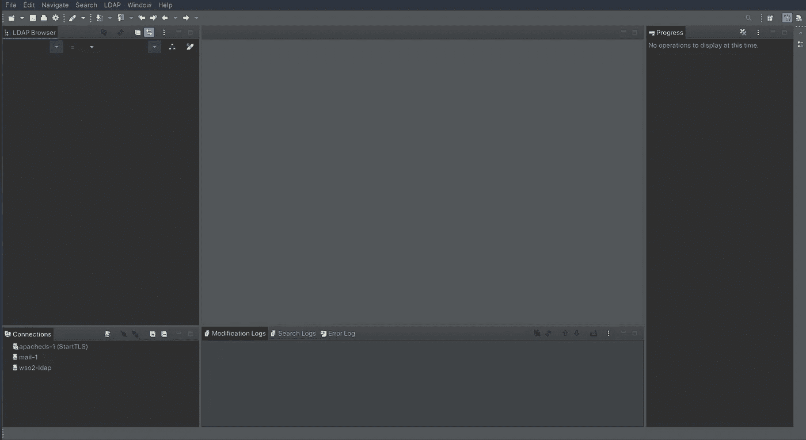

# 开始使用 LDAP 所需的唯一指南

> 原文：<https://medium.com/geekculture/the-only-guide-you-need-to-get-started-with-ldap-6f526385934f?source=collection_archive---------1----------------------->

## 轻松快速地了解 LDAP。


Photo by [Marita Kavelashvili](https://unsplash.com/@maritafox?utm_source=medium&utm_medium=referral) on [Unsplash](https://unsplash.com?utm_source=medium&utm_medium=referral)

有许多方法可以处理多台服务器的用户验证。您可以创建一个处理身份验证的 SQL 数据库。有提供单点登录的身份服务器。但是，对于一些大型组织来说，LDAP 是必需的。关于 LDAP 的大部分信息都很复杂，对于大多数初学者来说很难理解。

这是您开始使用 LDAP 所需的唯一指南。

## 先决条件

*   了解 Linux/BSD 操作系统
*   您需要熟悉命令行。
*   以及如何编辑文件
*   和一些基本的脚本

**目录 vs 数据库**

最常见的问题是目录和数据库之间有什么区别。目录和数据库都用来存储数据。然而，目录以树形层次结构的方式存储数据。SQL 数据库以行和列的顺序方式存储数据。

出现的问题是，为什么要在数据库上使用目录。与数据库相比，目录有一些好处。大多数数据库会缓存索引最多的数据，以便快速索引。但当服务器需要访问缓存缺失数据时，搜索树索引的[时间复杂度为 **O(log(n))**](https://www.geeksforgeeks.org/introduction-to-tree-data-structure/) 而[顺序索引为 **O(n)**](https://www.geeksforgeeks.org/array-data-structure/) 。因此在大多数情况下，目录查询比数据库查询快得多。

与数据库相比，目录将数据分布在多个服务器上以实现负载平衡要容易得多。[因为您可以将每个目录拆分到每个节点的不同服务器](/geekculture/distributed-computing-for-beginners-f4116adf609d)。而数据库需要人们通过水平或垂直分片来手动分片数据。[然而，在当今时代，大多数数据库解决方案都具有自动扩展功能。](https://www.cockroachlabs.com/)因此您不必担心数据库的数据分片。

在用户身份验证的上下文中，这两种服务都可以执行身份验证。

## 如何安装 LDAP 服务器？


Photo by [Gabriel Heinzer](https://unsplash.com/@6heinz3r?utm_source=medium&utm_medium=referral) on [Unsplash](https://unsplash.com?utm_source=medium&utm_medium=referral)

许多目录服务器实现 LDAP 协议。然而，最轻量级的是 OpenLDAP。以下是安装 OpenLDAP 服务器的几种方法。

**Debian/Ubuntu**

```
sudo apt-get install openldap-server slapd slurpd
```

**FreeBSD**

```
cd /usr/ports/net/openldap[version_num]-server
make install clean
```

通常，滚动发布版本不用于需要服务器的生产工作。

## LDAP 目录是如何工作的？

对于大多数来自数据库的人来说，目录的结构似乎令人困惑。当你意识到它只是一堆美化了的文件夹时，这就说得通了。LDAP 服务器中有一个主根域。在那个域下，你有多个子域。作为一个组织，您可能会有一个代表整个组织的子域。

```
dc=org_name,dc=org
```

也许，你想组织你的用户。你可以再创造一个。

```
dc=users,dc=org_name,dc=org
```

基于观察，可以对数据的排列进行分组。您不需要存储用户。您可以存储任何对象。例如，这里存放着一辆汽车。

```
ou=car_model,dc=brand,dc=cars,dc=org_name,dc=org
```

数据存储的问题随之而来。数据作为属性存储在每个节点上。

## Slapd 初始配置

每个 LDAP 服务器都需要创建一个基本配置。然而，不建议您手动完成整个过程，因为这非常繁琐且容易出错。但是，有时您需要实现自定义配置。

运行目录服务的程序叫做 [**slapd**](https://www.linuxtopia.org/online_books/network_administration_guides/ldap_administration/intro_What_is_slapd_and_what_can_it_do.html) **。**以下是如何配置 slapd 的指南。

[](https://openldap.org/doc/admin24/slapdconf2.html) [## OpenLDAP 软件 2.4 管理员指南:配置 slapd

### 一旦构建并安装了软件，您就可以配置 slapd(8)在您的站点上使用了。OpenLDAP 2.3…

openldap.org](https://openldap.org/doc/admin24/slapdconf2.html) 

## 不同的认证方法

有两种不同类型的身份验证

1.  普通认证:匿名，未经认证，用户名/密码。这些术语是不言自明的。
2.  SASL 认证:您可以使用目录服务来执行用户级认证。但是，您可以使用 SASL 链接目录服务之上的另一个单独的身份验证层。这将用于在不同的 LDAP 服务器之间同步目录服务管理员的权限。

对于本指南的范围，使用了普通用户名/密码身份验证的假设。请记住，大多数专业公司可能正在使用 SASL 认证。但是配置 SASL 需要时间，因此不在本指南的讨论范围之内。

## SASL 和用户名/密码身份验证的区别

唯一的区别是添加了一个标志。一旦通过验证，输出是相同的。

**SASL 认证示例**

```
ldapsearch -H ldapi:// -x -LLL -s base -b "" supportedSASLMechanisms
```

输出

```
dn:
supportedSASLMechanisms: **DIGEST-MD5**
supportedSASLMechanisms: **EXTERNAL**
supportedSASLMechanisms: **NTLM**
supportedSASLMechanisms: **CRAM-MD5** supportedSASLMechanisms: **LOGIN** supportedSASLMechanisms: **PLAIN**
```

这里有一个例子

```
sudo ldapsearch -H ldapi:// **-Y EXTERNAL** . . .
```

**用户名/密码认证示例**

```
sudo ldapsearch -H ldapi:// ...
```

## 如何在命令行中使用 LDAP 目录服务？

就像 SQL 一样，您将执行创建、读取、更新和删除操作。但是，与 SQL 语言不同，您可以直接使用命令行来执行操作。

**增加**

```
ldapadd -H ldap://[hostname:port] -x -D "cn=admin,dc=org_name,dc=org" -w [password] -f /path/to/update.ldif
```

**删除**

```
ldapdelete -H ldap://[hostname:port] -x -D "cn=admin,dc=org_name,dc=org" -W "uid=user2,ou=users,dc=org_name,dc=org" -w [password]
```

**修改**

```
ldapmodify -H ldap://[hostname:port] -x -D "cn=admin,dc=org_name,dc=org" -w [password] -f /path/to/update.ldif
```

**移动**

```
ldapmodrdn -H ldap://[hostname:port] -x -D "cn=admin,dc=org_name,dc=org" -w [password] -f
```

**列表**

```
ldapsearch -H ldapi:// -x -LLL -s base -b "" supportedSASLMechanisms
```

输出

```
dn:
supportedSASLMechanisms: **DIGEST-MD5**
supportedSASLMechanisms: **EXTERNAL**
supportedSASLMechanisms: **NTLM**
supportedSASLMechanisms: **CRAM-MD5** supportedSASLMechanisms: **LOGIN** supportedSASLMechanisms: **PLAIN**
```

如果您不修改 LDAP 服务器，它将毫无用处。虽然可以只使用命令行进行修改。

**向部门添加员工**

也许您需要向 LDAP 服务器添加一名新员工。你必须找到员工所在的特定域名。

```
# update.ldif
dc: ou=engineer,ou=department,ou=users,dc=example,dc=org # Group
action: add # Action
objectClass: iNetOrgPerson # Object Class
name: John Doe # Name
sn: John # First Name
cn: Doe # Last Name
uid: johndoe1001 # Identification Number
```

这是您将用来执行该操作的建议。

```
ldapmodify -H ldap://[hostname:port] -x -D "cn=admin,dc=org_name,dc=org" -w [password] -f /path/to/update.ldif
```

## 获得自己的身份

查看身份验证 DN 对于映射和权限非常有用。

```
sudo ldapwhoami -H ldapi:// -Y EXTERNAL -Q
```

输出

```
dn:gidNumber=0+uidNumber=0,cn=peercred,cn=external,cn=auth
```

## 如何散列你的密码？

[即使是拥有 40 亿账户的十亿美元公司也忘记对密码进行哈希运算。](/geekculture/your-passwords-are-useless-5087cdcb1433)一旦你被黑，所有的密码都会被泄露并在黑市上出售。[很多人在多种服务中使用同一个密码](/@drechang/your-password-manager-the-most-insecure-way-to-secure-your-passwords-c815d1903096)。散列你的数据库和目录服务的密码。OpenLDAP 支持以下密码的散列

*   讯息摘要 5
*   SHA256
*   BCRYPT
*   等等

所有密码都保存为文本。您可以使用以下命令生成密码哈希，并将其存储为密码。

```
slappasswd -h '{SSHA512}' -o module-load=pw-sha2.la -o module-path=/opt/oppenldap-current/libexec/openldap
Enter Password:
Re-enter new password:
```

输出

```
{SSHA512}ZhiudfhXZIhied...
```

从那里你可以保存到修改 LDIF 文件。然后使用以下命令将它复制到目录中

```
ldapmodify ...
```

散列密码有一个限制。问题是一些依赖 LDAP 的服务不支持特定的加密。然后进入为一个纯文本密码创建多个密码散列变体的领域。总的来说，这只是一大堆问题。[如果不修改代码，连接到其他服务器的 LDAP 服务器将无法处理 LDAP 加密方案。](https://docs.iredmail.org/password.hashes.html) SSO 技术不面临这个缺陷。因为 SSO 将身份验证的责任转移到了服务器而不是客户端。

## 查询过滤

LDAP 目录在系统中内置了过滤语言。它还支持 globbing。

**获取拥有 Gmail 帐户和名字的用户**

您可以运行以下命令来

```
ldapsearch -H ldap://[hostname:port] -x -D "cn=admin,dc=org_name,dc=org" -w [password] -b "ou=users,dc=org_name,dc=org" "(&(mail=*.gmail.com)(sn=A*)(objectClass=iNetOrgPerson))"
```

输出

```
# extended LDIF
#
# LDAPv3
# base <> with scope subtree
# filter: ()
# requesting: ALL
## john, users, org_name, org
dn: cn=john,ou=users,dc=org_name,dc=org
objectClass: top
objectClass: account
objectClass posixAccount
objectClass: shadowAccount
objectClass: iNetOrgPerson
cn: john
uid: johndoe1001
homeDirectory: /home/john
mail: johndoe101@gmail.com...
```

有大量关于 LDAP 搜索过滤的信息。

 [## LDAP 过滤器

### 过滤器是定义用于识别搜索请求中条目的标准的关键元素，但它们也用于…

ldap.com](https://ldap.com/ldap-filters/) 

## 有没有使用 LDAP 目录服务的简单方法？

虽然大多数应用程序可以很容易地在 CLI 中配置。LDAP 服务器是您不希望使用 CLI 配置的服务器之一，除非有必要。因为你很容易漏掉一些东西，比如打字错误，并且很难修复和调试它。在某些情况下，使用 CLI 工具配置 LDAP 服务器会更好。然而，这些情况很少发生，因为大多数可能的实现已经被开发和商业化了。

因此，您可能不希望使用命令行来实现 LDAP 服务器，因为从头开始配置整个 OpenLDAP 服务器需要大量专业知识。幸运的是，公司已经将实现抽象为自动化工具。有不同的 LDAP 服务器实现，例如

*   [389 目录服务器](https://directory.fedoraproject.org/)
*   [阿帕奇目录服务器](https://directory.apache.org/)
*   [微软 Azure 活动目录服务器](https://azure.microsoft.com/en-us/services/active-directory/)

微软对他们的 Azure Active Directory 服务进行了更多的营销，因此它是最受欢迎的 LDAP 后端服务器。然而，我们尽可能使用免费的开源软件。建议您使用 Apache 目录服务。服务器将自动提供服务器配置。您不希望一直使用 CLI 工具修改您的服务器。这就把我们带到了下一点。

## 如何安装 Apache 目录服务器？

下面是安装 [Apache 目录服务](https://directory.apache.org/)所需的命令。

**Ubuntu/Debian**

```
sudo apt-get install apache-directory-server
```

[**Arch Linux**](/geekculture/the-quick-and-easy-way-to-install-arch-linux-70b9bfc35863)

这个包不是 AUR 的[仓库](/geekculture/what-is-the-arch-user-repository-dd2bd98a3df2)。

[](https://directory.apache.org/apacheds/download/download-linux-bin.html) [## Linux 二进制安装程序的下载

### 我们建议您下载以下镜像站点:我们鼓励您验证下载文件的完整性…

directory.apache.org](https://directory.apache.org/apacheds/download/download-linux-bin.html) 

一旦命令可执行，您需要运行安装程序。

**FreeBSD**

为了使用 Apache 目录服务 Linux 版本，您需要启用 [Linux 二进制支持。](https://docs.freebsd.org/en/books/handbook/linuxemu/)

[](https://directory.apache.org/apacheds/download/download-linux-bin.html) [## Linux 二进制安装程序的下载

### 我们建议您下载以下镜像站点:我们鼓励您验证下载文件的完整性…

directory.apache.org](https://directory.apache.org/apacheds/download/download-linux-bin.html) 

一旦命令可执行，您需要运行安装程序。

## 获取 SSL 证书


Photo by [Markus Winkler](https://unsplash.com/@markuswinkler?utm_source=medium&utm_medium=referral) on [Unsplash](https://unsplash.com?utm_source=medium&utm_medium=referral)

任何创建过网站的人都知道[页面需要 SSL 连接来通过互联网](/geekculture/stop-paying-for-your-ssl-certificates-55d6c5efebad)执行加密。在 Apache 目录服务器中，[加密证书已经由一个自签名者创建。](https://directory.apache.org/apacheds/basic-ug/3.3-enabling-ssl.html)虽然，这没什么。您想要创建一个由证书颁发机构签名的证书。[确保你得到一个免费的证书颁发机构。设置自动更新证书的脚本。](/geekculture/stop-paying-for-your-ssl-certificates-55d6c5efebad)

## 如何设置 Apache Directory Studio？



Photo by Dre Chang

修改大多数软件配置 CLI 很容易。然而，LDAP 是这些例外之一，因为查询可能很难创建和管理。为了简化这个过程，您需要安装一个图形编辑器来方便地修改结构。Apache Directory Studio 是最好的 LDAP 编辑器之一。你可以在 Ubuntu 和 Debian 上安装它

[](https://directory.apache.org/studio/download/download-linux.html) [## Linux 下载

### 我们建议您下载以下镜像站点:我们鼓励您验证下载文件的完整性…

directory.apache.org](https://directory.apache.org/studio/download/download-linux.html) 

[Arch Linux](/geekculture/the-quick-and-easy-way-to-install-arch-linux-70b9bfc35863) 安装需要 [AUR 库](/geekculture/what-is-the-arch-user-repository-dd2bd98a3df2)。

```
sudo yay -S apachedirectorystudio
```

FreeBSD 版本可以使用启用了 Linux 二进制支持的 Linux 版本。

**在 LDAP 服务器上启用 SSL**

当您通过互联网连接两台不同的服务器时，启用 SSL 非常重要。[以下是如何启用 SSL 的说明。](https://directory.apache.org/apacheds/basic-ug/3.3-enabling-ssl.html#in-case-you-want-ads-to-generate-the-certificate)

## LDAP 库


Photo by [Florian Olivo](https://unsplash.com/@florianolv?utm_source=medium&utm_medium=referral) on [Unsplash](https://unsplash.com?utm_source=medium&utm_medium=referral)

使用 CLI 访问信息很烦人，因为每次查询都必须重新认证。GUI 工具只允许您在台式机和笔记本电脑上进行修改。那么如何以编程方式连接到服务器并进行查询的问题就出现了？有些库已经实现了 LDAP 目录。

这里有一些例子

*   Python: [python-ldap](https://www.python-ldap.org/en/python-ldap-3.4.0/)
*   NodeJS: [ldapjs](http://ldapjs.org/)
*   Java: [JNDI](http://www.coderpanda.com/jndi-example-accessing-ldap-in-java/)
*   C++: [OpenLDAP C++ API](https://www.openldap.org/conf/odd-tuebingen-2006/Ralf.pdf)

互联网上有许多以编程方式实现 LDAP 客户端的库。

## 从 NIS 过渡

现在几乎没人用 NIS 了。然而，从 NIS 转型的问题经常出现，很少有文章充分涵盖这一主题。也许一些企业，如银行或大学，正在使用需要使用 NIS 的遗留代码。但是他们需要过渡到 LDAP 来支持他们正在集成的技术堆栈。

你可以查一下，在引擎盖下找到一堆技术术语。您需要将 NIS 目录映射到 LDAP LDIF 文件中。从那里把它发送到 LDAP 服务器。有两种方法可以做到这一点。

*   [第一种方法是使用脚本执行从 NIS 数据到 LDIF 文件的目录映射，以便导入。](https://ldapwiki.com/wiki/NIS%20To%20LDAP%20Tool)
*   [另一种方法是使用自动化工具来执行迁移。](https://docs.oracle.com/cd/E18752_01/html/816-4556/nis2ldap-35.html)

## LDAP 的未来


Photo by [Nastya Dulhiier](https://unsplash.com/@dulhiier?utm_source=medium&utm_medium=referral) on [Unsplash](https://unsplash.com?utm_source=medium&utm_medium=referral)

不仅对于大多数没有经验的用户来说配置 LDAP 很难。LDAP 的问题是该服务不再适合现代的身份验证环境。用户名和密码不再足够安全，无法进行身份验证。[尽管云计算带来了隐私问题](/@drechang/your-browser-the-least-private-way-to-surf-the-web-a528f919365e)，但还是有基于网络的远程认证的使用案例。[使用 web 技术可以轻松解决动态多因素身份认证。](/geekculture/your-passwords-are-useless-5087cdcb1433)

于是就有了[身份服务器](https://wso2.com/identity-server/)的概念。身份服务器通过互联网提供了一种安全的联合方式。对于继续完全依赖 LDAP 来执行用户身份验证的大多数公司和组织来说，这是用户身份验证的下一步。

你可以使用身份服务器在互联网上设置你的[去谷歌化服务](/@dretechtips/how-to-dismantle-the-google-empire-e652bff6d2)。或者甚至取代 [Spotify 和网飞](/@dretechtips/how-to-build-your-own-illegal-streaming-service-ff353ef70cd0)。或者甚至向甚至没有身份验证的服务添加身份验证层。

IT 和工程领域是快速发展的领域。跟不上意味着你将被落在后面。跟上的最好方法是保持最新的新闻和教育内容。[订阅免费电子邮件列表，将你的职业生涯提升 10 倍。](/subscribe/@dretechtips)

加入我们吧，50 多位想要快速提升职业生涯和知识基础的人已经注册了。

**相关内容:**

*   [如何在 Linux 中安全删除文件？](/geekculture/how-to-securely-delete-files-in-linux-ce6ad1205922)
*   [如何在 Linux 中查找文件？](/geekculture/how-to-find-files-in-linux-6ed09a98c899)
*   [为什么 Windows 比 Linux 好？](/@drechang/why-windows-is-better-than-linux-da410b8d9689)