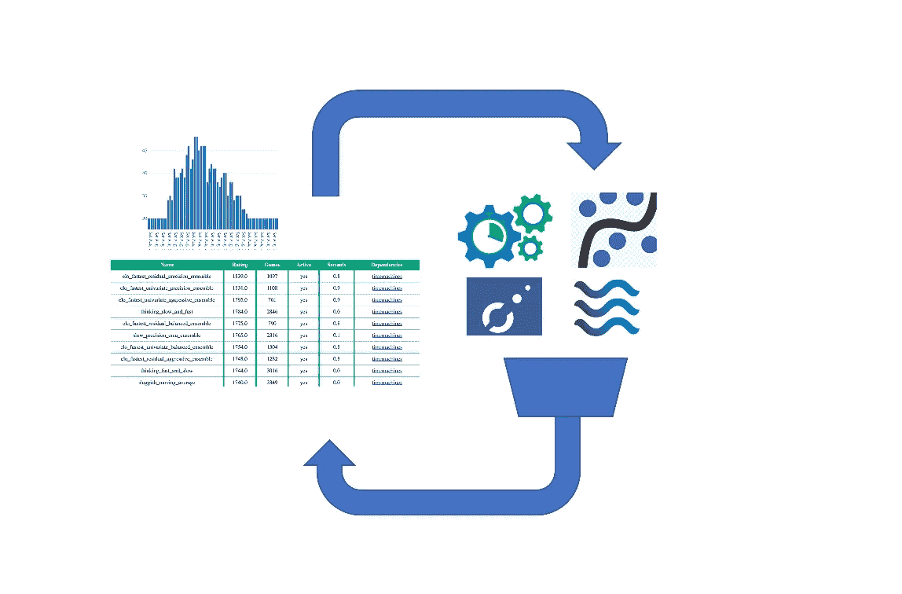
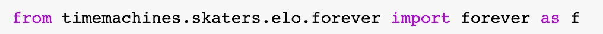
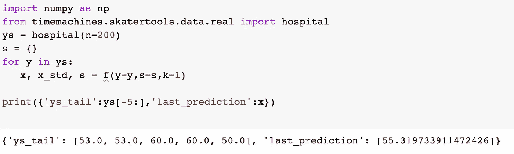
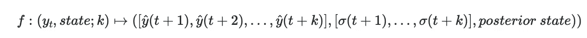
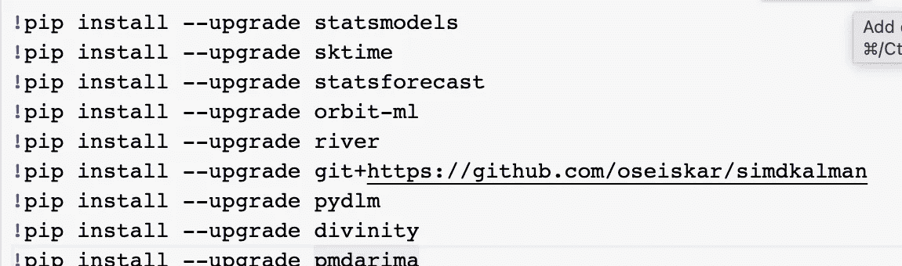
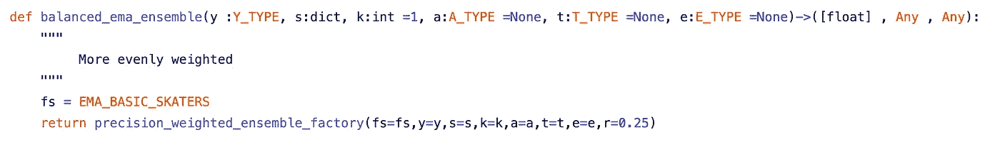
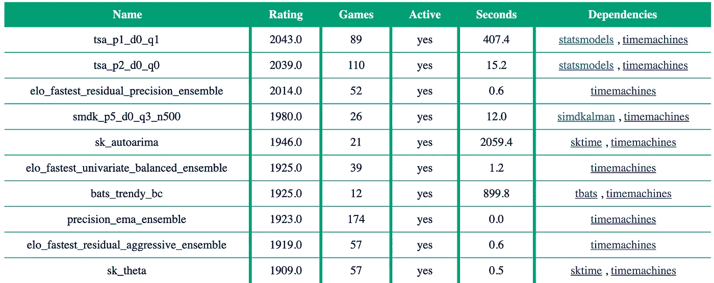
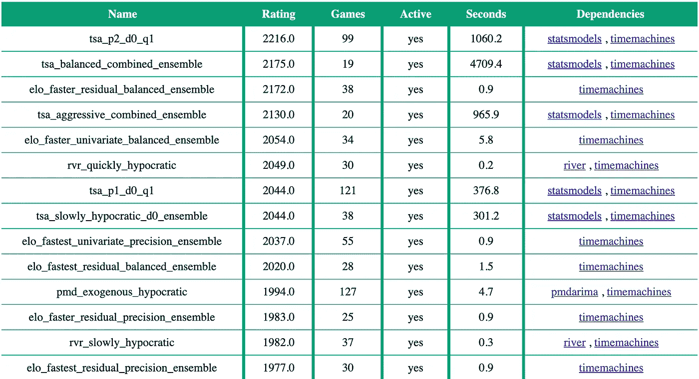

# 您需要的唯一一个单变量预测函数？

> 原文：<https://medium.com/geekculture/the-only-prediction-function-youll-ever-need-fe2ae42eaff0?source=collection_archive---------3----------------------->

如果采用性能最好的开源单变量时间序列预测算法，并通过运行性能对它们进行加权，会发生什么？如果这个列表是在运行时构建的，并且随着新方法在 Python 生态系统中的发布，候选方法变得越来越强，那么您可能永远不需要修改代码。

这里有一个[笔记本](https://github.com/microprediction/timeseries-notebooks/blob/main/forever_hello.ipynb)说明使用。

我将预测函数永远称为**，因为它会随着时间的推移自动变得更好。在这里，我将快速浏览一下用法，然后讨论未来可能的方向。**

****

**Importing the “forever” function from the timemachines package**

**然后我们预测:**

****

**这种简单的风格在[滑手](https://github.com/microprediction/timemachines/blob/main/docs/skaters.md)文档中有描述。像所有其他溜冰者一样,“永远”功能发出预测和后验状态。**

****

**如果你不介意计算或时间，你现在可以停止阅读。**

# **forever 函数将使用哪些方法？**

**随着时间的推移，随着 Elo 评级的变化，这种情况也会发生变化。在一个姐妹库中有 [**机器可读排行榜**](https://github.com/microprediction/timeseries-elo-ratings/tree/main/ratings) 指导选择要包含在合奏中的模型。参见所谓的 Elo 合奏溜冰者的 [**代码**](https://github.com/microprediction/timemachines/tree/main/timemachines/skaters/elo) ，特别是[**eloensemblefactory . py**](https://github.com/microprediction/timemachines/blob/main/timemachines/skaters/elo/eloensemblefactory.py)**和**[**top _ rated**](https://github.com/microprediction/timemachines/blob/main/timemachines/skatertools/recommendations/suggestions.py)**实用程序。********

******但是，只有当模型可以加载到您当前的环境中时，才会包含它。因此，您至少需要 statsmodels、sktime、pmdarima，可能还需要更多，这取决于您。在[笔记本](https://github.com/microprediction/timeseries-notebooks/blob/main/forever_hello.ipynb)中，我做了以下事情。******

************

******参见[安装说明](https://github.com/microprediction/timemachines/blob/main/INSTALL.md)。也许这不需要说，但不同型号之间的性能存在巨大差异，因此 Elo 套装有一个 CPU 参数。见 [**快速 Python 时间序列预测**](https://www.microprediction.com/blog/fast) 讨论。这并不排除使用像 [**statsmodels**](https://pypi.org/project/statsmodels/) ， [**pmdarima**](https://pypi.org/project/pmdarima/) ， [**pydlm**](https://pypi.org/project/pydlm/) 或 [**sktime**](https://pypi.org/project/sktime/#description) 这样的库。大概确实排除了[**neural propht**](https://pypi.org/project/neuralprophet/)或者 [**tbats**](https://pypi.org/project/tbats/) 。******

# ****组合时间序列模型的动机****

****也许你会发现 forever 函数很有用。然而，在这篇文章的剩余部分，我将详细阐述一些工具，这些工具可能会帮助你创建你自己的主题。****

****我认为，在时间序列文献中，以及更广泛的统计文献中，组合模型是有利可图的，这一点是很好理解的。专家文献的混合提供了许多建议，用于根据模型的功效组合模型的输出。在机器学习中，这有时被称为门控和池化。这也与投资组合理论有关，这是我的文章[优化模型组合](/geekculture/optimizing-a-portfolio-of-models-f1ed432d728b)的主题。****

****统计学习中的各种方法，如回归和决策树，也会产生模型组合。计量经济学模型总是混合的(例如高斯混合模型由 [**Eirola 和 Lendasse**](https://www.researchgate.net/publication/264273597_Gaussian_Mixture_Models_for_Time_Series_Modelling_Forecasting_and_Interpolation) 推荐，GARCH 模型的混合由 [**Hass 等人**](https://www.sciencedirect.com/science/article/abs/pii/S1062940813000399) 推荐)。不用说，boosting 还被用于时序预测，在 [**卡琳古拉等人**](https://arxiv.org/abs/2104.04781) 提供的主题上旋转一次。****

****机器学习竞赛排行榜经常充斥着 bagging 条目，其中训练数据集被引导，并采用预测的平均值。参见[平滑移动——对于我的热拍和代码，摆动会使时间序列更规则吗](https://microprediction.medium.com/smooth-move-does-wiggling-make-time-series-models-less-accurate-8544e675873)。****

****另一个想法是混合使用在线模型的不同管道。我以前写过时间序列模型的增量 [**组合**](https://github.com/microprediction/timemachines/tree/main/timemachines/skatertools/composition)——参见文章 [**预测，快与慢**](https://www.microprediction.com/blog/timemachines) 。****

****这里还有很多要补充的。姚、Pirs、Vehtari 和 gel man([**arXiv**](https://arxiv.org/abs/2101.08954))在最近的一篇论文中对这个话题有一些启发——这里只举一个例子。修改“完全池堆叠”(参见[**precision _ weighted _ skater**](https://github.com/microprediction/timemachines/blob/main/timemachines/skatertools/ensembling/precisionweightedskater.py))来执行部分池堆叠应该很简单。****

# ****成分****

****forever 函数是运行精度加权系综的一个例子。因此，您可以跟踪集成实用程序，看看它是如何执行的。****

****实际上，在这个包中有两种类型的合奏。一种是“信任”合奏，在这种情况下，孩子提供了一定程度的不准确性。另一种是由父母(合奏者)决定的风格。****

****无论哪种方式，我都提供了一个名为 [**游行**](https://github.com/microprediction/timemachines/blob/main/timemachines/skatertools/components/parade.py) 的函数，它在这方面非常方便，因为它跟踪 k 步预测以及它们对输入数据的准确性。****

****我们还需要一些小的便利来跟踪偏差、平方误差和更高阶矩的运行估计。为此，我编写了 [**动量函数**](https://github.com/microprediction/momentum/blob/main/momentum/functions.py) ，因为我找不到实现它们的极简包。(有些读者可能更喜欢同一个东西 [**这里**](https://github.com/microprediction/momentum/blob/main/momentum/objects.py) )的更面向对象的版本。****

****在此基础上，[**skater tools/ensembling**](https://github.com/microprediction/timemachines/tree/main/timemachines/skatertools/ensembling)模块中提供了一些用于组合 skater 函数的工具，这些工具应该可以很容易地创建预测函数的集合。****

****(这里要小心。还是那句话，我给你参考一下 [**README.md**](https://github.com/microprediction/timemachines) 或者 [**基本用法**](https://github.com/microprediction/timemachines/tree/main/examples/basic_usage) 或者……我的天啊居然有描述 [**滑手**](https://microprediction.github.io/timemachines/skaters.html) 和他们的 [**接口**](https://microprediction.github.io/timemachines/interface.html) 的文档。或者只是参考简单的例子。如果你观察移动平均系综的构造方式(可能是最简单的例子)，你会在 [**代码**](https://github.com/microprediction/timemachines/blob/main/timemachines/skaters/simple/movingaverage.py) 中看到这一点:****

********

****这是更基本的移动平均预测函数的单行集合。它使用在这里找到的**组合滑板，你可以随心所欲。******

# ******同质系综******

******最后一个话题是同质系综。******

******由于效率的原因，同质系综和异质系综之间存在工程上的区别。作为前者的一个例子，我认为 ARMA 模型的群体受到一些进化的推动，你可以在[**skaters . smdk . SMD karma**](https://github.com/microprediction/timemachines/blob/main/timemachines/skaters/smdk/smdkarma.py)中找到它******

****包含各种 ARMA 合奏。为了展开命名，预测函数**smdk _ P5 _ d0 _ Q3 _ n 1000 _ aggressive**维护 1000 个不同的 ARMA 模型，AR 度最多为 5，MA 度最多为 3。当数据点到达时，集合中的所有模型同时更新。****

****Python 的人对同质集成感兴趣，因为维护一个大的集合不会有很大的影响。我们受益于 numpy 高效的多维数组操作(我也受益于 Otto Sieskari 提供的 simdkalman 包提供的模板)。****

****有一些非常随意的选择，例如一个差分进化步骤来修剪表现不佳的模型的种群，并创建与表现最佳的十分之一相似的新模型(不要引用我的话，请阅读 [**代码**](https://github.com/microprediction/timemachines/blob/main/timemachines/skaters/smdk/smdkarmafactory.py) )。在撰写本文时，根据 AR、MA、测量误差或过程方差是否被修改，交叉采用四种风格之一。****

****(一旦创建了新的 ARMA 模型，它将在一段固定的时间内受到保护，以便预热。在此之后，提示大卫·爱登堡画外音作为兽群的恶性淘汰开始进行。)****

****这只是集成速度相当快的一个例子——比如说，与在每个时间步拟合 auto-arima 相比。事实上，它肯定足够快，可以在更大的合奏中使用——这就是关键。它不需要一直工作来增加价值。也许它可以作为你想出的东西的补充。****

****虽然我还没有尝试过，但是也可以将这些模型视为比简单的精确加权更复杂的下游组合的特征。作为进一步的评论，我注意到如果您希望硬连接组件模型以避免 HTTP 延迟，这很好，我会提醒您有一个 [**colab 笔记本**](https://github.com/microprediction/timeseries-elo-ratings/blob/main/time_series_recommendations.ipynb) 用于推荐。****

# ****有用吗？****

****以下是刚刚出炉的结果，我可能还没有把它们推送到 [**时间序列-电子-收视率**](https://github.com/microprediction/timeseries-elo-ratings) 库。下面是 5 步预测排行榜。你会注意到 Elo 集合在超高速算法中占据了第一、第二和第四位(运行 50 次预测不到 1 秒)。****

********

****它们优于 sk-time 对 theta 方法的实现，这绝不是一个糟糕的基准。类似地，如果我们提前 21 步考虑预测，我们也可以再次看到 Elo 系综的行进。这些如何组合似乎并不太重要。下表中“平衡”和“精确”集合之间的唯一区别是应用于经验方差倒数的指数。****

********

****有趣的是，虽然我们预测的是“正常”的时间序列(与模型残差相比)，但表现最好的模型残差预测器的 Elo 组合(称为**Elo _ fast _ residual _ balanced _ ensemble**)表现最好。我总是很快补充说，Elo 评级是相当嘈杂的，但这仍然是一个有希望的初步发现，并不完全令人惊讶。****

# ****贡献的****

****如果你对现有算法的巧妙组合感兴趣，或者对增加时间机器包中提供的溜冰者的数量感兴趣，请阅读 [**CONTRIBUTING.md**](https://github.com/microprediction/timemachines/blob/main/CONTRIBUTE.md) 。****

****如果你想贡献更好的分配权重的方法，而不是更好的模型，那么也许可以看看 [precise](https://github.com/microprediction/precise) 包中的在线方法。****

****我忘记提到的一个方面是(直到 Kevin 的一个评论提醒我，不，谢谢),用于计算 Elo 评级的*数据*是实时的，可以改进。时间序列从 Microprediction.Org 出发。因此，如果您想添加数据，请参见[发布文档。](https://microprediction.github.io/microprediction/publish.html)Ping me on[slack](https://microprediction.github.io/microprediction/slack.html)一个足够强大的密钥来创建数据流，如果你不介意自己烧一个的话。****

# ****我就说这些****

****我的新书[micro prediction:Building a Open AI Network](https://www.amazon.com/Microprediction-Building-Open-AI-Network/dp/0262047322)最近由麻省理工学院出版社出版，可能有助于阐明我从事自主预测的一些非金融市场动机(你会喜欢的)。我在[英达投资公司](https://www.intechinvestments.com/)工作。****