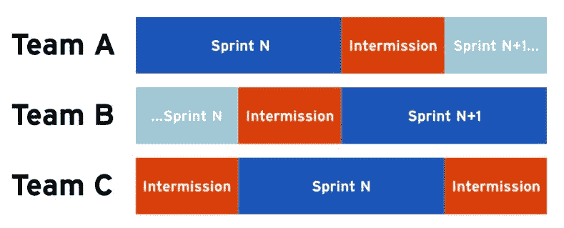

# 创新的起源

> 原文：<https://medium.com/geekculture/the-origin-of-innovation-4e4a6a324066?source=collection_archive---------67----------------------->

当我谈到让创新成为 R&D 组织的习惯这一概念时，许多科技高管起初会退缩。这可能听起来令人生畏，或者似乎需要他们已经很忙的团队投入更多的时间。一些人认为这会导致混乱，每个工程师都可以为所欲为。在这篇文章中，我将解决谁有责任提出创新的异议。但在此之前，让我们确保我们对这其中包含的价值保持一致。

以下是我的客户或科技高管操作系统*的读者主动提供的一些关于他们从实施习惯性创新中看到的影响的报价:*

> **“为什么球队不能每周都这样？”**
> 
> **“这是一笔丰厚的收入，从现在起一年后我们将为创新时间买单！”**
> 
> **“这是我们在过去几年中实施的最具影响力的变革。”**
> 
> *“我不相信我们的团队有能力做到这一点。”*

*你不想同病相怜吗？*

# *背景:习惯性创新*

*在我的书中，我描述了实施定期*间歇*的概念，以便为你的团队提供定期的时间进行真正的创新。你可以在[这篇文章](https://avivbenyosef.com/managing-non-feature-work-part-3suggested-approach/)中找到一些细节，或者[在这里](https://techexecutiveoperatingsystem.com)找到涵盖这个主题的示例章节。它的要点是，你的工程师应该得到他们对他们的时间表负责的时间，并做他们认为是正确的事情。*

**

*这些间歇让人们得以从激烈的短跑比赛中解脱出来。突然间，你拥有的这些聪明、有才华、高薪的工程师可以停止像吉拉分解机器一样运作，花些时间去思考。正是这个概念让许多 CTO 和 VPE 激动不已。让我们来解决我最近在谈论这个概念时听到的最常见的反对意见。*

# *反驳异议*

**“创新应该来自产品”**

*事实上，一些创新应该来源于你的产品人员所做的艰苦工作；不可否认。尽管如此，为什么不把你努力雇佣的大量脑力劳动者也包括进来呢？每个人都来自不同的背景，每个人都可以有别人可能从未想过的想法。我称之为润滑的意外收获——我们增加了想出一个“鸿运”主意的机会，并在这个过程中享受了一大堆好处。*

**“我的团队只想关注科技债务”**

*有时候，投资清理科技债务是有意义的。然而，你只能摆脱这么多债务，而科技资本的创造是没有上限的。工程师对他们的时间负责并不意味着他们可以为所欲为。为你的期望制定适当的指导方针:更少的债务，更多的影响。我在 | [这些](https://www.techexecpodcast.com/episodes/tech-capital) | [资源](https://www.youtube.com/watch?v=h2PpAw98XSk&pp=sAQA)中讲述了科技之都[的各种例子(还有，我的书的样本章节，你可以在下面订阅获得)。](https://avivbenyosef.com/managing-non-feature-work-part-2-guiding-principles/)*

**“这些间歇不会产生真正的影响”**

*你投入多少，就只能从这些间歇中得到多少。没有适当的上下文和背景，团队不太可能想出任何新奇的东西。有两种方法可以解决这个问题。首先，培养*产品精通*这样工程师们就会了解业务、产品和用户。没有这一点，他们的“淋浴想法”将都是关于技术，而不是你的用户。第二，我见过的最好的团队有一个生态系统，来自客户成功、营销和其他部门的人在休息前接近工程师，向他们“推销”想法或问题。想象一下这会给你的公司带来什么奇迹。*

**“我们不能让工程师随心所欲地使用产品”**

*没人说我们应该。我听说过这样的情况，没有给出足够的指导方针，导致工程师推动产品在过去明确反对的特性的实现。这不是中场休息的目标。如果团队对内部工具和改进有想法，他们可以随心所欲。当涉及到实际功能或产品变更时，他们必须从产品部门找个人来“支持”这个计划。同样，就像前面的例子一样，这种方法基于一个核心信念，即你的文化应该是工程师定期与公司其他人交流的文化。*

**“团队的想法都比较次要”**

*最后，有时工程师只是倾向于不去想“足够大”对此没有一个通用的解决方案。然而，在某些情况下，这可以追溯到一种不能容忍偶尔失败的文化。没有失败就没有真正的创新。让人们知道你期待这一点。在一天结束的时候，工程师应该能够证明他们在休息时间的回顾中所做的实验和计划是正确的。如果有人经常下毫无意义的赌注(也就是说，即使他们成功了，他们也不值得努力)——给他们反馈。*

*如果你还有什么异议，我很乐意听听。伸出手来！*

**Aviv Ben-Yosef 2021 —在我最近出版的书中获得更多:* [***科技高管操作系统***](https://techexecutiveoperatingsystem.com/)*