# AI 和 M 的强力公开简历小抄📷

> 原文：<https://medium.com/geekculture/the-overpowered-open-cv-cheat-sheet-c1825bd02bf6?source=collection_archive---------7----------------------->

## 从零到精通

图像处理和计算机视觉的世界是启动机器学习和人工智能项目的最佳时机。通过这篇文章，我将提到各种图像处理技术和计算机视觉技术，它们将帮助您轻松完成基于视觉的机器学习和人工智能项目。

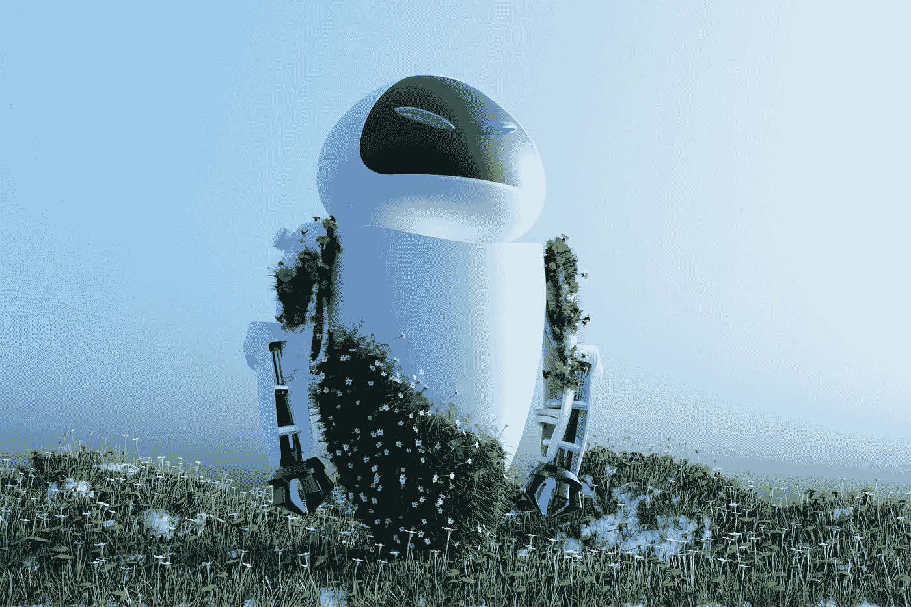

Photo by [Aman Pal](https://unsplash.com/@paman0744?utm_source=medium&utm_medium=referral) on [Unsplash](https://unsplash.com?utm_source=medium&utm_medium=referral)

让我告诉你更多关于这个小抄的事情。本笔记本将包含所有重要和有效的图像处理方法，从基础到高级。您可以将此页设为书签，以获得快速见解和代码片段。我创建这个备忘单的目的是将所有重要的图像处理和操作方法集中在一个来源，这将使即使是新手也能理解流程和实现。

贯穿本文，我们将有代码片段，输出和对程序块的理解。我还将提供一个 python 笔记本的链接，您可以在那里运行我们将在本文中讨论的所有内容

为了运行代码片段，我将使用 python 3.8 和 open CV，open CV 是 python 中的一个计算机视觉库，它将帮助我们执行图像处理和操作技术。如果你对这些东西都不熟悉，我会推荐你去搜索 anaconda，Jupiter notebook，或者如果你使用 Google Colaboratory，你也需要安装你的 Google Drive。

在动手之前，我们需要熟悉三个重要的术语。计算机视觉，图像处理和图像操作。

让我们用简单的术语来定义计算机视觉，计算机视觉是一种人工智能技术，其中计算机可以解释、理解并从图像或视频中提取知识。也就是说它能帮助电脑看清。图像处理可以简化为对图像进行增强或提取有用信息的方法或操作。所谓的图像特征。图像处理是指改变数字图像的属性以达到预期的效果。在我们进行的过程中，我将提供所有三个术语的示例。

> 警告，如果你像我一样使用 MacBook M1，我在退出预览版时遇到了一些问题，这可能是一个测试版操作系统，但你仍然可以使用笔记本预览版。

首先用 python 安装 open CV 包，可以在 anaconda 提示符下使用下面的命令，也可以通过笔记本安装

但是这篇文章很长，很多人可能时间紧迫，所以我先链接了笔记本链接

[https://github.com/siddheshshivdikar/open-cv-cheatbook](https://github.com/siddheshshivdikar/open-cv-cheatbook)

```
!pip install opencv-python
!pip install matplotlib
!pip install numpy
```

除此之外，还包括你最喜欢的图片，你会觉得很有趣(三年前，我选择了我最喜欢的歌手❤️的图片💁)

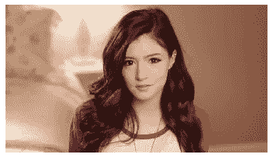

Gonna use the same image throughout 😋

现在，让我们将包导入笔记本中

```
import sys
import os
import cv2
import numpy as np
from matplotlib import pyplot as plt
```

让我们从打开和显示我们笔记本中的一张图片开始。我在同一个目录中创建了一个名为“图片”的文件夹

```
input = cv2.imread("./images/image_name.jpg")
plt.axis("off")
plt.imshow(input) #replace this with later for full screen image
plt.show()
```

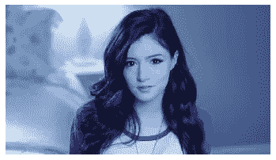

Wait whaaa ! 😕

## 我以为 RGB 是我的灵魂伴侣😩那为什么是 BGR？😵‍💫

需要记住的重要一点是，默认情况下 opencv 使用 BGR 作为颜色格式，而不是 RGB，所以当你试图在 Matplotlib 中预览图像时，它可能看起来很奇怪。如果你问为什么？那我来给你解答一下。像公制和英制一样，BGR 色彩空间在色彩制造商和软件提供商中很受欢迎，这使得 open CV 的早期开发者选择它作为他们的格式。你最终会习惯的…

这里是你如何转换它只是取代上面的线，一切都会看起来正确！

```
 plt.imshow(cv2.cvtColor(input, cv2.COLOR_BGR2RGB))
```

## 简单但最重要的✨灰度

尽管将彩色图像转换为灰度图像会导致信息丢失，但它在特征提取方面会更有用，比如在人脸识别任务中检测特征，此外还会提高性能指标。所以灰度是没有任何颜色的从黑到白的单色阴影范围。我将在下面提到这两种转换格式

```
#plt.imshow(cv2.cvtColor(input, cv2.COLOR_BGR2GRAY)) # BGR TO GRAYg_input = cv2.imread("./images/image_name.jpg", 0) # 0 converts into GS plt.title("Grayscale")plt.axis("off")
plt.imshow(cv2.cvtColor(g_input, cv2.COLOR_BGR2RGB))
plt.show()
```

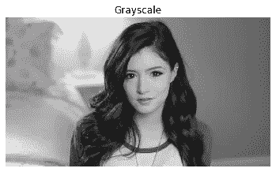

## 让我们看看更大的图片🤭

我们甚至可以在笔记本电脑外的窗口中显示从输出中获得的图像。这可能是一个令人困惑的过程，因为它不像看起来那么简单。首先，您必须使用 cv2.imshow()，然后是 cv2.waitKey()，它在您指定的延迟后等待一个键。当那个键被按下时，程序恢复。现在我们将使用 cv2.destroyAllWindows()来关闭窗口。试一试

```
#For windows 
cv2.imshow('Chrissy Grey', g_input)
cv2.waitKey()
cv2.destroyAllWindows()#If it dosen't run on Mac then
cv2.imshow('Chrissy Grey', g_input)
cv2.waitKey(1)
cv2.destroyAllWindows('frames')
```

## 色调饱和度值；三颗宝石💎

HSV 颜色空间由 3 个矩阵组成，“色调”、“饱和度”和“值”。在 OpenCV 中，“色调”、“饱和度”和“值”的取值范围分别是 0–179、0–255 和 0–255。“色调”表示颜色，“饱和度”表示相应颜色与白色混合的量，“值”表示相应颜色与黑色混合的量。

> 一个聪明的人说它比 rgb 格式更适合物体检测和跟踪

想知道为什么吗？这是因为 HSV 是最适合于**基于颜色的图像分割** a 的颜色空间，因为物体的 R、G、B 分量与击中物体所捕获的光量相关，使得物体辨别困难。在 HSV 中，我们可以分离亮度。顺便说一句，你知道我们也可以提取单个的成分，比如 H，S 和 V 吗？也会证明这一点

```
plt.title("Converted to HSV")
plt.axis("off")
plt.imshow(cv2.cvtColor(h_input, cv2.COLOR_BGR2RGB))
plt.show()
plt.title("Hue Sepration")
plt.axis("off")
plt.imshow(cv2.cvtColor(h_input[:,:,0], cv2.COLOR_BGR2RGB))
plt.show()
plt.title("Saturation Sepration")
plt.axis("off")
plt.imshow(cv2.cvtColor(h_input[:,:,1], cv2.COLOR_BGR2RGB))
plt.show()
plt.title("Value Sepration")
plt.axis("off")
plt.imshow(cv2.cvtColor(h_input[:,:,2], cv2.COLOR_BGR2RGB))
plt.show()
```

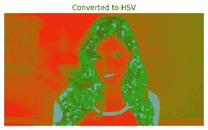

This is HSV conversion of our image.

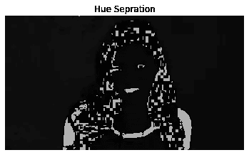

Do you find any Background elements ?

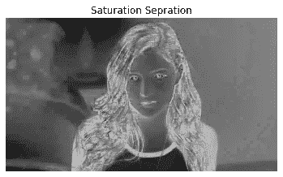

Better edges and facial features like boundaries ?


Better Luminosity ?

这个结果是不是很迷人，我们甚至还没有开始任何复杂的方法。为了证明这一点，让我们把 R，G，B 分量也分开；我在上面插入了三张图片，因为我必须通过分离不同的通道向你展示不同的特征，让我们通过连接我们将要分离的不同颜色的通道图片来节省一些空间。请注意，您必须按照 BGR 的顺序将其分开。

```
B, G, R = cv2.split(input) # used to split into respective channels#cv2.imshow('Red', R)
#cv2.imshow('Green', G)
#cv2.imshow('Blue', B)
#plt.axis("off")
#plt.imshow(cv2.cvtColor(R, cv2.COLOR_BGR2RGB))
#plt.show()
#plt.axis("off")
#plt.imshow(cv2.cvtColor(G, cv2.COLOR_BGR2RGB))
#plt.show()
#plt.axis("off")
#plt.imshow(cv2.cvtColor(B, cv2.COLOR_BGR2RGB))
#plt.show()concat = cv2.hconcat([R,G,B]) 
# or np.hstack([img,img]) use np.vstack and cv2.vconcat([img,img]) for vertical 
plt.title("Red Green and Blue Channels")
plt.axis("off")
plt.imshow(cv2.cvtColor(concat, cv2.COLOR_BGR2RGB))
plt.show()#cv2.waitKey()
#cv2.destroyAllWindows()
```


Saw the difference ?

同样，如果你合并通道，你会得到原来的图像，试试看。

```
merged = cv2.merge([B,G,R])
```

## 我希望天空看起来更蓝🏙

现在，许多图像处理算法使天空看起来更美丽、更蓝，我们可以尝试通过放大通道的简单方式来模拟它，显然它必须是蓝色的。从长远来看，这些简单的事情会帮助我们

```
amplify = cv2.merge([B+50,G,R])
#cv2.imshow('Amplify', amplify)
plt.axis("off")
plt.imshow(cv2.cvtColor(amplify, cv2.COLOR_BGR2RGB))
plt.show()
#cv2.waitKey()
#cv2.destroyAllWindows()
```


Way better than before ✨

同样，我们也可以分离通道组件和❤️💚💙为什么你会问？可以简单到只提取红色形状或使用彩色遮罩进行图像分割

```
zeros = np.zeros(input.shape[:2], dtype = 'uint8')
# cv2.imshow("Red",cv2.merge([zeros,zeros,R]))
# cv2.imshow("Green",cv2.merge([zeros,G,zeros]))
# cv2.imshow("Blue",cv2.merge([B,zeros,zeros]))
# cv2.waitKey()
# cv2.destroyAllWindows()
plt.title("Red Channel")
plt.axis("off")
plt.imshow(cv2.cvtColor(cv2.merge([zeros,zeros,R]), cv2.COLOR_BGR2RGB))
plt.show()
plt.title("Blue Channel")
plt.axis("off")
plt.imshow(cv2.cvtColor(cv2.merge([zeros,G,zeros]), cv2.COLOR_BGR2RGB))
plt.show()
plt.title("Green Channel")
plt.axis("off")
plt.imshow(cv2.cvtColor(cv2.merge([B,zeros,zeros]), cv2.COLOR_BGR2RGB))
plt.show()
```

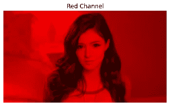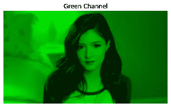

## 让我告诉你直方图被低估了😔

直方图主要向您显示图像中有多少**阴影**、**中间色调**和**高光**及其位置，因为数据集图像操作直方图也会对您的理解产生影响。

```
histogram = cv2.calcHist([input],[0], None,[256],[0,256])
plt.hist(input.ravel(), 256,[0,256])
plt.show()
```

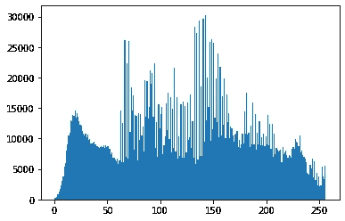

```
#lets look at colors through histogram as well
color = ('b','g','r')
for i, col in enumerate(color):
    histogram = cv2.calcHist([input], [i], None, [256], [0, 256])
    plt.plot(histogram, color =  col)
    plt.xlim([0,256])
plt.show
```

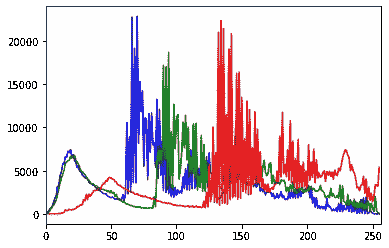

## 让我们从空白开始😶

我们都知道什么是边界框，什么是人脸识别中的多边形，什么是车道检测中的每一条车道，现在我们要实现基础，这样下次你需要突出显示它们时，你就知道该怎么做了。让我们从空白画布开始。

```
# mac users change the following destroy window function if you are directly jumping on thisimage =  np.zeros((720,720,3), np.uint8)
gimage =  np.zeros((720,720), np.uint8)cv2.imshow("BGR",image)
cv2.imshow("Grey Scale",gimage)cv2.waitKey(0)
cv2.destroyAllWindows()
```

在生成的图像上画一条简单的线，我已经在评论中非常直接地解释了参数，没有双关的意思😂

```
image =  np.zeros((720,720,3), np.uint8)
cv2.line(image, (0,0),(500,720), (157,229,16), 5)
cv2.line(image, (720,720),(500,0), (157,229,16), 5)
#here (0,0) is the origin 
#(500,50) is the the end
#(157,229,16) is the BGR value of the line
#5 is the thickness in pixels
plt.axis("off")
plt.imshow(cv2.cvtColor(image, cv2.COLOR_BGR2RGB))
plt.show()
#cv2.imshow("line",image)
#cv2.waitKey(0)
#cv2.destroyAllWindows()
```

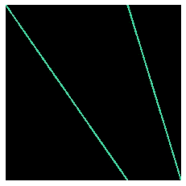

Line over an image

画矩形遵循与上面相同的惯例，这里有填充和未填充的变化。

```
image =  np.zeros((720,720,3), np.uint8)
cv2.rectangle(image, (100,100), (300,200), (157,229,16), 5)
#use -1 to fill images
cv2.rectangle(image, (500,500), (600,600), (157,229,16), -1)
plt.axis("off")
plt.imshow(cv2.cvtColor(image, cv2.COLOR_BGR2RGB))
plt.show()
#cv2.imshow("rectangle",image)
#cv2.waitKey()
#cv2.destroyAllWindows()
```

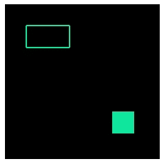

Rectangle over an image

Ummm 圈子？

```
image =  np.zeros((720,720,3), np.uint8)
cv2.circle(image, (350,350), 100, (157,229,16), 5)
# (350,350) coordinate
# 100 is the radius 
# (157,229,16) is the color
# 5 is the thickness of the circle
plt.axis("off")
plt.imshow(cv2.cvtColor(image, cv2.COLOR_BGR2RGB))
plt.show()
#cv2.imshow("circle",image)
#cv2.waitKey(0)
#cv2.destroyAllWindows()
```

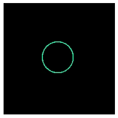

Circle over an image

在图像上绘制多边形*在边界框中的矩形上使用此选项*

```
image =  np.zeros((720,720,3), np.uint8)
pts = np.array([[10,50],[300,75],[100,200],[400,500],[10,500]], np.int32)
#straight away feed the cords
pts = pts.reshape((-1,1,2))
cv2.polylines(image, [pts], True, (157,229,16), 3)
plt.axis("off")
plt.imshow(cv2.cvtColor(image, cv2.COLOR_BGR2RGB))
plt.show()
#cv2.imshow("polygon",image)
#cv2.waitKey(0)
#cv2.destroyAllWindows()
```


Drawing a polygon over an image

图片上的文字*我的猫在写文字的时候在我的键盘上打滚，她真笨*🐱

```
image =  np.zeros((720,720,3), np.uint8)
cv2.putText(image, 'Guddu is love', (80,300), cv2.FONT_HERSHEY_COMPLEX, 2, (100,170,0), 3)
plt.axis("off")
plt.imshow(cv2.cvtColor(image, cv2.COLOR_BGR2RGB))
plt.show()
#cv2.imshow('siddo', image)
#cv2.waitKey(0)
#cv2.destroyAllWindows()
#(80,300) is bottom left start point
```

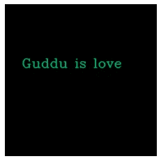

Writing text on an image

> 我的意思是我们已经学到了这么多，我们可以制作自己的照片编辑应用程序😛

因此，如果你想制作一个照片编辑应用程序，你需要裁剪、旋转、缩放和调整大小，或者如果你是一只考拉🐨我们将坚持在图像预处理中使用它们…

让我们快点🤫图像翻译。

> 图片沿 x 轴和 y 轴的移动称为平移。我们可以使用平移来上下左右移动图像，以及上述方式的任意组合。—羽毛笔机器人为了好玩而转述的

我用注释让你们更好地理解它，它有点数学化

```
# Types of image transformations affine transformation and non affine transformation
#transformation matrix
# T = | 1 0 Tx|
#     | 0 1 Ty|
height, width =  input.shape[:2]
s_height, s_width = height/3, width/3
#making transformation matrix using numpy
T = np.float32([[1, 0, s_width],[0, 1, s_height]])
#use Wrap affine function which is built into  cv
Translation = cv2.warpAffine(input, T,(width, height))
plt.axis("off")
plt.imshow(cv2.cvtColor(Translation, cv2.COLOR_BGR2RGB))
plt.show()
```

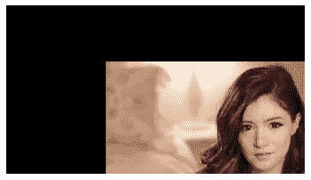

Translated image

> PS 一口气学完会很累，你可以休息一下！🥺

使用旋转矩阵旋转图像🙂 → 🙃

```
# T = |  cos0 -sin0|
#    | sin0 cos0|
# 0 = is angle of rotation
#cv2.getRotationMatrix2D(rotation_center_x, rotation_center_y, angle_of_rotation, Scale)
#this will result in cropped image try scaling it
height, width =  input.shape[:2]
rotation_matrix = cv2.getRotationMatrix2D((width/2, height/2), 45, .55)r_image = cv2.warpAffine(input, rotation_matrix, (width,height))plt.axis("off")
plt.imshow(cv2.cvtColor(r_image, cv2.COLOR_BGR2RGB))
plt.show()
```

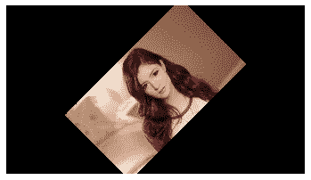

Rotated image

我们可以用转置来旋转，这很容易

```
#transpose only rotates img 90 at a time
r_img =  cv2.transpose(input)
plt.axis("off")
plt.imshow(cv2.cvtColor(r_img, cv2.COLOR_BGR2RGB))
plt.show()
```

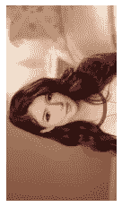

I bet I didn't rotate this manually you can check the code 💁‍♂️

调整图像大小:如果你试图在笔记本上显示调整后的图像，恭喜你！用窗户代替好吗？open cv 为我们提供了一些调整大小的技巧，你可以使用最适合你的方法。我将在代码单元中解释它们的用法。

```
#interpolation(concept of image resizing): construction/genration new pixels while expanding the image
#types
#cv2.INTER_AREA : good for shrinking down or sampling
#cv2.INTER_NEAREST : Fastest
#cv2.INTER_LINEAR : good for zooming or up sampling
#cv2.INTER_CUBIC : Better
#cv2.INTER_LANCZOS4 : Best
#uses cv2.resize functionshrink_img = cv2.resize(input, None, fx=0.75, fy=0.75)
plt.axis("off")
plt.imshow(cv2.cvtColor(shrink_img, cv2.COLOR_BGR2RGB))
plt.show()
cv2.imshow("shrink",shrink_img)
cv2.waitKey(0)up_img = cv2.resize(input, None, fx=2, fy=2, interpolation = cv2.INTER_CUBIC)
plt.axis("off")
plt.imshow(cv2.cvtColor(up_img, cv2.COLOR_BGR2RGB))
plt.show()
cv2.imshow("up",up_img)
cv2.waitKey(0)dsize_img = cv2.resize(input, (800,450), interpolation = cv2.INTER_AREA)
plt.axis("off")
plt.imshow(cv2.cvtColor(dsize_img, cv2.COLOR_BGR2RGB))
plt.show()
cv2.imshow("defined size",dsize_img)
cv2.waitKey(0)cv2.destroyAllWindows()
#you cant distinguish their sizes in matplot so see them in window or use shape function
```

> 你想看什么？调整过大小的图片？真的吗？

此外，当调整图像大小时，它们会降低质量，所以你可能也想看看这个。

```
#resizing images tends to loose quality
#mac users please change the window functionssmall_img=cv2.pyrDown(input)
cv2.imshow("smalled",small_img)
cv2.waitKey(0)large_img=cv2.pyrUp(small_img)
cv2.imshow("Larged",large_img)
cv2.waitKey(0)cv2.destroyAllWindows()
```

## 裁剪不想要的人呜呜不是那个意思🌚

当我制作这个 cheatsheet Open Cv 的时候，它没有直接裁剪功能，所以它有点棘手，因为我们只需要得到中心点并保存帧，但是嘿，可能有更好的选择，我发现这个很有趣

```
#using numpy as cv dosent have direct cropping function
height, width =  input.shape[:2]
#25 and 75 gives the center point
#start points
s_r, s_c = int(height * .25), int(width * .25)
#end points
e_r, e_c = int(height * .75), int(width * .75)crop = input[s_r:e_r , s_c:e_c]plt.axis("off")
plt.imshow(cv2.cvtColor(crop, cv2.COLOR_BGR2RGB))
plt.show()
```

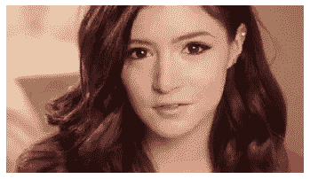

Cropped image

> 你还在 photoshop 火车上吗？*啾* *啾*🚄

## 曝光或 so 解释为亮度，但不…曝光对高光色调起作用😬

您可能需要使图像变亮或变暗，以使其适合您的数据准备清单，您可以通过以下方式实现这一点…

```
M =np.ones(input.shape, dtype = "uint8") *50
addexp = cv2.add(input, M)
plt.axis("off")
plt.imshow(cv2.cvtColor(addexp, cv2.COLOR_BGR2RGB))
plt.show()subexp = cv2.subtract(input, M)
plt.axis("off")
plt.imshow(cv2.cvtColor(subexp, cv2.COLOR_BGR2RGB))
plt.show()
```

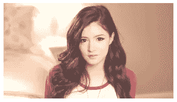

Increasing the exposure

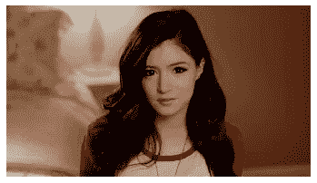

Decreasing the exposure

> 想象过 photoshop 图层合并是如何工作的吗？比如选择、删除和合并选定的区域？你和我一样激动吗！那就上车吧🤯

让我们现在创建两个形状，可能与我们之前创建的不同。

```
#lets create two shapes like before but in grey scale
sheet_square =  np.zeros((300,300), np.uint8)
cv2.rectangle(sheet_square, (50, 50), (250, 250), 255, -2 )
plt.axis("off")
plt.imshow(cv2.cvtColor(sheet_square, cv2.COLOR_BGR2RGB))
plt.show()
sheet_semic =  np.zeros((300,300), np.uint8)
cv2.ellipse(sheet_semic, (145, 145), (145, 145), 30, 0, 180, 255, -1 )
plt.axis("off")
plt.imshow(cv2.cvtColor(sheet_semic, cv2.COLOR_BGR2RGB))
plt.show()
```

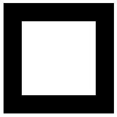

Lets call this Friend A

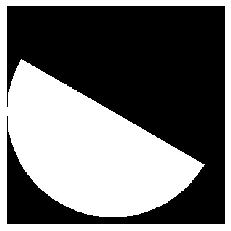

Lets call this Arima San

还记得逻辑门*位运算*吗？我们将使用相同的人谁是新的，只是结合了图像；或者只是将它们重叠在一起；EXOR 只是更像 union 一样使用公共区域；不仅仅是从另一个图形中减去图形，只剩下公共区域。

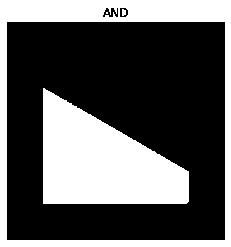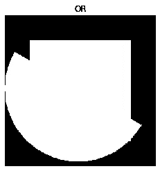

## 模糊:可能有助于提高边缘检测性能

许多类型的瑕疵都会进入图像:模糊、对比度差、噪声、JPEG 压缩等等。其中，模糊可以使边缘变得柔和，这些边缘由于标记的粗糙表面而经常包含不规则性。让我们从使用归一化矩阵开始。

你可以把内核想象成一个 3x3 的遮罩，它覆盖每个像素并应用所需的变换

```
plt.title("Orignal")
plt.axis("off")
plt.imshow(cv2.cvtColor(input, cv2.COLOR_BGR2RGB))
plt.show()# using kernal 3 x 3  normalizing it by dividing by 9
kernel_3 =  np.ones((3,3), np.float32) / 9# using kernal 7 x 7  normalizing it by dividing by 49
kernel_7 =  np.ones((7,7), np.float32) / 49blured_3 =  cv2.filter2D(input, -1, kernel_3)
plt.title("Blur using 3 x 3")
plt.axis("off")
plt.imshow(cv2.cvtColor(blured_3, cv2.COLOR_BGR2RGB))
plt.show()blured_7 =  cv2.filter2D(input, -1, kernel_7)
plt.title("Blur using 7 x 7")
plt.axis("off")
plt.imshow(cv2.cvtColor(blured_7, cv2.COLOR_BGR2RGB))
plt.show()
```

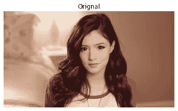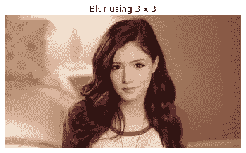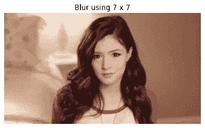

open-cv 内置的模糊和卷积功能非常棒，所以你应该很擅长它们。下面我将跳过显示它们，但是一定要运行并实现它们！

```
#view using cv2.imshow to see the differenceplt.title("Orignal")
plt.axis("off")
plt.imshow(cv2.cvtColor(input, cv2.COLOR_BGR2RGB))
plt.show()box = cv2.blur(input, (3,3))
plt.title("Box Blur")
plt.axis("off")
plt.imshow(cv2.cvtColor(box, cv2.COLOR_BGR2RGB))
plt.show()gaussian = cv2.GaussianBlur(input, (7,7), 0)
plt.title("Gaussian Blur")
plt.axis("off")
plt.imshow(cv2.cvtColor(gaussian, cv2.COLOR_BGR2RGB))
plt.show()#uses median values of pixels 
median = cv2.medianBlur(input, 5)
plt.title("Median Blur")
plt.axis("off")
plt.imshow(cv2.cvtColor(median, cv2.COLOR_BGR2RGB))
plt.show()#bilateral is used to remove noise and keep the edges sharpbilateral = cv2.bilateralFilter(input, 9, 75, 75)
plt.title("Bilatral Blur")
plt.axis("off")
plt.imshow(cv2.cvtColor(bilateral, cv2.COLOR_BGR2RGB))
plt.show()
```

## 图像去噪☁️

是的，模糊图像有效，但不是每次都有效。你可能会问为什么模糊图像也会模糊边缘，这将进一步影响，是的，你猜对了我们图像中的有用功能。cv2 不漂亮吗？我们内置了所有东西，这里有一个例子。

```
noise_img = cv2.imread("./images/Noise.jpg")
#cv2.imshow('Noise', noise_img)
#cv2.waitKey()
plt.title("noise")
plt.axis("off")
plt.imshow(cv2.cvtColor(noise_img, cv2.COLOR_BGR2RGB))
plt.show()
den = cv2.fastNlMeansDenoisingColored(noise_img, None, 6, 6, 7, 21)
#parameter after None are filter strength use value in range (5-10)
#next is hForColorComponents use same value as h
#cv2.imshow('Denoised', den)
#cv2.waitKey()
#cv2.destroyAllWindows()
plt.title("Denoise")
plt.axis("off")
plt.imshow(cv2.cvtColor(den, cv2.COLOR_BGR2RGB))
plt.show()
```

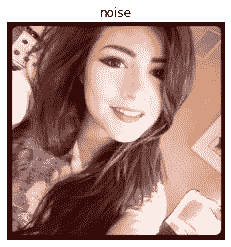

## 同样，我们可以锐化模糊的图像🃏

我们将使用内核来锐化图像，但是的，可能有其他令人敬畏的选项可以用来实现您想要的输出。在这一点上，我们应该研究更多关于内核作为图像过滤器的信息，以便我们可以掌握尽可能多的知识…

```
kernal_s = np.array([[-1, -1, -1], [-1, 9, -1], [-1, -1, -1]])
sharpened = cv2.filter2D(input, -1, kernal_s)
plt.title("sharpned")
plt.axis("off")
plt.imshow(cv2.cvtColor(sharpened, cv2.COLOR_BGR2RGB))
plt.show()
```


## 阈值:回到人工智能和 ML 🛤的轨道上

就应用而言，图像分割无疑是最好的，你可以说它有助于分离图像中的背景和主体，但在你开始之前，阈值处理只对灰度图像有效。让我们来看看几种不同的类型。使用正确的阈值类型将为你创造奇迹，✨

```
#converting it into binary form
#cv2.threshold(input, Threshold value, max value, threshold type)
#Threshold types
#cv2.THRESH_BINARY - common
#cv2.THRESH_BINARY_INV - common
#cv2.THRESH_TRUNC
#cv2.THRESH_TOZERO
#cv2.THRESH_TOZERO_INV
#Threshold only works on greyscale imageret, threshb = cv2.threshold(g_input, 127, 255, cv2.THRESH_BINARY)
plt.title("Thresh binary")
plt.axis("off")
plt.imshow(cv2.cvtColor(threshb, cv2.COLOR_BGR2RGB))
plt.show()ret, threshbi = cv2.threshold(g_input, 127, 255, cv2.THRESH_BINARY_INV)
plt.title("Thresh binary inverse")
plt.axis("off")
plt.imshow(cv2.cvtColor(threshbi, cv2.COLOR_BGR2RGB))
plt.show()ret, thresht = cv2.threshold(g_input, 127, 255, cv2.THRESH_TRUNC)
plt.title("Thresh trunc")
plt.axis("off")
plt.imshow(cv2.cvtColor(thresht, cv2.COLOR_BGR2RGB))
plt.show()ret, threshz = cv2.threshold(g_input, 127, 255, cv2.THRESH_TOZERO)
plt.title("Thresh zero")
plt.axis("off")
plt.imshow(cv2.cvtColor(threshz, cv2.COLOR_BGR2RGB))
plt.show()ret, threshzi = cv2.threshold(g_input, 127, 255, cv2.THRESH_TOZERO_INV)
plt.title("Thresh zero Inverse")
plt.axis("off")
plt.imshow(cv2.cvtColor(threshzi, cv2.COLOR_BGR2RGB))
plt.show()
```

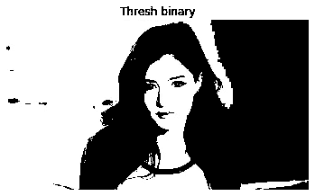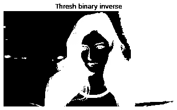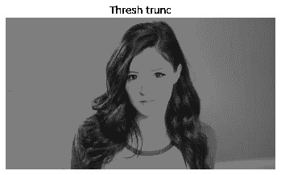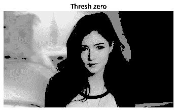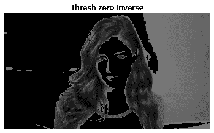

> 想过摄像机是如何工作的吗？让我看看👀

我刚刚取出一页，现在我要指向它并对它进行拍摄，即使它在框架之外，因为我们希望将其裁剪和倾斜成一个直的图像。好的，但是我要借助网站找到坐标，以获得角点坐标，但是你也可以编码

让我们开始吧…

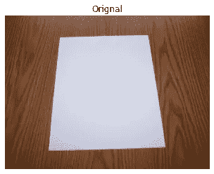

```
#1 163 65
#2 427 58
#3 127 402
#4 480 393
#the boundary of page is contours
#[https://www.image-map.net/](https://www.image-map.net/)
#non affine transform 4 points
# affine transform 3 points
w_img = cv2.imread("./images/Warp.jpg")#the coordinate of the object 
p_a = np.float32(([274,110], [713,96], [216,616], [802,655]))#coordinates of desired output
p_b = np.float32(([0,0], [420,0], [0,594], [420,594]))#make cv2 perspective matrix
M = cv2.getPerspectiveTransform(p_a, p_b)warped = cv2.warpPerspective(w_img, M, (420,594))plt.title("Orignal")
plt.axis("off")
plt.imshow(cv2.cvtColor(w_img, cv2.COLOR_BGR2RGB))
plt.show()plt.title("warped")
plt.axis("off")
plt.imshow(cv2.cvtColor(warped, cv2.COLOR_BGR2RGB))
plt.show()
```

带着这份美丽离开🤗

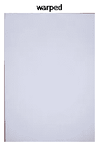

嗯，好吧，但是文本呢？

让我们使用阈值，但等待！我们必须指定阈值的值，对吗？并且图像条件对于每个场景可能不相同，如果我们有阈值来自动适应我们的文本呢🤔

## 救援⛑的自适应阈值化

考虑到我们捕获的带有手写文本的图像，我们可能需要识别它或至少改进它以使其可读，我们可以利用自适应阈值。我将鼓励您尝试简单的阈值处理来自己观察差异。自适应阈值处理评估像素的小邻居，然后为每个邻居选择最佳阈值 T。这种策略允许我们处理像素强度变化很大的情况，并且 T 的理想值对于图像的不同区域是不同的。

```
#Threshold is important for scanning text from materials here we can use adaptive threshold
#remember to change window destroy function mac users
#otsus thresholding is important for text recognition
text_img = cv2.imread("./images/Chrissy_text.jpg", 0)#for adaptive thresholding
ret, thresha = cv2.threshold(text_img, 127, 255, cv2.THRESH_BINARY)
#for removing noise
text_img = cv2.GaussianBlur(text_img, (3,3), 0)#adaptive thresholding
#cv2.adaptiveThresholding(image, max Value, adaptive type, threshold type, block size, constant that is substracted from mean)
#block size need to be odd number constant is optimally to be 5
thresh = cv2.adaptiveThreshold(text_img, 225, cv2.ADAPTIVE_THRESH_MEAN_C, cv2.THRESH_BINARY, 3, 5)
plt.title("Adaptive threshold")
plt.axis("off")
plt.imshow(cv2.cvtColor(thresh, cv2.COLOR_BGR2RGB))
plt.show()
cv2.imshow('Adaptive Threshold', thresh)
cv2.waitKey()
cv2.destroyAllWindows()#adaptive 
_,thresh_one= cv2.threshold(text_img, 0, 255, cv2.THRESH_BINARY + cv2.THRESH_OTSU)
plt.title("OTSU Adaptive threshold")
plt.axis("off")
plt.imshow(cv2.cvtColor(thresh, cv2.COLOR_BGR2RGB))
plt.show()
cv2.imshow('OTSUS Adaptive Threshold', thresh_one)
cv2.waitKey()
cv2.destroyAllWindows()#adaptive thresholding with bluring
blur =  cv2.GaussianBlur(text_img, (5,5), 0)
_,thresh_two= cv2.threshold(blur, 0, 255, cv2.THRESH_BINARY + cv2.THRESH_OTSU)
plt.title("OTSU Adaptive threshold blur")
plt.axis("off")
plt.imshow(cv2.cvtColor(thresh, cv2.COLOR_BGR2RGB))
plt.show()
cv2.imshow('OTSUS Adaptive Threshold blur', thresh_two)
cv2.waitKey()
cv2.destroyAllWindows()
```

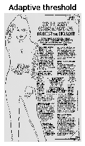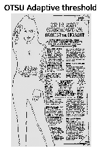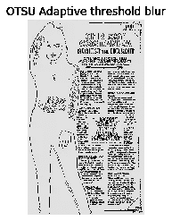

> 相信我，这些图像在全屏下看起来完全可读，试一试吧

## 是钢笔🖊还是铅笔✏️ …

如果我们中有人在做笔记，他们可能会用钢笔或铅笔，所以字体的粗细，不敢相信我把它叫做，在这两种情况下可能是不同的，但在最佳情况下，我们可以通过膨胀和腐蚀来达到一个合理的形式。简单地说，膨胀是从边界开始的，侵蚀是从边界开始的。示例图像和代码块将帮助您更好地进行说明

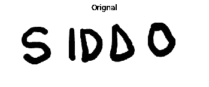

```
#Dilation add pixels to boundaries of the object in an image **make white bigger
#Erosion remove pixels from the boundaries **make black bigger
#Opening erosion followed by dilation
#closing dilation followed by erosion
t_img = cv2.imread("./images/siddo.png", 0)
plt.title("Orignal")
plt.axis("off")
plt.imshow(cv2.cvtColor(t_img, cv2.COLOR_BGR2RGB))
plt.show()#kernal
kernel = np.ones((5,5), np.uint8)#erosion
erosion = cv2.erode(t_img, kernel, iterations = 1)
plt.title("Erosion")
plt.axis("off")
plt.imshow(cv2.cvtColor(erosion, cv2.COLOR_BGR2RGB))
plt.show()#dilation
dilation = cv2.dilate(t_img, kernel, iterations = 1)
plt.title("Dilation")
plt.axis("off")
plt.imshow(cv2.cvtColor(dilation, cv2.COLOR_BGR2RGB))
plt.show()#opening 
opening = cv2.morphologyEx(t_img, cv2.MORPH_OPEN, kernel)
plt.title("Opening")
plt.axis("off")
plt.imshow(cv2.cvtColor(opening, cv2.COLOR_BGR2RGB))
plt.show()#closing is da best
closing = cv2.morphologyEx(t_img, cv2.MORPH_CLOSE, kernel)
plt.title("Closing")
plt.axis("off")
plt.imshow(cv2.cvtColor(closing, cv2.COLOR_BGR2RGB))
plt.show()
```

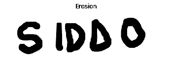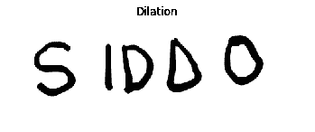

## 婴儿步骤:让我们开始一点轮廓和分割我们的初始图像

正如我们所知，在对图像进行任何分割之前，我们最好的办法是将其转换为二进制，然后添加一点模糊以减少图像中的最小噪声。我们将使用 findContours 来检测图像的边界。我已经在代码块中解释了所需的信息🐥

```
g_input = cv2.imread("./images/Chrissy.jpg", 0)
blur =  cv2.GaussianBlur(g_input, (3,3), 0)
edged = cv2.Canny(blur, 100, 150)
contours, heirarchy = cv2.findContours(edged, cv2.RETR_EXTERNAL, cv2.CHAIN_APPROX_SIMPLE)
print("Number of contours found = " + str(len(contours)))
#cv2.CHAIN_APPROX_NONE : gives all the points
#cv2.CHAIN_APPROX_SIMPLE : gives end points
#mode
#cv2.RETR_LIST : retrieves all contours
#cv2.RETR_EXTERNAL : retrieves external or outer contours only
#cv2.RETR_CCOMP : retrieves all in 2-level hierarchy
#cv2.RETR_TREE : retrieves all in full hierarchy
display = cv2.drawContours(input, contours, -1, (0,0,255), 2)
plt.title("Contours")
plt.axis("off")
plt.imshow(cv2.cvtColor(display, cv2.COLOR_BGR2RGB))
plt.show()
cv2.imshow('Contours', input)
cv2.waitKey(0)
cv2.destroyAllWindows()#print(contours)
#Number of contours found = 236
```

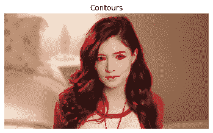

我们甚至可以根据轮廓的区域对其进行排序，逻辑几乎相同，但我们将学习通过笔记本将输出图像保存在我们的工作目录中

```
shape_img = cv2.imread("./images/shapes.jpg")
plt.title("Shape before")
plt.axis("off")
plt.imshow(cv2.cvtColor(shape_img, cv2.COLOR_BGR2RGB))
plt.show()
#cv2.imshow('Contours', shape_img)
#cv2.waitKey(0)
#cv2.destroyAllWindows()blank_image = np.zeros((shape_img.shape[0], shape_img.shape[1], 3))
shape_g = cv2.imread("./images/shapes.jpg", 0)edged = cv2.Canny(shape_g, 70, 100)contours, hierarchy = cv2.findContours(edged.copy(), cv2.RETR_EXTERNAL, cv2.CHAIN_APPROX_NONE)
print("Number of contours found = ", len(contours))def areas(contours):
    areas = []
    for i in contours:
        #calculates the pixel area
        v = cv2.contourArea(i)
        areas.append(area)
    return areas

sort = sorted(contours, key=cv2.contourArea, reverse=True)for j in sort:
    cv2.drawContours(shape_img, [j], -1, (255,0,0), 3)
    cv2.waitKey(0)
    cv2.imshow("contours with greater to lower area ", shape_img)cv2.waitKey(0)
cv2.destroyAllWindows()for (i,k) in enumerate(sort):
    (x, y, w, h) = cv2.boundingRect(k)
    cropped = shape_img[y:y+h, x:x+w]
    name = "out_" + str(i + 1) + ".jpg"
    print(name)
    cv2.imwrite(name, cropped)
```

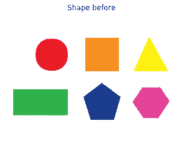

```
Number of contours found =  6
out_1.jpg
out_2.jpg
out_3.jpg
out_4.jpg
out_5.jpg
out_6.jpg
```

我们甚至可以将形状与一堆形状进行匹配，找出所有情况下的相似形状。让我告诉你一个用例，我必须区分任何其他端口，如 HDMI、USB A， USB C 和 lightning，给定它们的插头从前面看的图像，我们知道它们每个都有不同的形状，现在我们可以对形状进行阈值处理和匹配，以找到哪个端口，形状匹配是如何工作的，找到一些定义该形状的特征，我们将在接下来的示例中进行研究，该示例将清楚地向您展示它提取的特征，但我们可以根据原始图像调整端口的大小，并比较 港口形状下的区域也可以工作，你应该试着把这个作为一个练习，挑战自己😎

```
src = cv2.imread("./images/src.png", 0)
envv = cv2.imread("./images/env.png")
env = cv2.imread("./images/env.png", 0)ret, thresha = cv2.threshold(src, 127, 255, 0)
ret, threshb = cv2.threshold(env, 127, 255, 0)contours, hierarchy = cv2.findContours(thresha, cv2.RETR_CCOMP, cv2.CHAIN_APPROX_SIMPLE)sorted_contours = sorted(contours, key=cv2.contourArea, reverse = True)template_contour = contours[0]contours, hierarchy = cv2.findContours(threshb, cv2.RETR_CCOMP, cv2.CHAIN_APPROX_SIMPLE)for c in contours:
    match = cv2.matchShapes(template_contour, c, 1, 0.0)
    print(match)
    if match < 0.15:
        closest_contour = c
        break
    else:
        closest_contour = []
cv2.drawContours(envv, closest_contour, -1, (0,255,0), 4)plt.title("Source")
plt.axis("off")
plt.imshow(cv2.cvtColor(src, cv2.COLOR_BGR2RGB))
plt.show()plt.title("Enviornment")
plt.axis("off")
plt.imshow(cv2.cvtColor(env, cv2.COLOR_BGR2RGB))
plt.show()plt.title("Match found")
plt.axis("off")
plt.imshow(cv2.cvtColor(envv, cv2.COLOR_BGR2RGB))
plt.show()
```

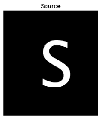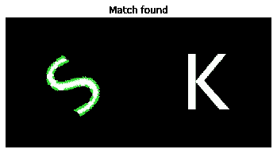

现在我们知道匹配形状，但让我们回到旧的记忆，我想找到口袋妖怪从废话吨口袋妖怪只是为了测试像素匹配的工作原理是它只是匹配像素到像素通过窗口扫描整个图像从左到右，然后下降

```
#not even ideal :D
pokemon = cv2.imread("./images/Pokemon.jpg")
gray = cv2.cvtColor(pokemon, cv2.COLOR_BGR2GRAY)
pikachu = cv2.imread("./images/Pikachu.jpg",0)result = cv2.matchTemplate(gray, pikachu, cv2.TM_CCOEFF)
min_val, max_val, min_loc, max_loc = cv2.minMaxLoc(result)#marking
top_l = max_loc
bottom_r = (top_l[0]+50, top_l[1]+50)
cv2.rectangle(pokemon, top_l, bottom_r, (255,0,0), 5)plt.title("Pika")
plt.axis("off")
plt.imshow(cv2.cvtColor(pikachu, cv2.COLOR_BGR2RGB))
plt.show()plt.title("Pokemons")
plt.axis("off")
plt.imshow(cv2.cvtColor(gray, cv2.COLOR_BGR2RGB))
plt.show()plt.title("Match found")
plt.axis("off")
plt.imshow(cv2.cvtColor(pokemon, cv2.COLOR_BGR2RGB))
plt.show()cv2.imshow('Matchfound', pokemon)
cv2.waitKey()
cv2.destroyAllWindows()
```

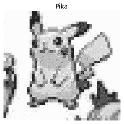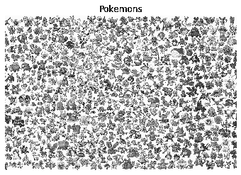

## 要跟踪的轮廓和特征:只剩一个…😵‍💫

> 我爱上了你的形状~打开 CV 到每个交叉的角落，同时选择好的特征😂

当分割图像时，如果你不需要一个完美的边界，我的朋友会节省大量的性能和提高速度，甚至会分离图像上的不同集群，就像考虑世界地图上的大陆一样🗺或者甚至检测手✋让使用凸包轮廓

```
pup = cv2.imread("./images/pup.png")
og = pup.copy()
gg = pup.copy()
gray = cv2.imread("./images/pup.png", 0)
plt.title("Orignal ")
plt.axis("off")
plt.imshow(cv2.cvtColor(pup, cv2.COLOR_BGR2RGB))
plt.show()
ret, thresh = cv2.threshold(gray, 127, 255, cv2.THRESH_BINARY_INV)
contours, hierarchy = cv2.findContours(thresh.copy(), cv2.RETR_LIST, cv2.CHAIN_APPROX_NONE)
#bounding rectangle
for c in contours:
    x,y,w,h = cv2.boundingRect(c)
    cv2.rectangle(og, (x,x), (x+w,y+h),(0,0,255),2)
    cv2.imshow('Bounding rect', og)
cv2.waitKey(0)
#itreating through each contour
for c in contours:
    accuracy = 0.01 * cv2.arcLength(c,True)
    approx = cv2.approxPolyDP(c, accuracy, True)
    a = cv2.drawContours(pup, [approx], 0, (0,255,0), 2)
    cv2.imshow('Approx poly DP', a)

cv2.waitKey(0)
cv2.destroyAllWindows()plt.title("contours")
plt.axis("off")
plt.imshow(cv2.cvtColor(a, cv2.COLOR_BGR2RGB))
plt.show()
```

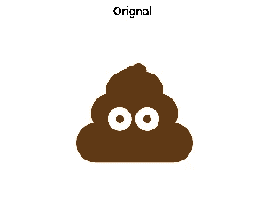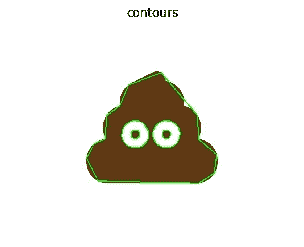

```
ret, thresh = cv2.threshold(gray, 176,255,0)
contours, hierarchy = cv2.findContours(thresh.copy(), cv2.RETR_LIST, cv2.CHAIN_APPROX_NONE)
n = len(contours) - 1
contours = sorted(contours, key=cv2.contourArea, reverse = False)[:n]
for c in contours:
    hull =  cv2.convexHull(c)
    b = cv2.drawContours(gg, [hull], 0, (255,0,0), 2)
    cv2.imshow('conves Hull', b)cv2.waitKey(0)
cv2.destroyAllWindows()plt.title("convex hull")
plt.axis("off")
plt.imshow(cv2.cvtColor(b, cv2.COLOR_BGR2RGB))
plt.show()
```

跟踪具有 harris 角点的特征和要跟踪的良好特征。

> 角落是一个很棒的功能！**每个角落都有变化**。所以，导数在各个方向上变化。所以二阶导数也是各个方向变化的！—有人

简而言之，它决定了使用模糊时哪个滑动窗口(也称为核心窗口)在🥱的任何方向上移动时变化最大

```
#image features
img = cv2.imread("./images/pup.png")
gray = cv2.cvtColor(img, cv2.COLOR_BGR2GRAY)#Harris corners require array datatype to be float
gray = np.float32(gray)harris_corners = cv2.cornerHarris(gray, 3, 3, 0.05)kernel = np.ones((7,7),np.uint8)corners=cv2.dilate(harris_corners, kernel, iterations = 2)img[corners > 0.025 *  corners.max()] = [255, 127, 127]plt.title("Corners")
plt.axis("off")
plt.imshow(cv2.cvtColor(img, cv2.COLOR_BGR2RGB))
plt.show()
```


## 好的跟踪特征:我喜欢公开简历的命名连接

看看好的跟踪功能是如何吸引眼球的👀眼睛从不说谎，所以用好的特征来跟踪就好了😂

```
img = cv2.imread("./images/pup.png")
gray = cv2.cvtColor(img, cv2.COLOR_BGR2GRAY)corners = cv2.goodFeaturesToTrack(gray, 50, 0.01, 55)for corners in corners:
    x , y = corners[0]
    x = int(x)
    y = int(y)
    cv2.rectangle(img, (x-10,y-10), (x+10,y+10), (0,255,0), 2)

plt.title("Corners")
plt.axis("off")
plt.imshow(cv2.cvtColor(img, cv2.COLOR_BGR2RGB))
plt.show()
```


## 世界是美丽的，只是不要忘记拥抱它的美丽！✨

你为学习所做的努力将永远带你去你想去的地方和人。我感到有动力与每一个想学习或开始学习的人分享我获得的知识，这是一个很大的进步，如果你已经完全了解了，你可以评论一下小抄的用处。我会继续在 cheatsheet 中添加一些东西，我已经准备好了很多，只需要发送给你们。快乐编码，用心生活。你可以在我的社交网站上关注我，我希望这能帮助和激励人们离开❤️