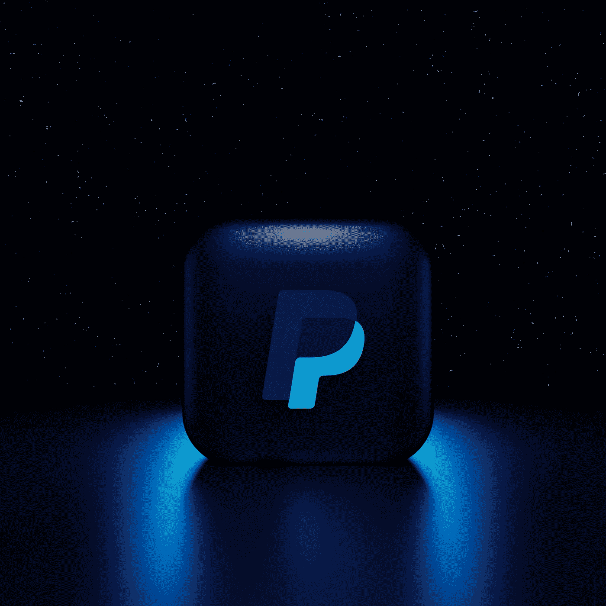

# PayPal 和 Metamask 的合作关系:对加密货币去中心化的关键影响

> 原文：<https://medium.com/geekculture/the-paypal-and-metamask-partnership-a-critical-impact-on-cryptocurrency-decentralization-bc4d78999611?source=collection_archive---------20----------------------->

## **为什么在使用 PayPal 和 Metamask 来满足您的加密货币需求之前，您应该三思而行**

Photo by [Mariia Shalabaieva](https://unsplash.com/@maria_shalabaieva?utm_source=medium&utm_medium=referral) on [Unsplash](https://unsplash.com?utm_source=medium&utm_medium=referral)

你对 metamask 和 PayPal 最近的合作感到兴奋吗？在上船之前，有一些重要的事情要考虑，尽管它…