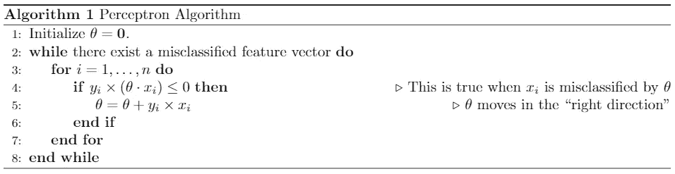
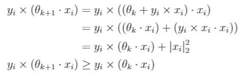
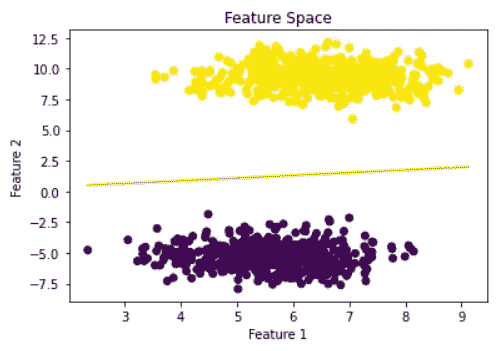
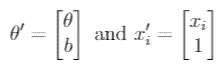
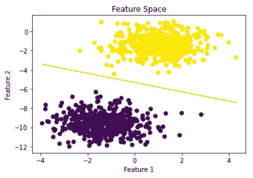
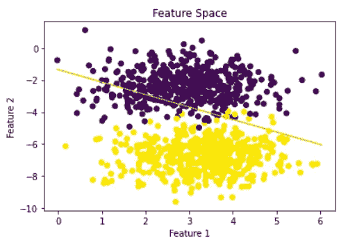

# 感知器算法:如何工作和为什么工作

> 原文：<https://medium.com/geekculture/the-perceptron-algorithm-how-it-works-and-why-it-works-3668a80f8797?source=collection_archive---------7----------------------->

感知器算法是最简单的机器学习算法，也是神经网络和支持向量机等更复杂模型的基本构建模块。理解它是如何工作的以及为什么会工作是监督学习问题的基础。


Image by [**Shelby Hiter**](https://www.datamation.com/author/shelbyhiter/)on Datamation

*注:NumPy 是唯一用于实现该算法的库，本帖中的所有代码都可以在下面的 colab 笔记本中找到并运行。此外，所有的图像、代码和数字都是由作者生成的。*

[https://colab . research . Google . com/drive/1 XP C16 z 4g E0 q 9 regfs-EXW ziy _ cVlbDdi？usp =共享](https://colab.research.google.com/drive/1XpC16z4gE0Q9REGfs-ExwziY_cVlbDdi?usp=sharing)

# 感知器算法:它是如何工作的

感知器算法是一种用于监督学习的模型。所有监督学习模型都在一组特征向量 *X* 和一组相应的标签 *Y、*上训练，标签可以是 1 *。*感知器算法的目标是在特征空间中找到判定边界，使得属于给定类别的每个特征向量落在边界的同一侧，并且边界将两个类别分开。

数学上，特征向量 *X* 是特征空间中的向量，我们可以把特征空间想象成一个向量空间，所以决策边界必须把向量空间分开。在 3D 空间中，2D 平面分隔了整个空间，而在 2D，1D 线分隔了整个空间。对于一个 *n-* 维空间，一个 *(n-1)-* 维空间称为超平面，感知器算法的目标是找到一个划分该空间的超平面。虽然决策边界不需要是线性的，但感知器算法的最简单版本可以处理线性决策边界。

将我们自己限制在通过特征空间的原点的所有超平面的集合，这是我们稍后将放松的假设，超平面和决策边界可以由向量 *θ* 来定义，该向量与超平面正交或垂直。使用特征向量 *X、*标签 *Y* 和 *θ* 来表示决策边界，感知器算法的工作用下面的伪代码来描述:



对于所有线性可分的数据，这个算法总是会找到一个判定边界。在 python 中，这段伪代码是这样写的:

```
def train_perceptron(X, y):
    theta = np.zeros(len(X[0]))
    misclassified = True
    while misclassified:
        misclassified = False
        for i in range(len(X)):
            if y[i] * np.dot(theta, X[i]) <= 0:
                theta += y[i] * X[i]
                misclassified = True
return theta
```

算法的第一步是将 *θ* 初始化为特征空间中的零向量。这是一个重要的步骤，因为感知器使用 *θ* 和一个特征向量的点积来确定适当的标签，所以训练感知器的重点是学习 *θ* 的最佳值。

有两个主循环，从伪代码的第 2 行和第 3 行开始。在第 2 行，执行这个循环，直到所有数据点都被正确分类，或者插入另一个终止条件，我们将在后面看到。在第 3 行，这个循环迭代训练数据中的每个特征向量，根据需要更新 *θ* 。

# 工作原理:感知机的更新

感知器更新步骤是算法的关键部分，出现在伪代码的第 4 行和第 5 行。第 4 行的 if 语句确定 *θ* 是否正确分类了特征向量 *xᵢ.*由于 *θ* 是决策边界的法向量，我们可以使用点生成来确定特征向量在超平面的哪一侧。回想一下，平行单位向量的点积为+1，反平行(方向完全相反的向量)单位向量的点积为-1。基于此，如果 *θ* 和 *xᵢ* 指向同一方向，则点积为> 0，如果指向相反方向，则点积为< 0。

如果 *yᵢ* 是+1，点积是> 0，那么*yᵢ(θ***⋅***xᵢ)*>0。同理，如果 *yᵢ* 为-1，点积为< 0，那么*yᵢ(θ*t24】⋅t26】xᵢ)>0。这些条件表明 *θ* 对 *xᵢ* 的分类是正确的。但是，如果 *yᵢ* 和*θ***⋅***xᵢ*没有相同的符号，那么*yᵢ(θ***⋅***xᵢ)*将小于或等于 0。这是在第 4 行的 if 语句中检查的条件。

当决策边界正确地对特征向量进行分类时，没有任何更新。然而，当错误分类发生时，在“正确的方向”上更新决策边界，以防止错误分类再次发生。这次更新采取的形式是将(*yᵢ***⋅***xᵢ*)增加到 *θ* 。这一增加的原因是因为新的 *θ* 更好地分类了 *xᵢ.要了解这一点，请考虑以下几点:*



这显示了在递增 *θ* 之后，错误分类的特征向量和 *θ* 之间的点积更大的标签倍。由于这个量对于正确分类的特征向量来说是正的，并且更新使得这个值更大，因此它沿着正确的方向移动决策边界。

# 行动中的感知机

一旦训练了一个感知器，通过寻找 *θ* 学习了决策边界，就可以用它来对数据进行分类。colab 笔记本(链接如上)包含生成数据、训练感知器和绘制决策边界的代码。本节将展示这种算法的一些优点和缺点。

生成了两个 2D 特征向量簇，如下图所示。正如上面所写的，感知器算法被训练来寻找由 *θ* 定义的决策边界，并被视为下图中的绿线。



This data is linearly separable with a decision boundary through the origin.

感知器算法在寻找适合这个数据集的决策边界方面做得很好。但是，这里有两点需要注意:

1.  不是所有的数据都可以用一条穿过原点的直线(或超平面)分开。
2.  该数据集中没有噪声。紫色和黄色的星团没有重叠，这使得它们很容易分离。

虽然感知器算法在这些条件为真时工作，但如果这些条件不满足，它就会悲惨地失败。要解决这个问题，可以对算法进行一些修改。

# 改进的感知器

## 带偏移的感知器

首先，放松判定边界必须通过特征空间的原点的假设，可以通过包括偏移项*b*来修改算法。先前，通过原点的判定边界，正确分类的特征向量满足条件*yᵢ(θ*t8】⋅xᵢ)0。利用偏移项 *b，*正确分类的特征向量满足条件*yᵢ(θ***⋅***xᵢ+b)*>0。这被称为带偏移的感知器。

与上面原始感知器算法中的 *θ* 类似， *b* 只在一个特征向量被错误分类时更新。当一个点被错误分类时， *θ* 更新为*θ=θ*+y*ᵢ***⋅***xᵢ、*和 *b* 更新为 *b = b +* y *ᵢ.*

可以将偏移项合并到原始感知器算法中，而不添加偏移项 *b* ，而是如下扩展 *θ* 和 *xᵢ* :



在这种情况下，原感知器算法相当于偏移量为 *b* 的感知器。在 colab 笔记本中，算法明确使用了偏移 *b.* 感知器通过偏移学习的决策边界示例如下所示。



A decision boundary that does NOT pass through the origin

## 不可分割的数据

从伪代码的第 2 行开始的循环一直执行，直到感知器算法找到分隔两类数据的决策边界。然而，这并不总是可能的！这是有问题的，因为当感知器算法应用于无法完美分离的数据时，它将执行无限循环。

一般来说，有两种策略可以解决这个问题。最简单的策略是限制外部循环的执行次数。外部循环的每次执行都是一个时期，因此我们可以添加一个条件，设置要执行的时期的最大数量。

第二种策略是当在每个时期之间对 *θ* 的更新变得足够小时，退出第二循环。这种方法实现起来稍微复杂一些，并且由于在感知器算法中没有正则化项，所以 *θ* 变得无界，这使得该方法更加复杂。

下面是感知器算法的一个例子，该算法根据 10 个时期内不可分离的数据进行偏移训练。



This example applies the Perceptron Algorithm with Offset to inseparable data. The code for this plot is available towards the bottom of the colab notebook.

虽然决策边界确实在某种程度上分隔了两个集群，但它并没有做好工作。这突出了感知器算法在处理可分离数据时是有用的，但在其他情况下不是很有用。

# 感知器的扩展

我们已经看到了感知器算法的工作方式和原因，以及它的局限性。虽然算法本身目前并不是一个流行的选择，因为它只对线性可分数据有效，但它背后的思想形成了当今许多流行的机器学习概念的主干。

决策边界、多个时期的训练以及感知器如何处理特征向量等概念对于理解神经网络等更复杂的模型来说都是至关重要的。应用

1.  核
2.  激活功能
3.  正规化
4.  多重感知器

和其他技术是将感知器算法扩展到支持向量机和神经网络的关键。这些是我将在以后的文章中涉及的概念。

感谢您阅读我在 Medium 上的第一个故事！

—约书亚·皮卡德