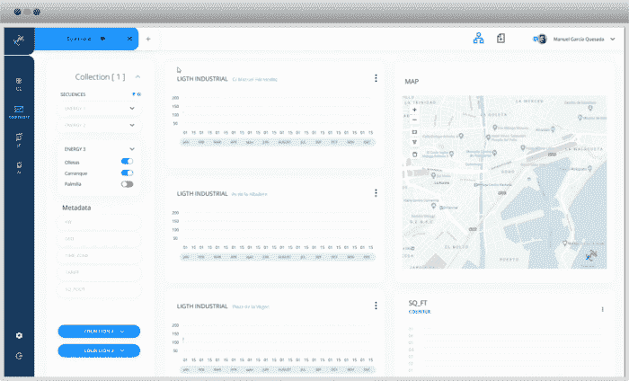

# 完美的 360°数据平台

> 原文：<https://medium.com/geekculture/the-perfect-360-data-platform-28af45bca63?source=collection_archive---------15----------------------->

## 关键特征是什么？

为了能够驾驭数据科学家或数据专家的力量，你需要为他们提供**足够的分析和机器学习**培训工具。通过提供强大、灵活且易于使用的数据平台，每个公司都有可能优化其业务流程。

如今，数据已经成为最重要的公司资产之一。它允许 It 部门提高效率、控制环境、进行预测等。因此，通过为您的数据向导提供合适的工具来利用其潜力非常重要。随着公司收集的数据量不断增加，**企业被迫开发系统，让他们能够找到最相关的见解**。

Shapelets data analytics platform

并非所有公司都能够充分利用他们的数据科学团队，因为**专业人员经常与不同的平台合作，这使得从数据中敏捷地提取结论及其沟通变得复杂。**正因如此，集中管理数据有助于专业人员使用相同的工具，避免重复工作。

为什么使用数据平台将帮助数据科学家最大限度地发挥他们的努力，并将他们引向正确的方向，这有 5 个关键原因。高效的数据科学平台需要:可扩展、协作、集成、易于使用和自主。

## 可攀登的

一个有用的平台**必须适应业务需求的发展**，数据的指数级增长，以及参与项目的不同参与者。因此，一个完美的平台必须能够支持批处理和数据流，而且能够随着时间的推移增加数据的摄取。它还应该与摄取所需的数据科学工具兼容(Hadoop、Databricks、Sparks 等)。它还应该足够灵活，以适应各种类型的数据科学家。

在一个完美的世界中，这个平台还将在不到一分钟的时间内以分布式方式将数据科学家自己的算法集成到平台中。任何主要语言都可以通过 DSL 前端添加和使用新的算法，而不管它是什么语言。每个工人可以使用他的本地库(NumPy，pandas …)，允许与现有的解决方案完全组合；使用任何他喜欢的环境。并且有一个简单的算法部署。

## 合作

对一个人来说，分析一个复杂的数据集可能很简单，但也有可能犯下危及整个项目的错误。在项目中使用协作可以减少错误的数量，此外，这也是一个用更多的信息或见解来改进模型的好机会。**在一个平台上工作的所有专业人员都有适当的权限访问所有数据、资源和平台本身，这一点很重要。**

## 综合

同样重要的是，该平台可以**适应新的资源，从而促进集成**。通过这种方式，他们将能够访问出现在市场上或来自新的学术发展的新工具，避免使用过时的工具。完美的平台应该能够读取任何地方的数据；从传感器、网络日志、网络点击流、社交媒体等获取数据流。它也可以作为围绕序列的附加数据的主要数据源。它还可以适应任何类型的新平台，以及数据科学家的偏好。

## 易用性

当开始使用一个平台时，另一个要寻找的关键因素是，它可以被快速和容易地安装和学习使用。在选择服务时，重要的是评估它可以立即使用，没有系统之间的兼容性问题，并且它的采用不会涉及重大困难。提供一个数据应用程序，为 Tableau、Qlik、SAS 和 Excel 等层级提供出版物和分析，这将有助于业务和数据分析师创建研究案例的更多可视化演示。

## 自治

为了从数据中提取价值，并在组织内无障碍地进行交流，数据科学家必须能够在有助于检测异常的平台上单独创建自动化。完美的数据平台将能够使用模式识别和异常检测来改进分析。它还会尝试使用数据之间的相关性来直观地发现输出中的任何因果关系。

总之，最好的数据科学平台应该由五个关键要素组成，这五个要素可以提高数据向导的工作效率。它将具有足够的可伸缩性，可以在很短的时间内集成越来越多的数据，同时又足够灵活，可以适应每种库类型，并具有简单的算法部署。这也将是一个协作平台，所有工作人员都可以访问数据和分析。它将是一体化的，也就是说，它将能够支持来自任何地方的任何类型的数据，并且能够容易地适应任何类型的平台。对于工作人员来说，它应该易于使用(直观地)在数据摄取过程中进行分析和导出报告。最后，它将有足够的自主权来协助工作人员检测异常情况，并对数据有全局视野。

我们希望这篇文章能帮助你找到合适的智能技术来提升你的工作水平。如果您需要任何帮助或有任何问题，**您可以在这里联系我或我们在 Shapelets** **的** [**专家团队。我们很乐意与您分享我们的经验。**](https://shapelets.io/)