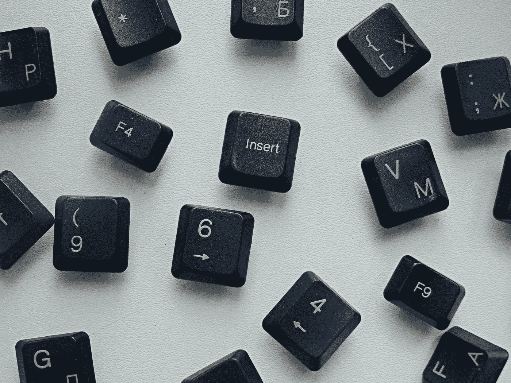

# 完美的键盘伴侣

> 原文：<https://medium.com/geekculture/the-perfect-keyboard-companion-57ad22aa015e?source=collection_archive---------14----------------------->

Photo by [Sofya](https://unsplash.com/@s_o_f_i_k?utm_source=medium&utm_medium=referral) on [Unsplash](https://unsplash.com?utm_source=medium&utm_medium=referral)

这一切都是从一个笑话开始的——一个单独的动作有一个单独的按钮不是很酷吗？是的，肯定会的。

像一个[流甲板](https://www.elgato.com/en/stream-deck)，但只有一个按钮，因此便宜很多。也没有显示器。

此外——一个人需要多少额外的按钮？

> “有趣”的故事——我用自己的钱买的第一个键盘是一个[海盗船 K50](https://thinkcomputers.org/corsair-raptor-k50-gaming-keyboard-review/) 。它有 18 个…