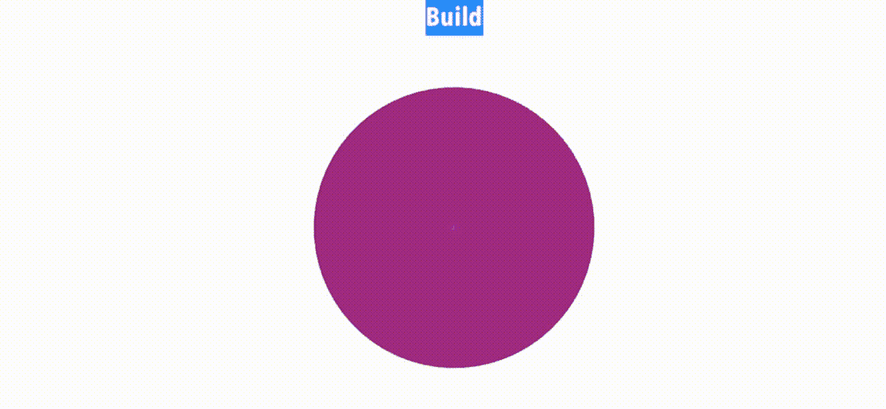

# 使用 SwiftUI 2.0 的完美饼图

> 原文：<https://medium.com/geekculture/the-perfect-pie-chart-using-swiftui-2-0-f3314d306875?source=collection_archive---------1----------------------->

## 图表系列的第 7 部分

The perfect pie using SwiftUI 2.0

当我在 SwiftUI 2.0 中写第一篇关于画饼的文章时，我的意图是保持简洁。条形图系列已经有三篇文章了，我想更快地找到解决方案。但我错了——画馅饼伴随着冲突的泥潭。它肯定不是一块馅饼。这是第四版。哪些有效，哪些无效，以及…