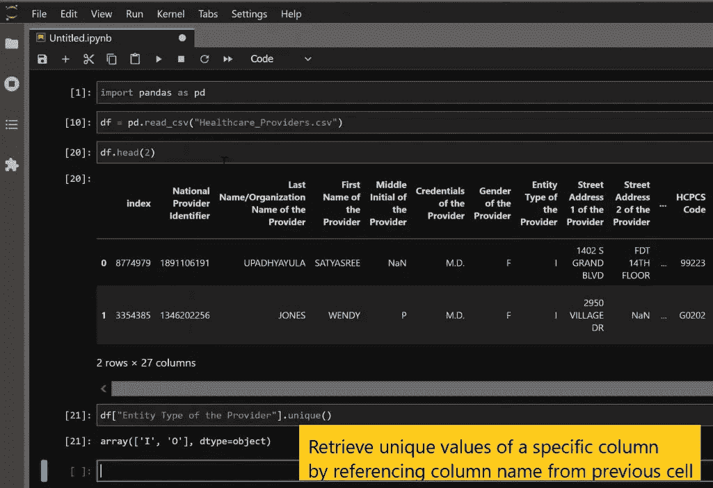
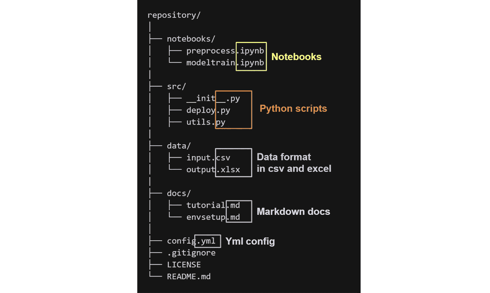
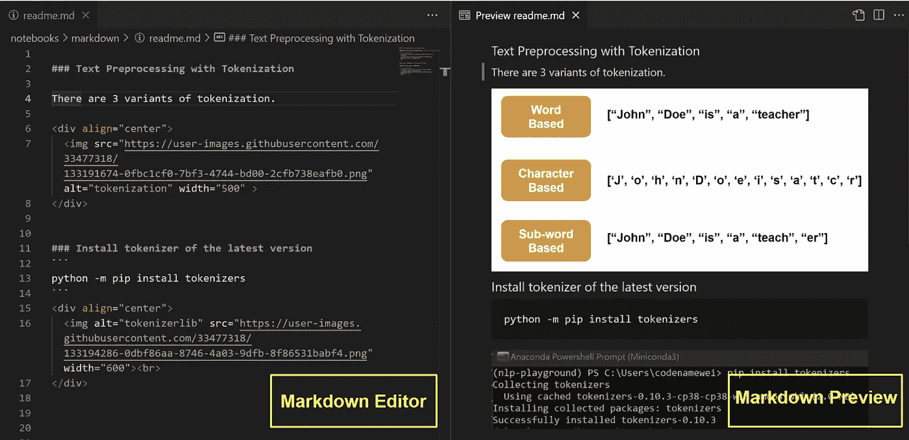
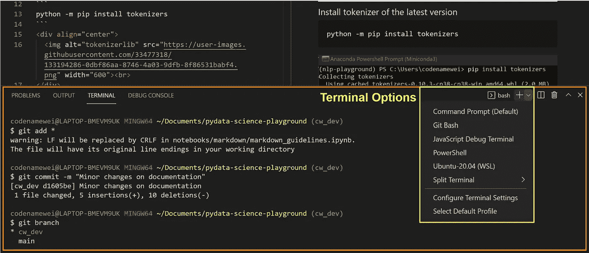
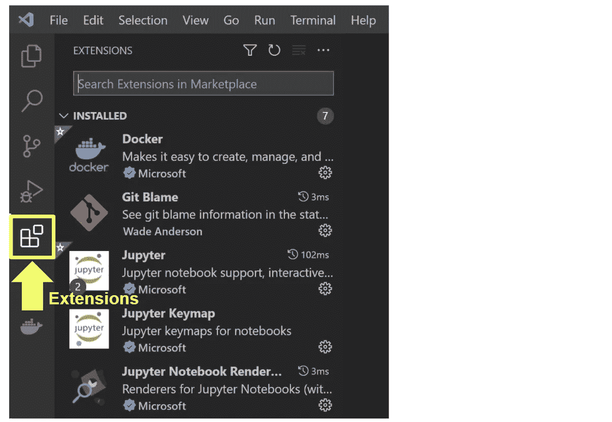
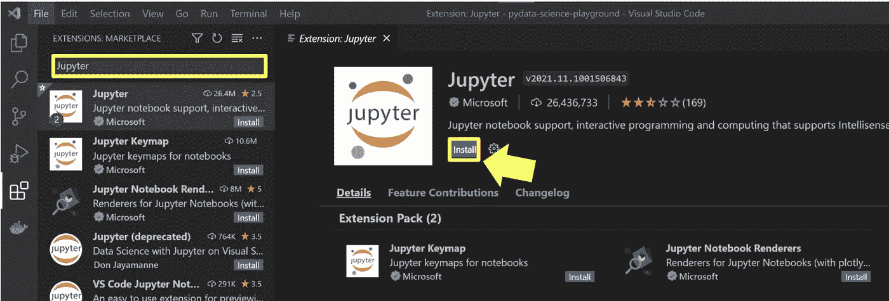
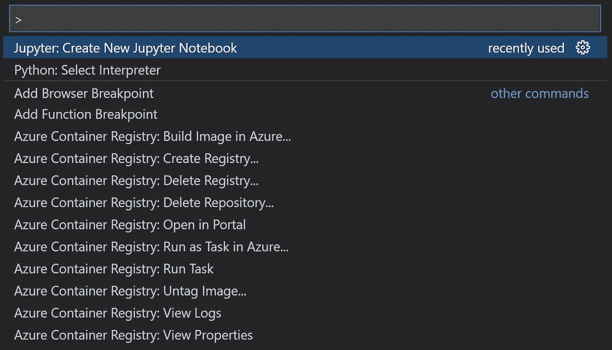
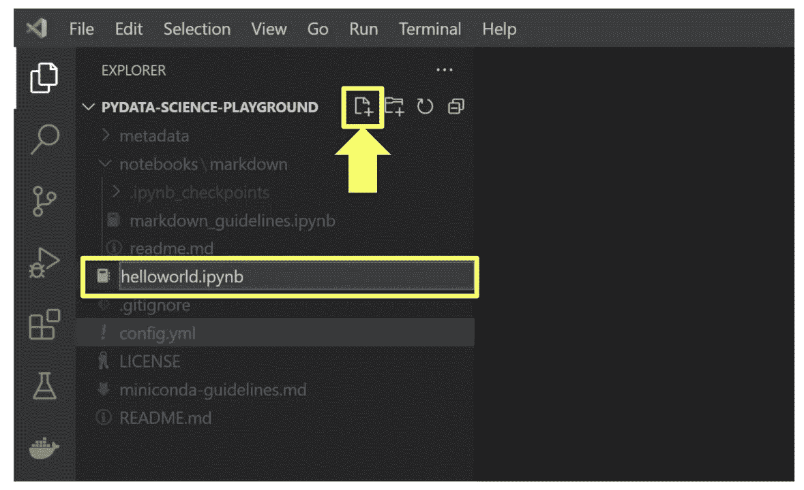
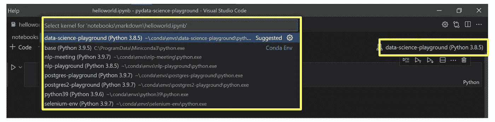
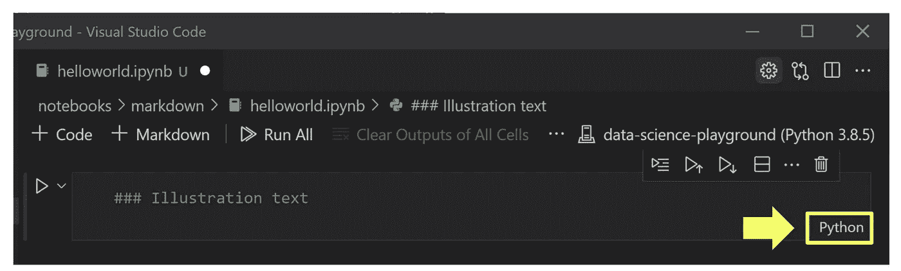

# 在 VS 代码中使用 Jupyter Notebook 的好处

> 原文：<https://medium.com/geekculture/the-perks-of-using-jupyter-notebook-in-vs-code-c68c6a022a9e?source=collection_archive---------14----------------------->

为什么以及如何在 VS 代码中使用 Jupyter 笔记本

Photo by the author.

众所周知，Jupyter Notebook 是数据科学领域的首选 IDE。Jupyter 的单元特性允许即时运行代码片段块和输出清单。

Photo by the author

它与数据分析操作的本质配合得天衣无缝，特别是在后续代码行高度依赖于当前单元格输出的情况下。

虽然使用 Jupyter Notebook 本身就很棒，但是在带有 Jupyter 扩展的 VS 代码中使用时，这些特性可以得到极大的增强。

## 为什么要在 VS 代码中使用 Jupyter 笔记本？

1.  **浅薄的学习曲线**

首先，开发人员在代码开发的某个阶段使用了 VS 代码。因此，在 VS 代码中开始使用 Jupyter 笔记本有一个非常浅的学习曲线。

Photo by the author

**2。在不同格式的文件之间无缝切换**

Photo by the author

通常，项目文件夹包含不同格式的文件。比如 python 笔记本(。ipynb)用于数据分析和建模步骤，而原生 python 脚本(。py)是部署模型时的首选。更不用说还有 CSV 或 excel 形式的数据输入和输出源。

通过将 VS Code 设置为 go-to-workspace，可以轻松地在文件之间切换。随后，编辑每个文件可以与根据文件格式呈现的优化视图并行进行。VS 代码尤其适用于 markdown 文件，如下所示。

Photo by the author

**3。VS 代码中的内置端子**

在 VS 代码中打开终端的能力特别有用。有了这个特性，人们可以在同一个界面中运行 git 操作和其他基于文本的命令。

Photo by the author

这真实地展示了 VS 代码中的强大特性，允许在一个一体化平台中执行日常操作。

## 如何在 VS 代码中使用 Jupyter 笔记本？

由于 Jupyter 在 VS 代码中的布局与原生 web 浏览器不同，本节介绍了 4 个基本功能，以确保 Jupyter Notebook 在 VS 代码中易于采用。

*   安装 Jupyter 扩展
*   创建 Jupyter 笔记本
*   改变康达环境
*   更改单元格类型

## **安装 Jupyter 延伸件**

Jupyter 扩展的安装在 IDE 中提供了笔记本支持。

1.  运行 VS 代码，打开扩展视图

*   单击活动栏中的扩展图标，或者

Photo by the author

*   使用快捷键(Ctrl+Shift+X)

2.用关键字 **Jupyter** 搜索并安装列表中的第一个选项。

Photo by the author

## **创建 Jupyter 笔记本**

创建新的 Jupyter 笔记本有两种方法。

*   用快捷键(Ctrl + Shift + P)打开命令选项板。搜索 **Jupyter:创建新的 Jupyter 笔记本**

Photo by the author

*   点击新文件图标，以*结尾命名新文件。ipynb* 扩展

Photo by the author

## 3.改变康达环境

要为笔记本电脑选择 Conda 虚拟环境，只需点击右上角的环境选项卡。随后，从 Conda 环境下拉列表中选择所需的环境。

Photo by the author

请注意，这个步骤是在 VS 代码中打开笔记本的情况下执行的。

## 4.更改单元格类型

要更改任何单元格的单元格类型，只需单击位于单元格右下角的选项卡。将出现一个单元格类型下拉列表供选择。

Photo by the author

这里介绍一下在 VS 代码中使用 Jupyter 笔记本最基本的操作。这 4 个功能足以满足大多数日常使用。

查看 [VS 代码文档](https://code.visualstudio.com/docs/datascience/jupyter-notebooks)了解其他功能。

请注意，需要一些时间来熟悉这个界面。如果用户一直在原生浏览器中使用 Jupyter notebook，情况尤其如此。然而，学习应该不会有什么大的困难，可以通过频繁的使用来提高。

感谢阅读！我希望你通过这个设置体验到生产力的提升！