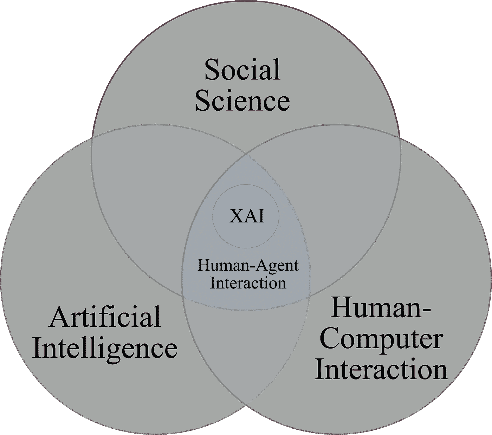
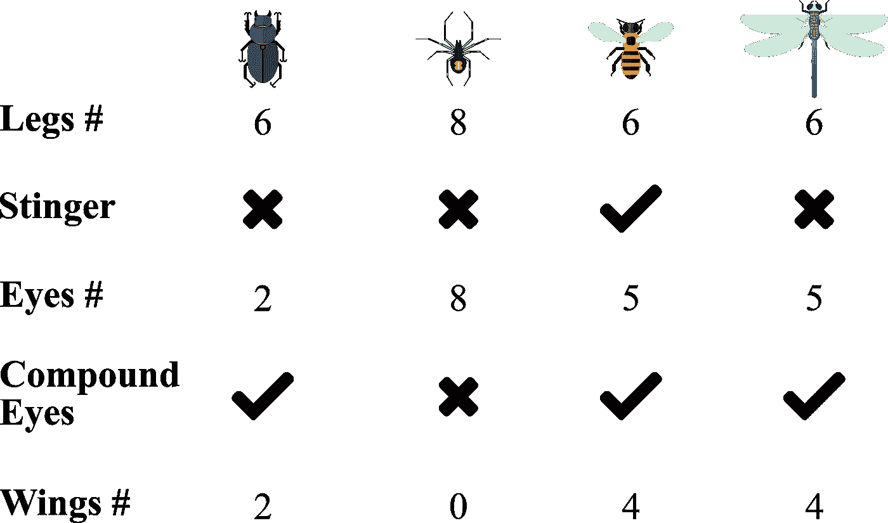

# 人工智能可解释性背后的哲学

> 原文：<https://medium.com/geekculture/the-philosophy-behind-ai-explainability-a774d084bbc3?source=collection_archive---------16----------------------->

社会和哲学范式如何塑造人工智能的解释期望

*Cogito，ergo sum。* *我认为。故我在。这句话被末日预言家用来警告有一天先进的人工智能会把我们踩在它开明的强大脚下。关于人工智能及其智能，以及它如何超越我们人类，有一场激烈的辩论。这些信念源于各种哲学流派和争论。虽然类人机器人奴役我们的风险似乎有些牵强(就目前而言)，但让我带你看看驱动其可解释性的哲学。我之前谈到过[如何使用关系和功能来解释一个训练好的模型](/geekculture/explaining-a-trained-model-d750c70b60a8)；以及[如何与任何与人工智能代理](/geekculture/why-ai-systems-owe-you-an-explanation-16496ae52efb)互动过的人相关。*

当我们谈论可解释的人工智能(XAI)时，它不仅仅局限于一个代理揭示其潜在原因或另一个代理的决定。**XAI 的解决方案更多的是一个人-代理交互问题。我们在维恩图中看到的是社会和哲学方面对人工智能解决方案的影响，以及我们与它的互动。**

Image redrawn by the author

XAI 试图解释为什么某个观察或事件会发生。用户无法理解模型观察到的行为或决策，除非他们知道决策的基础。假设一个训练有素的模型可以根据眼睛、腿、翅膀的数量以及复眼和刺的存在等特征准确标记节肢动物的图像。

Image redrawn by the author | Insects icons by [freepik.com](http://freepik.com)

现在你作为一个用户想通过一个解释代理来理解标签行为，让我们称之为 EA。想象一下你和 EA 之间的如下解说对话:

> 你:为什么测试图片 IMG_1.jpg 标注为*蜘蛛*而不是*甲虫*？
> 
> EA:因为 IMG_1.jpg 中的节肢动物有 8 条腿，符合类别*蜘蛛*。
> 
> 你:为什么推断 IMG_1.jpg 里的节肢动物有 8 条腿而不是 6 条？
> 
> EA:模型计算了图像上高亮显示的腿的数量。*(见此处**[*)*](/geekculture/explaining-a-trained-model-d750c70b60a8)*
> 
> 你:模型怎么知道蜘蛛有 8 条腿？
> 
> EA:因为在它被训练的训练集中，几乎所有有 8 条腿的动物都被贴上了*蜘蛛*的标签。
> 
> 你:但是章鱼也可以有八条腿。为什么没有把 IMG_1.jpg 归类为章鱼？
> 
> EA:因为模型的作用只是对节肢动物进行分类。

因此，可解释的人工智能不仅仅是联想和原因的呈现。它是由基于解释者选择关注的事实的背景需求驱动的。在这里，经过训练的模型关注于腿的数量和其他支持属性。但是输出结果也依赖于必须对节肢动物进行分类的背景，而不是所有类型的多足动物。让我们这样说吧，安德鲁为什么打碎玻璃盘子？答案可能是积极的情绪，他是一个犹太新郎。或者这可能是一个消极的场景，安德鲁是一个糟糕的餐馆洗碗工。因此，背景是 XAI 的一个重要因素。

语境的重要性给我们带来了一个有趣的概念**对比解释**。正如我们在安德鲁的案例中看到的，解释是“利益相关”。我们提出*为什么*的问题，并得到更好解释的答案。因此，对事件进行对比分析可以更好地显示出相关性。对比分析由预期事件和未发生的对比事件组成，后者被称为衬托事件。安德鲁打碎盘子是一个期望的事件，而箔片可以包括安德鲁原封不动地离开盘子，或者打碎一个杯子。衬托可被视为通过为 *why* 问题添加结构来增加解释重点的一种方式。一个事实通常不够具体:我们还需要指定一个陪衬。此外，解释与一个箔相关的事实的原因通常不会解释与另一个箔相关的事实。这就限制了解释原因。例如，为什么树叶在 11 月变黄而不是在 1 月变黄会从箔片中引出不同的解释，而不是为什么树叶在 11 月变黄而不是变蓝。在 XAI 的上下文中，箔是数据集中相对于被解释的一些例子的其他(真实的或合成的)例子；记得章鱼吗？

所以现在我们可以做出关于可解释哲学的第一个陈述:**为什么问题是对立的**。它们被用来回应特定的反事实案例，这种案例被称为箔片。也就是说，人们不会问为什么事件 P 会发生，而是问为什么事件 P 会发生而不是某个事件 q。这对 XAI 有着重要的社会和计算意义。

说到选择解释背后的基本原理，可以说观察 x 的原因可能有 x 的解释那么多。考虑一个人由于在转弯处出现一棵高大的灌木而发生的不幸事故。受害者的死因会被医生写成“多次出血”。代表受害者家庭起诉市政府的律师会将其称为“维修部门的疏忽”，而事故中的另一方，即马车制造商，会将其称为“刹车锁结构的缺陷”。所有这些陈述都是真实的，但是这个问题的特殊背景使得一些解释比其他的更有意义。因此，我们来到关于可解释哲学的第二个陈述:**解释是以一种有偏见的方式选择的。**

解释中有三种类型的认知过程:

*   因果联系，这是人们用来识别事件原因的过程。
*   解释选择，这是人们用来选择一小部分已识别原因作为解释的过程。
*   讲解评估，即用户如何评估讲解质量的过程。

大多数研究表明**人们有一定的认知偏差，这是由他们的信念或角色引起的，他们应用于解释的产生、选择和评估。**

解释过程并不仅仅停留在选择一个解释，而是将它视为两个角色之间的互动:解释者和被解释者(有时同一个人/代理人扮演两个角色)，并且有某些规则来管理这种互动。为了以一种可理解的形式给出一个解释，它应该具有以下特性:

*   信息应该是高质量的。一个高质量的解释不会说那些被认为是错误的事情，也不会说那些证据充分的事情。
*   解释应该提供正确的信息量。也就是说，根据需要提供信息；并且不会使它比所需的信息更多。现在，我们不讨厌推荐者给出的压倒性结果吗？
*   解释应该是相关的。
*   避免晦涩、模糊和混乱。

这些特性已经被可解释哲学的第三个陈述所概括:**因果解释首先是一种社会互动的形式，因此受制于对话规则**。

来源:

*   [人工智能的解释:来自社会科学的见解](https://www.sciencedirect.com/science/article/abs/pii/S0004370218305988)
*   [谷歌云人工智能解释白皮书](https://cerre.eu/wp-content/uploads/2020/07/ai_explainability_whitepaper_google.pdf)