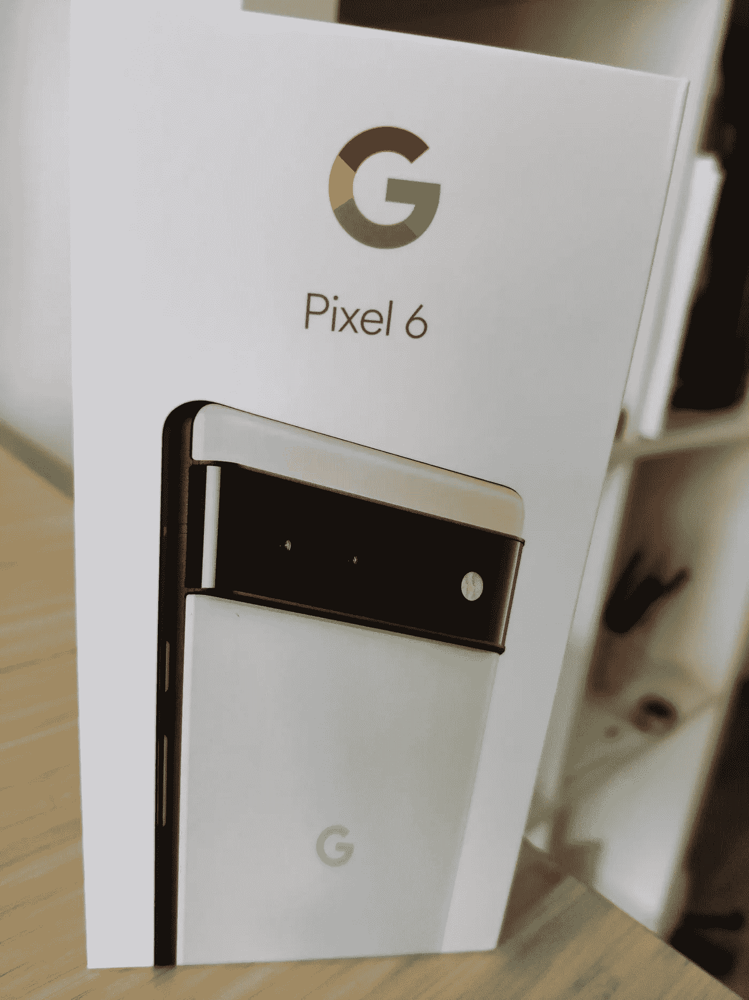

# 像素 6。去谷歌还是不去谷歌？

> 原文：<https://medium.com/geekculture/the-pixel-6-to-google-or-not-to-google-f3938b718f57?source=collection_archive---------7----------------------->

The Pixel 6 box

我是那些拥有独一无二的基本电话的罕见的疯狂的人之一。我很喜欢。它的尺寸对我来说刚刚好，没有过多的商标，几乎是纯 Android，并且是大多数人想知道它是什么的谈话的开始。但我是一个毫无顾忌的书呆子，不喜欢拥有一部不再受支持的手机，尽管我尽了最大努力，我还是无法让[linegeos](https://lineageos.org/)工作。我买了一辆[一加](https://www.gsmarena.com/oneplus_nord-10289.php) …