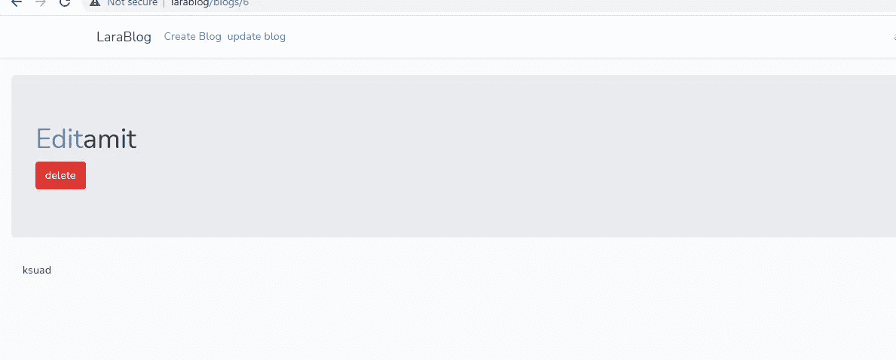

# 此路由不支持 POST 方法。支持的方法:删除。

> 原文：<https://medium.com/geekculture/the-post-method-is-not-supported-for-this-route-supported-methods-delete-c27ad7a18d33?source=collection_archive---------5----------------------->

当我单击“删除”按钮时，它显示此路由支持的方法删除不支持 Post 方法。

让我们去解决这个错误。

1 步骤转到您的刀片页面并添加此方法

```
{{ method_field('delete')}}
```



现在删除功能工作正常。