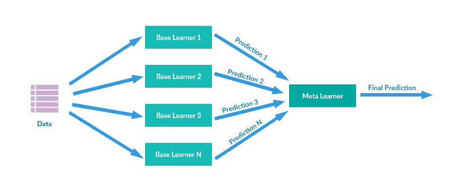
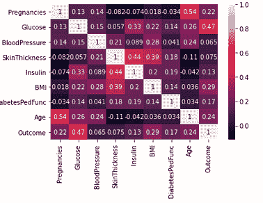
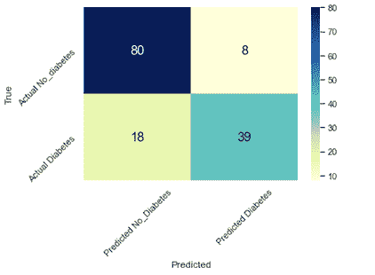

# 合奏的力量

> 原文：<https://medium.com/geekculture/the-power-of-ensemble-96cd2621c2de?source=collection_archive---------60----------------------->

Ensemble Machine Learning

【如何在 Python 中的机器学习中使用集成方法】

# 介绍

*   在监督学习中，有许多不同的方法来帮助预测结果，例如线性或逻辑回归、k-最近邻、随机森林等等。它们通常在准确预测群体中不同的数据点方面表现最佳。如果您能够构建一个模型，将这些方法结合起来以获得更高的准确度或精确度，那就更好了。这被称为系综法。
*   *监督学习适用于广泛的预测领域，包括公共卫生、市场营销和经济。*
*   *在本帖中，我们将展示如何使用机器学习为皮马土著美国人建立糖尿病预测模型，以及集成学习如何改善预测。*

什么是集成学习，为什么它很重要？

*集成学习是指将多种预测技术集成在一起，以建立更准确的预测模型。*

# 糖尿病(结局)和其他变量之间有什么明显的关系吗？

*初步检查表明目标变量(结果)和其他几个变量之间的相关性/关系较弱。测量的 2 个最强的相关性是预期的，1)怀孕和年龄，以及 2)葡萄糖浓度和结果(糖尿病)。*

Correlation Matrix for Variables in Diabetes Dataset

# 我们能建立一个集合方法来预测皮马土著美国人是否会患糖尿病吗？

集成是将多个监督学习组合(集成)起来，以建立一个比单个模型更准确的机器学习模型。

集合导致模型具有 82%的精确度和 82%的准确度。

Confusion Matrix for True and Predicted Outcomes for Diabetes

# 关闭

*集成不同的监督学习技术导致比使用任何一种监督学习技术更准确的预测。*

# 行动号召

*此处提供了用于此分析的 Jupyter 笔记本全文*[*https://github.com/NZRufus/Pima-Indians-Diabetes*](https://github.com/NZRufus/Pima-Indians-Diabetes)

*关于 Ensemble 的更多信息，这里有一些有用的链接*[*https://www . data camp . com/community/tutorials/Ensemble-learning-python*](https://www.datacamp.com/community/tutorials/ensemble-learning-python)*，*

[*https://machinelingmastery . com/ensemble-machine-learning-algorithms-python-scikit-learn/*](https://machinelearningmastery.com/ensemble-machine-learning-algorithms-python-scikit-learn/)*，*[*https://www.geeksforgeeks.org/ensemble-methods-in-python/*](https://www.geeksforgeeks.org/ensemble-methods-in-python/)