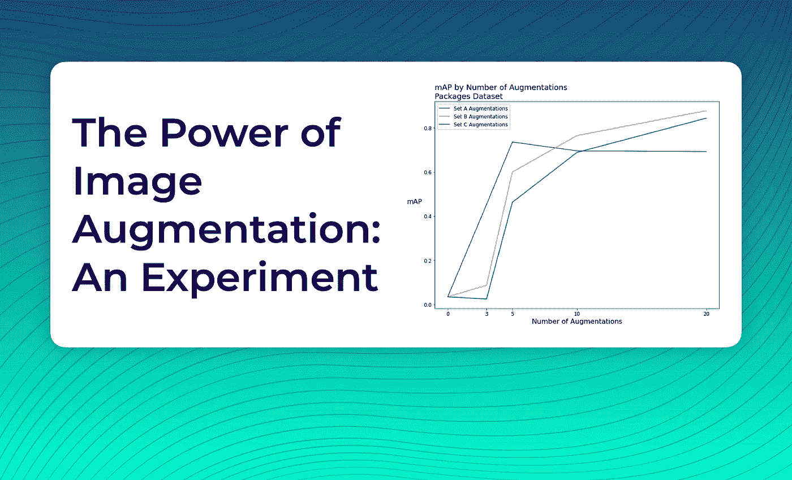
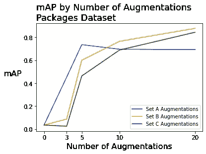
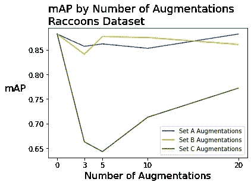
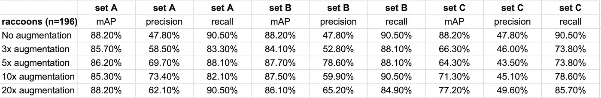
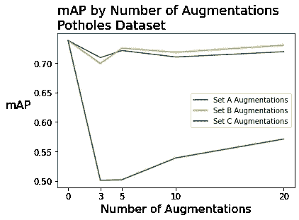
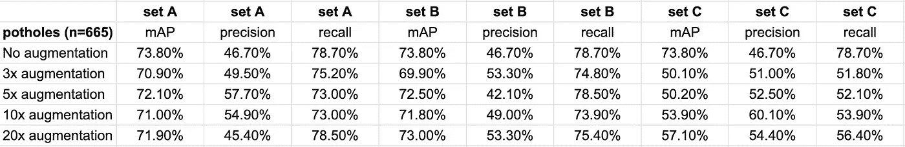

# 图像增强的力量:一个实验

> 原文：<https://medium.com/geekculture/the-power-of-image-augmentation-an-experiment-1c93084ff96c?source=collection_archive---------31----------------------->

## 通过图像增强提高物体检测模型性能的 4 点建议

计算机视觉的惊人之处之一是使用现有图像加上随机变化来增加有效样本量。假设你有一张包含咖啡杯的照片。然后，复制照片，顺时针旋转 10 度。从你的角度来看，你做得不多。

但是你已经(很容易地)将你要给你的模型的图片数量增加了一倍！你的计算机视觉模型现在对咖啡杯的样子有了一个全新的视角。

现在，为同一个现有的咖啡杯照片制作两个版本还不如为一个咖啡杯拍摄两张不同的照片好。例如，你不应该拍摄一张照片，将其放大 10，000 倍，并根据该数据拟合一个对象检测模型，然后期望你的模型表现得像你拍摄了 10，000 张咖啡杯的真实照片一样好。图像增强有一些限制。

也就是说，图像增强是一种从现有数据生成新数据的非常强大的技术。使用 [Roboflow](https://roboflow.com/) 的一个巨大好处是，你只需点击一个按钮就可以做到这一点！

**图像增强到底有多强大？我决定做一个小实验。我研究了模型性能如何基于三个不同的维度变化:原始数据集的大小、扩充的类型和扩充的数量。**

# 原始数据集的大小

我从[public.roboflow.com](https://public.roboflow.com)选择了三个[公共图像数据集](http://public.roboflow.com/)。(您现在就可以自己使用这些数据集！)

*   一个[包裹数据集](https://public.roboflow.com/object-detection/packages-dataset)，由位于公寓和住宅门口附近的 26 个包裹图像组成。
*   一个[浣熊数据集](https://public.roboflow.com/object-detection/raccoon)，由 196 张浣熊图片组成。
*   一个[坑洞数据集](https://public.roboflow.com/object-detection/pothole)，由 665 幅道路坑洞图像组成。

# 增强类型

在文章的开始，我使用旋转作为一个示例增强:复制一个图像，并将其旋转 10 度。然而，有许多不同类型的[图像增强技术](https://docs.roboflow.com/image-transformations/image-augmentation)！我将我探索的增强类型分为三组。(*为什么把增强分解成集合？嗯，Roboflow 让你可以应用* [*多达 23 种不同的增强技术*](https://docs.roboflow.com/image-transformations/image-augmentation) *！对这些进行彻底的搜索需要很长时间。*)

## 设置 A:随机旋转，随机裁剪，随机噪声

*   [随机旋转](https://blog.roboflow.com/why-and-how-to-implement-random-rotate-data-augmentation/):对于每次放大，我随机将每张图片逆时针或顺时针旋转 10 度。
*   [随机裁剪](https://blog.roboflow.com/why-and-how-to-implement-random-crop-data-augmentation/):对于每次放大，我随机裁剪每张图片，最多 20%。你可以认为这是在放大图像。
*   [随机噪声](https://blog.roboflow.com/why-to-add-noise-to-images-for-machine-learning/):对于每一次放大，我都在图像的 10%像素中随机添加了黑色或白色像素。看起来好像我在图像上撒了盐和胡椒，这有助于抵御恶意攻击并防止过度拟合。

## 设置 B:随机亮度，随机模糊，随机剪切，加上所有“设置 A”的增强

*   随机亮度:对于每一次增强，我随机地使图像变亮或变暗 30%。对于一个图像来说，这几乎就像是如果太阳真的很亮，或者如果它是一个真正的阴天。
*   [随机模糊](https://blog.roboflow.com/using-blur-in-computer-vision-preprocessing/):对于每一次增强，我都添加了高达 1.75 像素的随机高斯模糊，这可以模拟相机移动，就像你在车上拍照一样。
*   随机剪切:对于每次放大，我在图像上添加了 5 个随机放置的黑盒，最多占图像的 15%。这复制了遮挡，其中感兴趣的对象被摄像机视图中的另一个对象遮挡。

## 集合 C: [边界框级别的](https://blog.roboflow.com/introducing-bounding-box-level-augmentations/)旋转、边界框级别的裁剪和边界框级别的亮度，以及所有“集合 A”和“集合 B”的增强。

[边界框级增强](https://docs.roboflow.com/image-transformations/image-augmentation/bounding-box-level-augmentation)类似于常规的图像增强，除了不是整个图像改变(这是图像增强所发生的)，只有边界框中的区域变化受这些影响。它们是由一篇 [2019 年谷歌研究论文](https://arxiv.org/pdf/1906.11172.pdf)推广的。

*   随机边界框级别的旋转:对于每个增强，我随机地将每个边界框中的内容逆时针或顺时针旋转 10 度。
*   随机边界框级别的裁剪:对于每个增强，我随机裁剪每个边界框中的内容，最多 20%。
*   随机边界框级别的亮度:对于每一次增强，我将图像的边界框区域随机增亮或变暗 30%。

# 扩增次数

对于每一张图片，我们将它放大(复制并添加随机变化)一定的次数。我们想了解的主要问题之一是，增强的数量如何影响模型性能？

对于每个数据集，我们通过将每个图像增强一定次数来构建增强数据集，然后在每个增强数据集上拟合模型。

*   **0x 增强** —这只是没有增强的常规数据集
*   **3 倍放大**——每幅图像在随机扰动下复制 3 次
*   **5 倍增强**
*   **10 倍放大**
*   **20 倍放大**

# 衡量绩效

我们通过查看对象检测中的三个常见指标来衡量性能:

*   [平均精度](https://blog.roboflow.com/mean-average-precision/)(地图):黄金标准度量。地图范围从 0%到 100%。您的贴图越接近 100%，您的模型执行得越好。
*   [Precision](https://blog.roboflow.com/glossary/#:~:text=Precision%20-%20A) :不要和 mean 平均精度混淆，Precision(也叫阳性预测值)计算的是正确预测的对象数除以模型预测的对象总数。例如，如果一个模型预测数据集上有 10 个对象，并且其中 8 个预测是正确的，那么我们的模型在该数据集上有 80%的精度分数。
*   [Recall](https://blog.roboflow.com/glossary/#:~:text=Recall%20-%20A) :也叫灵敏度，Recall 计算的是正确预测对象的数量除以数据中“地面真实”对象的总数。例如，如果模型预测数据集中有 20 个对象，而我们的模型正确地检测到其中的 8 个对象，那么我们的模型在该数据集上的召回分数为 40% (8/20)。

# 结果

## 包数据集

当在 packages 数据集(有 26 个源图像)上拟合模型时，在扩充图像之前，mAP 非常低-潜在的 100%中的 3.5%。应用增强技术显著增加了地图高达 80 个百分点。

Evaluating mAP by number of augmentations on the packages dataset.

我们看到精确度和召回率也有类似的提高，从零增加的 0%提高到 70%或 80%以上。下面是包数据集的 mAP、precision 和 recall 分数的完整表格。

Calculating mAP, precision, and recall by number of augmentations on the packages dataset.

## 浣熊数据集

当在浣熊数据集(具有 196 幅源图像)上拟合模型时，在零增强的情况下，平均精度高于 88%。在这种情况下，增强的效果各不相同！

Evaluating mAP by number of augmentations on the raccoons dataset.

非边界框级别的增强对 mAP 没有显著影响，但在精度方面有显著提高(高达 20 或 30 个百分点)。

Calculating mAP, precision, and recall by number of augmentations on the raccoons dataset.

包围盒级别的增强对地图和回忆有显著的负面影响。

## 坑洞数据集

当在 potholes 数据集(有 665 幅源图像)上拟合模型时，地图开始时大约有 74%没有放大。

Evaluating mAP by number of augmentations on the potholes dataset.

在扩充了 potholes 数据集之后，我们看到了类似于 raccoons 数据集的性能效果。浣熊和坑洞数据集的源影像(分别为 196 和 665)明显多于包数据集(26 张影像)。

Calculating mAP, precision, and recall by number of augmentations on the potholes dataset.

# 外卖食品

*   **扩充的积极效果似乎在小样本数据集上最为明显。**这真是一个好消息:即使您的数据集非常小，图像增强也可以帮助您的模型表现得相当好！有 26 张图片的软件包数据集，看到*地图通过增强*提高了 80 多个百分点！
*   如果你要做扩张，做更多的扩张！虽然有 3 到 5 次强化是有帮助的，但如果你增加强化次数，你通常会看到好处。例如，20 倍放大的地图总是比 3 倍放大的地图高，这对于精确度和召回率来说几乎总是正确的。
*   更多类型的增强并不总是更好。包围盒级增强技术在与非包围盒级增强技术结合使用时，通常会对模型性能产生负面影响。主题专业知识和[知道在给定场景中应用哪种类型的增强](https://blog.roboflow.com/tag/augmentation/)非常重要！
*   **增强不是魔法。**这不像“增强使事情变得更好”那么简单在很多情况下(样本量已经很大了)，零放大比放大图像更好。这可能归结为数据集中的特定图像或所选的特定增强类型。计算机视觉不是一门完美的科学，但也是一门艺术。

请注意，每个数据集只包含一个类(分别为包裹、浣熊和坑洞)。在对象检测问题中，情况并不总是这样——例如，门可以在 packages 数据集中进行标记，因此我们将“packages”和“doors”作为两个独立的类包含在内。

**那么，为什么我们只研究了单类物体检测问题呢？**嗯，我已经在这里比较了很多变量(原始数据集的大小、扩充的数量、扩充的类型)，所以我选择不*也不*探究扩充的数量如何影响类的数量。

为了让你的模型更加生动，考虑使用[迁移学习](https://blog.roboflow.com/a-primer-on-transfer-learning/)和我们在这篇文章中没有探讨的增强类型。

*原载于 2021 年 5 月 3 日 https://blog.roboflow.com***。**