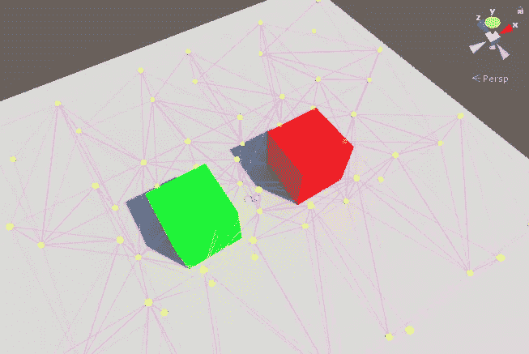
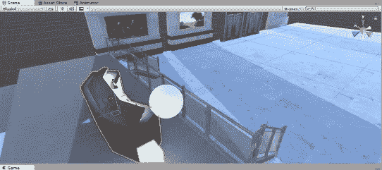

# 光在统一中探测的力量！

> 原文：<https://medium.com/geekculture/the-power-of-light-probes-in-unity-98069b5190bb?source=collection_archive---------44----------------------->

在 Unity 中，照明被“烘焙”以存储关于光源如何击中场景中静态对象的信息。这允许投射阴影。但是在游戏中，我们经常会看到一些动态的物体，我们希望它们对我们的光源做出反应。

一种最不密集但有效的方法是使用 Unity 的内置**光探头。**

光探头允许我们存储一系列可以存储照明数据的位置，然后在物体穿过该区域时创建阴影。

一个**光探测器组**需要被编辑以覆盖所有可能的区域，其中光源可以与场景中的动态对象发生反应。这是用上图中的一系列黄色点和粉色线完成的。

此外，**发射数据**也可用于产生**光探头**与之互动的“假”光源。这可以允许来自游戏中的计算机屏幕的多种照明效果，而无需创建多个密集的光源。

The emission data of both the cube and the desk are effecting the lighting of the sphere.