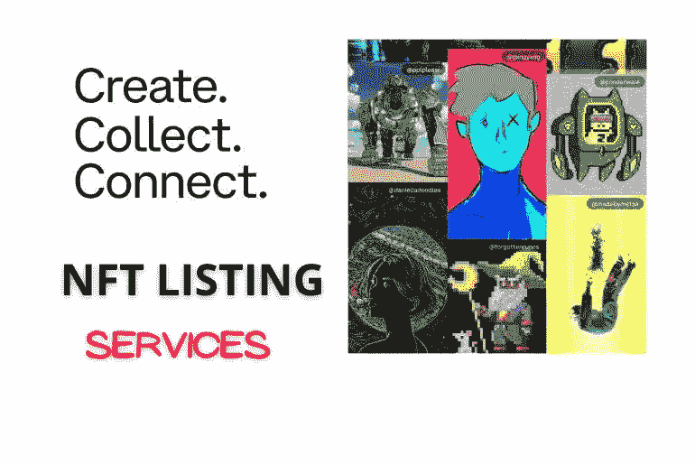

# NFT 上市服务的力量在产生野生到达！

> 原文：<https://medium.com/geekculture/the-power-of-nft-listing-services-in-generating-wild-reach-56a27133e81b?source=collection_archive---------23----------------------->

从他们迄今所展示的潜力来看，N **FT** 已经成为 Web3 空间的增强元素，尽管更多的元素还在后面。这些代币为来自各行各业的有才华的人打开了闸门，这些人以前被认为是不可行的职业选择。**艺术家、音乐家、摄影师、**甚至**游戏玩家**已经收获了非功能性技术所能提供的早期好处。他们可以在各种 NFT 市场平台上创建和销售他们的创意产品。这就是一个 [**NFT 列表服务提供商**](https://bit.ly/3CMAubo) 在决定这些项目的覆盖范围方面发挥作用的地方。

# NFT 上市服务:必要性

NFT 上市服务是由独家代理机构提供的，这些代理机构将非专利技术上市到受欢迎的 NFT 市场平台上进行销售。虽然这对于一个局外人来说听起来很容易，但有一些错综复杂的事情可以增强 NFT 系列在创收和社区参与方面的表现。随着 NFT 空间的不断发展，内容会不时发生变化(或者更新)，这就需要与 NFT 上市相关的服务。对于那些想利用 NFTs 潜力的非技术型创作者来说，这是一种解脱。

**NFT Minting**

# NFT 上市是如何发生的？

**✪** 你应该首先在 NFT 市场创建或铸造 NFT 资产。您可以将它们添加到现有收藏中(如果有)或创建一个新收藏。选择一个最适合你需求的 NFT 市场，因为这里有通用的资产出售平台和利基市场。

**✪** 在这里，你可以根据自己的文件规格，制作任何格式的 NFT，包括 **JPG、PNG、GIF、MP4** 和 **MP3** 。您还应该提供 NFT 资产的详细信息，包括销售类型(固定价格或拍卖)。

**✪**[**如果你想把你的 NFT**](https://bit.ly/3KwsNs2) 细分成多个部分，制作你的 NFT 的副本形成一个收藏，并指定二次销售的版税，你也可以选择。****

******✪** 现在，从市场平台上列出管理适度的非功能性交易。管理员将检查多种因素的 NFT，并让他们在他们的平台上公开销售。****

****请注意，您可能需要支付铸造和在几个 NFT 市场上市的费用。这些费用是在区块链注册 NFT 时应支付的区块链交易费(更好理解为“Gas”)之外的费用。****

# ****创造者列出他们的非功能性食物的顶级 NFT 市场****

****➡ **OpenSea** 允许在它的平台上铸造和交易各种风格的 NFT 收藏。****

****➡ **Rarible** 允许不同种类的 NFT 在多个区块链上铸造和交易。****

****➡ **SuperRare** 让天才艺术家能够将他们的 NFT 艺术品卖给收藏家。****

****➡ **基金会**专注于为拥有英俊皇室特征的艺术家带来机会。****

****➡ **Nifty Gateway** 是一家策划的数字画廊，以出售流行的非功能性网络艺术创作者的作品而闻名****

****➡皇家音乐公司是一个音乐人的 NFT 市场，允许他们出售 NFT 歌曲，为买家提供部分所有权。****

****➡ **魔法伊甸园**是索拉纳星球上一个受欢迎的非功能性食物市场，允许出售非功能性食物。****

# ****结论****

****好吧，如果你已经读到这里，并且你是一个渴望通过出售 NFTs 在生活中做大的创造者，这是一个完美的机会。是的，尽管隐秘的冬天可能很快结束，但这是一个机会。[**专业的 NFT 列表服务提供商**](https://bit.ly/3CMAubo) 可以帮助你让你的创意作品为 NFT 收藏界所知。即使你对上市 NFT 有所顾虑，这些机构的专家可以提供最佳的解决方案，以确保你最大限度地利用你独特的创意作品。****