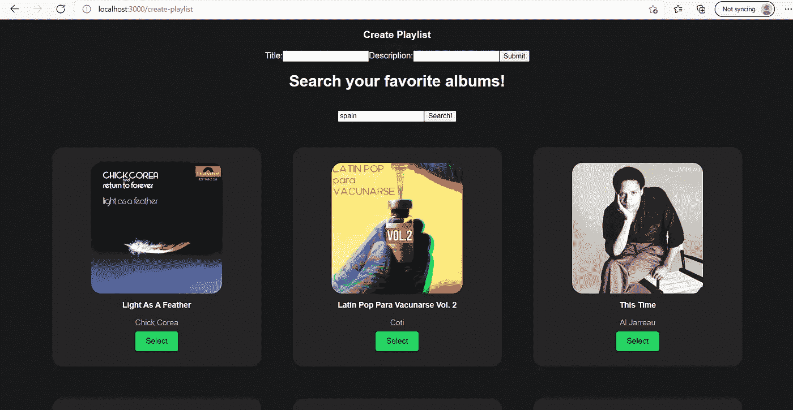
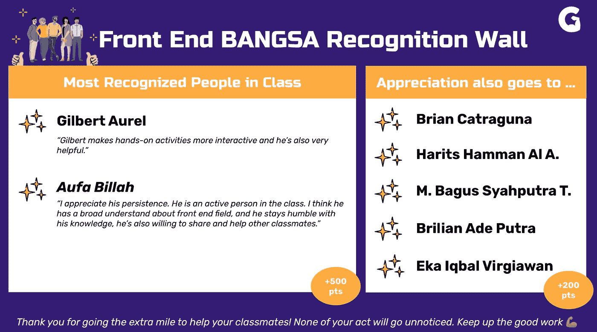

# 乐观的力量

> 原文：<https://medium.com/geekculture/the-power-of-optimisim-93580e58a2ac?source=collection_archive---------25----------------------->

你好！带着我和我的博客再次回到这里！距离我写第一篇博客已经两周了。今天，我想分享我在 Generasi Gigih 的前端工程之旅。我已经进入 Generasi Gigih 的中级阶段 4 周了，在这里，我们从周一到周五接受技术课程和 Cakap 英语课程的培训，Cakap 是一家英语在线课程提供商。

自从我报名参加 Generasi Gigih 以来，我实际上同时承担了很多责任，这真是一次过山车之旅。然而，我真的很高兴我能完成我的日常目标，比如参加所有的课程，完成所有的家庭作业，还有其他的日常目标，比如完成我的本科论文和实习工作。好消息是这周我终于要做我的本科论文研讨会了！真的很高兴我终于可以完成它了。

在我的 Generasi Gigih 之旅中，我接触到了许多可以应用到我的前端应用程序的 React 概念和技术。从第三周开始，我真的感觉到自己被扇了一巴掌，因为这比我想象的前两周要困难得多！从第三个开始，我被介绍了网络概念，我认为这些概念并不复杂，因为在课堂上我们只是在 [Giphy Web API](https://developers.giphy.com/docs/api#quick-start-guide) 上练习，它不需要很多授权协议，因为我们只是将 API 键放在请求参数上。然而，从第三周的作业开始，我们被分配将我们的应用程序连接到 [Spotify Web API](https://developer.spotify.com/documentation/web-api/) ！老实说，这对我来说是一个非常具有挑战性的任务，因为授权流程对我来说是复杂的和新的，因为我以前从未实现过这种授权。因此，我不得不从 Spotify 提供的文档中学习，我的好朋友们也给了我很多帮助！经过数小时的工作和调试，这是我目前的结果:

My Spotify Front End App

到第四周结束时，我能够创建一个 Spotify 前端应用程序，它可以:

*   登录我的 Spotify 帐户，并重定向至创建播放列表页面
*   从 Spotify 搜索任何曲目
*   从 Spotify 中选择我喜欢的任何曲目
*   创建新的播放列表并插入所选曲目！

我觉得我花在完成每项作业上的 5-6 个小时是值得的。嗯，尽管我的应用程序中仍有一些错误，但我已经走了很长一段路来理解前端工程的概念，因为重要的不是速度，而是每天的进展总是很小，对吗？

在 Generasi Gigih 的第四周，委员会公布了 Generasi Gigih 所有 282 名参与者的排行榜。为了提供更多的背景知识，在中级阶段，学生根据他们获得的分数进行评分。分数是根据上课活跃程度、上课出席情况、完成作业情况等不同的事情来分的。所以当我在排行榜上看的时候，我真的很高兴看到我的 ID 出现在前 30 名中！我觉得我在这门课程上的努力是值得的。我也真的很高兴我的名字被放在吉吉将军的表彰墙上！

The Recognition Wall

对我来说，在课堂上活跃并不像人们想的那么容易，因为不积极参与的诱惑实际上非常大，因为一切都是远程完成的。然而，我尽我最大的努力，打开我的摄像头，尽我所能地积极参与讨论！尽管我的知识有限，我还是尽我所能在实践环节帮助我的朋友，并在课堂上回答导师的问题。然而，我认为有一些事情我可以改进，例如在课堂上更加专注，因为有时我会因为概念难以理解而走神😄。

如果我被告知要问我那些成功登顶的朋友任何事情，我会问“当事情不按计划进行时，你是如何保持热情的？”。我会问这个问题，因为我以前也有过陷入代码修复的时候，无论我做什么，它都不会工作，也有过想放弃的时候。我从他们身上学到的是，他们对这个主题充满热情，因为他们自己也在修补技术。在我的班级里有 Gilbert 和 Aufa，他们是最活跃的学生，知道很多关于前端工程的知识。根据我的观察，他们自己在前端工程方面有很多探索，每当有人卡住时，他们总是试图回答其他学生关于不和的问题。我想我也应该自己探索更多关于前端工程的知识，也应该更积极地帮助 Generasi Gigih 社区。

对于每一个正在努力奋斗的人，我只想说，当你失败或被作业卡住时，不要对自己太苛刻！冷静下来，休息一会儿，因为有时当你的大脑没有任何压力时，解决方案会自己出现！也不要害怕问你的同学，甚至直接通知导师，因为他们肯定会喜欢分享他们的知识😊。