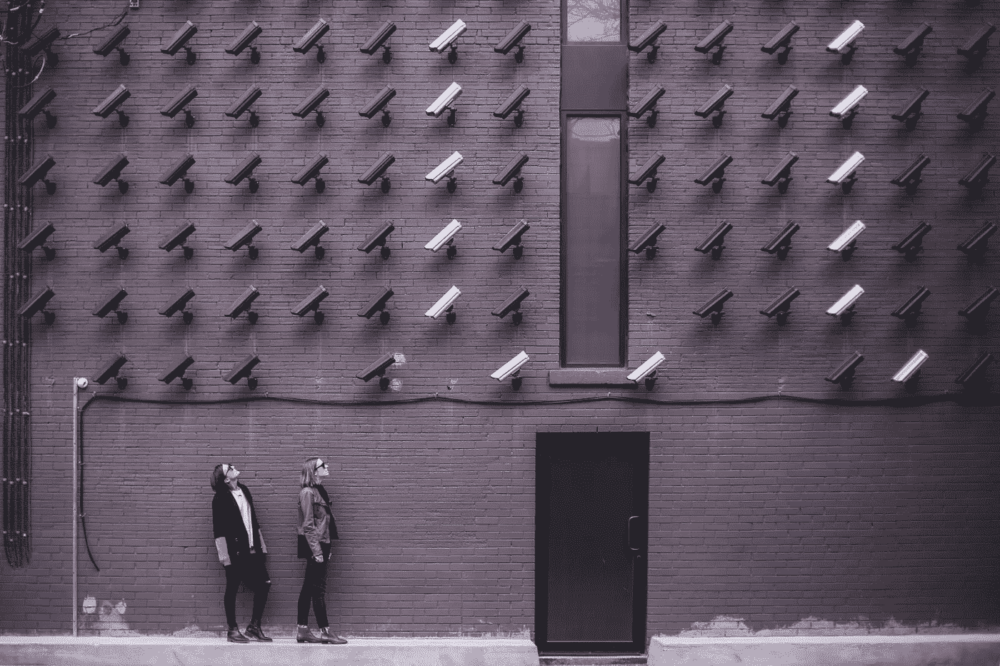
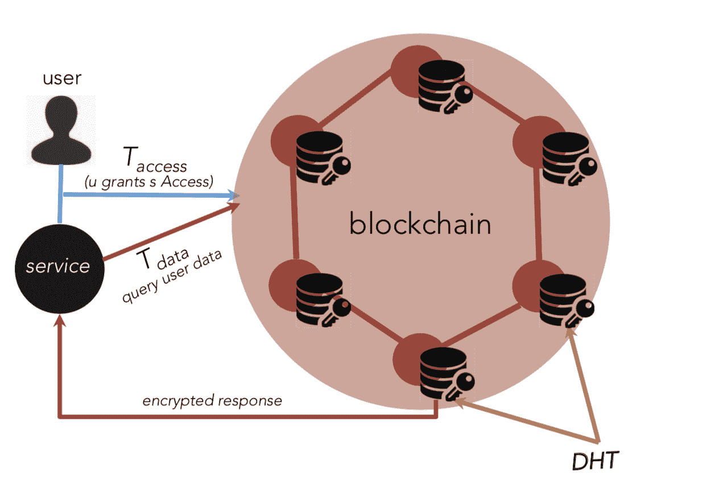

# 你名字的价格

> 原文：<https://medium.com/geekculture/the-price-of-your-name-4eaf4afbf7dc?source=collection_archive---------28----------------------->

## 解决当前和未来的数据隐私问题

Photo by [Burst](https://www.pexels.com/@burst?utm_content=attributionCopyText&utm_medium=referral&utm_source=pexels) from [Pexels](https://www.pexels.com/photo/two-person-standing-under-lot-of-bullet-cctv-camera-374103/?utm_content=attributionCopyText&utm_medium=referral&utm_source=pexels)

说“不，谢谢。请不要再给我打电话了”对我来说已经变得和问候早上好一样平常了。

不管我是否需要或想要，信用卡和预先批准的贷款似乎很容易就能得到发放。

让我(不)感到惊讶的是，有多少人可以获得我的电话号码和姓名。如果他们知道我的电话号码，那么世界上没有人知道我的银行信息或信用卡号码的可能性有多大。

这种想法让我感到害怕。

当我试着去想谁能接触到我的号码时，我并不惊讶地意识到电话号码基本上是被泄露的——在我们购物的超市里，在我们申请工作的时候，或者在我们获得新的执照的时候。我们的基本假设是，我们的数据对我们提供给它的人来说是安全的，这显然不会再错了。

数据泄露的故事如此普遍，以至于人们翻阅新闻，声称数十亿数据点从你信任的公司被盗。

至少，看似不重要的细节，如姓名和位置，可能已经暴露，但直到它通过一个事件击中你的脸，很容易衡量存储的数据的深度，并忽略它可能对你的影响。

如果新闻报道的对象是我每天接触的公司——脸书、推特(Twitter)、Instagram，那么如果有人掌握了每次点击、每次滚动停止以及所有人和所有事曾经交谈的数据，那就不足为奇了。

宣布数据被盗和宣布数据将被监控对我们有不同的影响。一个是新闻和遥远的，而另一个散发着侵扰和隐私侵犯的气味，并呼吁抵制和放弃 WhatsApp。这一系列的最新新闻是脸书的最新(也是再次)[数据泄露事件。正在寻找答案。目前还不知道，究竟是什么数据被盗，以及目前的情况如何。](https://techcrunch.com/2021/04/06/answers-being-sought-from-facebook-over-latest-data-breach/?guccounter=1&guce_referrer=aHR0cHM6Ly93d3cuZ29vZ2xlLmNvbS8&guce_referrer_sig=AQAAAJ_llM-lXhJFv8Xd2eIFRJ2qTKeXOuIhaztmHnQ1WqxQb-9E0nFVoFAJxxMcNqx2vRftlW6E2_GGnKS_eaXaF4A912cKcDY0hDg7ZJkMUB8LUc8MpIZ0W1vd46NfHONsJrcTZ1N-Lpq5-YsI60bhG129bHOFgEK4Ve_EKLIfzQlp)

但这只是数据泄露的故事——当一个实体故意利用公司的安全漏洞并窃取数据时。

公司通过设计赠送数据怎么样？

先说一下产品和设计。

由于只需一个电话号码就能轻松汇款，GooglePay 现在已经成为生活中不可或缺的一部分。无论是坐在路边端茶倒水的小商贩，还是大型商场里的商店，都可以使用 Google Pay 作为支付方式。我可以使用该产品支付我刚刚去地铁站乘坐的汽车的费用。

但有趣的是。在接收端的人现在有了我的名字和电话号码，永远可用。出售同样的东西或利用它进行骚扰也不是不可能的。

数据泄露如此普遍，数据的价值如此之低，以至于隐私不再是设计中的一个问题吗？

# 被盗数据会影响谁？

事实上，我们这些用户会受到数据丢失的严重影响，甚至我们的数据落入坏人之手也有可能造成巨大损失。不幸的是，我们信任的大多数公司既不向我们提供如何使用数据的细节，也不觉得应该对此负责。

历史上有很多公司对他们的数据管理不当，要么侥幸逃脱，要么支付了对他们的账户完全无关紧要的罚款。

如果您认为您的数据包括在所有这些数据泄露中，并且已经为此支付了罚款，则永久使用您的数据的总价格不会超过 20-30 美元。
考虑一下这个数据，仅在 [2018 年，仅脸书](https://washingtonmonthly.com/magazine/july-august-2019/what-your-data-is-really-worth-to-facebook/)一个美国用户就获得了平均约 110 美元的广告收入。
用你可能在脸书工作的年数乘以访问你数据的产品数量，这就是你数据的当前真实价值。

# 数据隐私是一个可以解决的问题

数据隐私涵盖了数据所有权(谁拥有用户数据)、数据泄露以及数据访问和许可(谁被允许访问数据)的多个方面。

像大多数问题一样，这个问题也是可以解决的。像大多数复杂的问题一样，解决方案可能并不完美，但肯定会降低问题的强度。

每个有机会解决或减少此类问题影响的解决方案的主题都倾向于:
——给予用户更多控制来管理他们的数据暴露，以及
——让公司对数据处理更加负责任
。

任何孤立的解决方案都不可能完全解决手头的问题。

## **1。分散隐私**

今天，无论我们是去附近的超市，还是去脸书，还是登录我们听说过的一个新的电子商务网站，每个人都想分一杯羹。

虽然自动填充使重复信息的填充变得更加容易，但我们实际上是允许

创建将由多个不同方拥有的多个数据实例。

输入我们的数据后，除非这些公司受到像 GDPR 那样的严格法律的约束，否则我们绝对会失去对我们数据的跟踪，并且不知道这些数据的用途。

一个看似简单的解决方案是将我们的数据放在一个地方，然后决定授予请求者对有限数据的临时访问权。

假设新网站请求您的数据，而您有一个可以访问的中心网站，并在一段时间内授权访问。根据您预定义的时间跨度，您的数据将根据您的授权和访问权限进行摄取。

该机制还将为您提供谁已经或曾经访问过您的数据的集中视图。

然而，上述建议中突出的两个主要问题是:

1.  数据集中化不是会让它更容易受到攻击吗？
2.  我们如何确保任何请求我们数据的实体只能在我们允许的有限时间内访问我们的数据？

这两个问题的答案在于通过区块链利用分散数据管理的概念。

[“去中心化隐私:使用区块链保护个人数据”](https://ieeexplore.ieee.org/document/7163223)详细讲述了使用区块链创建个人数据管理系统，该系统专注于用户保留对其数据的所有权和可见性。

Overview of Access Management System — [https://ieeexplore.ieee.org/document/7163223](https://ieeexplore.ieee.org/document/7163223)

提议的解决方案的主要特点是:

*   web/移动仪表板提供数据概览和更改实体数据权限的能力
*   强加密/解密支持的分散式数据存储
*   身份管理，以确保系统中玩家的数据保护

分散隐私的概念虽然优雅，但在实践中并不是最容易实现的。在战胜技术挑战后，它的成功也将取决于关键行业参与者的采用。

但是，如果实现了，这一解决方案将改变公司如何区分自己的参数。

## 2.操作系统强制数据隐私

苹果新的 IOS 14 仍然是新闻的主角。如果您不知道具体原因，操作系统会要求明确的用户权限，以便跨应用程序进行数据跟踪。

对于支持其他应用程序执行其预期操作的操作系统提供商来说，能够约束它们也是有意义的。

流行的操作系统唾手可得的事实为该模型提供了额外的优点，即简化了实施。

如果谷歌(Google)和微软(Microsoft)也步其后尘，在安卓(Android)上实现同样的功能，使用跨应用数据的应用程序将会发现自己严重缺乏同样的功能。

然而，要使这一点切实可行，所有主要参与者都需要在这一未来愿景上保持一致。除了现有的，隐私模式在关键参与者中的实施预计会受到关键行业参与者的抗议，这些参与者的商业模式依赖于用户数据。

## 3.设计中的隐私

正如在上面的文章中简要提到的，许多产品的核心都依赖于数据共享。

举个例子，

*   优步依赖于你作为一名车手，与车手分享你的位置和目的地
*   亚马逊送货依赖于与送货人共享您的地址
*   Google Pay 需要知道电话号码、二维码或合众国际社的详细信息才能转账

人们关心的是服务何时提供以及交易发生后的情况。

为了保护隐私:

1.  交易完成后，服务提供商(送货人、收款人、优步司机)不得访问您的任何数据。示例:
    -无法保留电话号码
    -无法保留地址
2.  在交易过程中，暴露的数据的数量和类别应该是绝对最低要求。例如:
    -除非必要，交易不需要姓名
    -屏蔽电话号码

要实现上述目标，公司需要以用户隐私为核心构建产品，这还不是他们的首要任务。

一个组织利用用户数据赚钱的自私利益导致了新的独特商业模式的产生和成功，这使他们有足够的理由不关注用户隐私。

与此同时，像苹果这样的公司已经站出来，通过逆流而上创造了一个差异化优势。

随着对数据隐私的日益关注，这一天迟早会到来，届时它将成为一个普遍和强制性的考虑因素，所有产品都需要遵守。是时候让这个行业的高层，在考虑数据隐私的情况下，对他们的商业模式进行一次深刻而诚实的思考了。