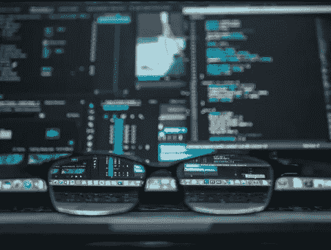

# 未来的编程语言是过去的语言

> 原文：<https://medium.com/geekculture/the-programming-languages-of-the-future-are-those-of-the-past-de8d84d5a3ed?source=collection_archive---------13----------------------->

Image Credit: [Kevin Ku](https://www.pexels.com/photo/data-codes-through-eyeglasses-577585/) on Pexels

技术充满了对新事物的热情，在信息时代，信息和创新以令人难以置信的速度发展，有一个天真的假设，旧的将永远为新的让路。

然而，当我们看编程语言时，似乎它们中最有价值的似乎在逆向老化，服从林迪效应；还有…