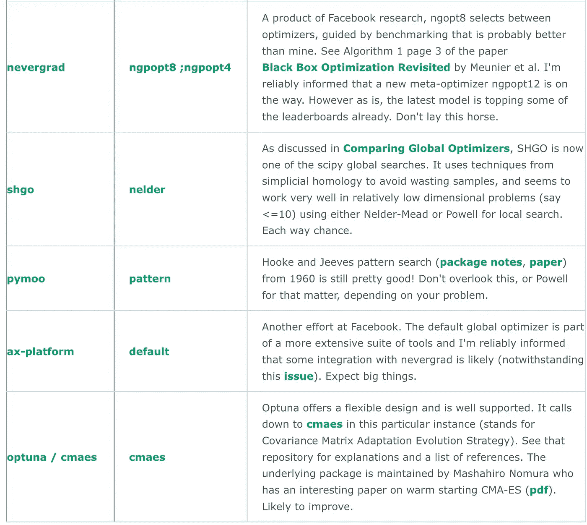

# (简短)Python 全局优化器表单指南

> 原文：<https://medium.com/geekculture/the-python-optimizer-form-guide-3b8ea3b4d78f?source=collection_archive---------6----------------------->



去原文长得多的[文章](https://www.microprediction.com/blog/humpday)找工作链接。

# 大量的警告

我的第一篇关于这个主题的 [**文章**](https://www.linkedin.com/posts/petercotton_comparing-python-global-optimization-packages-activity-6723950446962184192-9jxb) 试图以不同的方式获得优化器性能，对于读者来说，这里有一些熟悉的角色，并没有什么大的惊喜——尽管我重复警告，一些技术(例如代理)可能受到我在这里使用的有点风格化的 [**目标函数**](https://github.com/microprediction/timemachines/tree/main/timemachines/objectives) 的青睐。

一些软件包的灵活性(如并行性、离散优化、嵌套域等)不允许大放异彩。我的意图不是贬低这些库的设计特性的聪明之处。随着更多真实世界目标函数的引入，看看 Elo 的变化将会很有趣。我建议您参考 [**当前排行榜**](https://github.com/microprediction/optimizer-elo-ratings/tree/main/results/leaderboards/overall) ，因为我不会手动更新此处的推荐。

新脸书的 inclusions 做得很好——这是一种解脱，因为我有点抛弃了他们的签名时间序列包( [**咳咳**](https://www.linkedin.com/feed/update/urn:li:activity:6763174814715920384/) )。他们去年组织了一次公开比赛来改进 nevergrad 和 IOHprofiler ( [链接](https://github.com/facebookresearch/nevergrad/blob/master/docs/opencompetition2020.md?fbclid=IwAR25mgn37HHMuAaU9ZZg3sBvYPuOb9V5oAQiFSVKIA-KDvVvEmN6BvkLlWs))。

我的新目标是 [dlib](http://dlib.net/optimization.html) 。如上所述，它使用了由马尔赫比和瓦亚提斯开发的方法([论文](https://arxiv.org/abs/1703.02628))，这是一种优雅的方法。博客上有一个很好的[视频](http://blog.dlib.net/2017/12/a-global-optimization-algorithm-worth.html)和非常清晰的解释。不仅性能非常好，而且对于任何真实世界中昂贵的目标函数来说，运行时间都可以忽略不计。该库不允许你运行超过 34 维的问题，但这似乎是唯一的限制。

一些优化者，包括 SHGO，真的很难将自己限制在一个固定的评估数，这可能会在打黑棋时伤害他们。这个惩罚是否公平取决于你的需要。阅读 [Elo 方法论](https://microprediction.medium.com/interpreting-the-elo-ratings-for-python-global-optimizers-65304573e422)来深入了解这句话。

# 推荐工具比我的建议更好

让我提一下，您可以在[**humpday/comparison**](https://github.com/microprediction/humpday/tree/main/humpday/comparison)中寻找能够生成推荐优化器的实用程序。这些只是和他们后面的类别 Elo 评级一样好，这需要更多的时间来平衡，但如果你想要一些快速的建议，当给你 130 个函数评估时，哪些优化器在 8 维问题上表现最好。也许您希望将优化器的总计算时间(不同于目标函数)限制在 5 分钟以内。

```
from humpday.comparison.suggestions import suggest
from pprint import pprint    
pprint(suggest(n_dim=8, n_trials=130, n_seconds=300))
```

或者这个:

```
from humpday import recommend def my_objective(u):
        time.sleep(0.01)
        return u[0]*math.sin(u[1]) recommendations = recommend(my_objective, n_dim=21, n_trials=130)
```

希望这能加快你的搜索速度，或者鼓励你尝试一些你可能会忽略的软件包。

哦，现在有[文件](https://microprediction.github.io/humpday/)了！