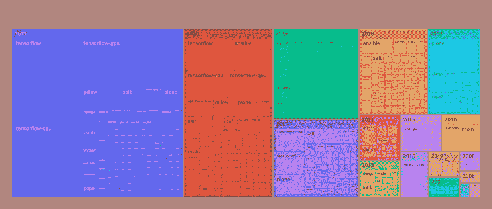

# Python 漏洞景观

> 原文：<https://medium.com/geekculture/the-python-vulnerability-landscape-3904494eec67?source=collection_archive---------4----------------------->

## 分析 Python 包的 10 年漏洞数据

几年前，我开始整理我自己的关于 Python 包中已知漏洞的数据库。我的清单大部分来自[NIST·NVD](https://nvd.nist.gov/)、 [Github 咨询数据库](https://github.com/advisories)、供应商披露和博客帖子，最近来自 [PyPA 咨询数据库](https://github.com/pypa/advisory-db)。这个数据库最终支持…