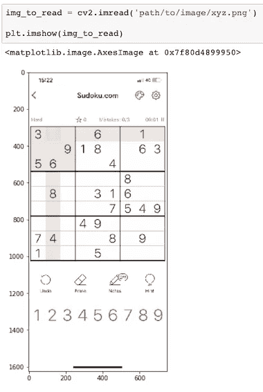
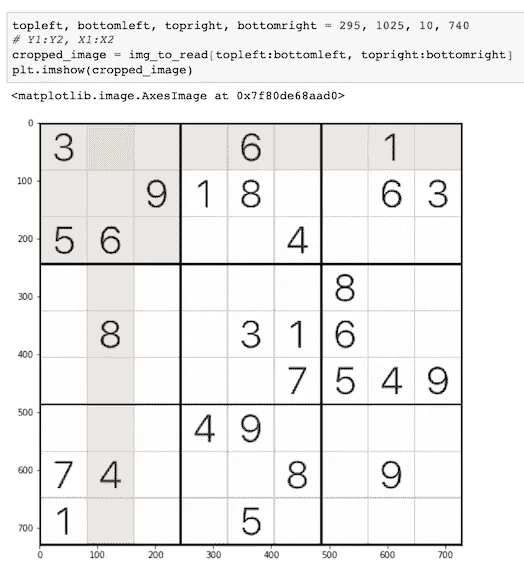
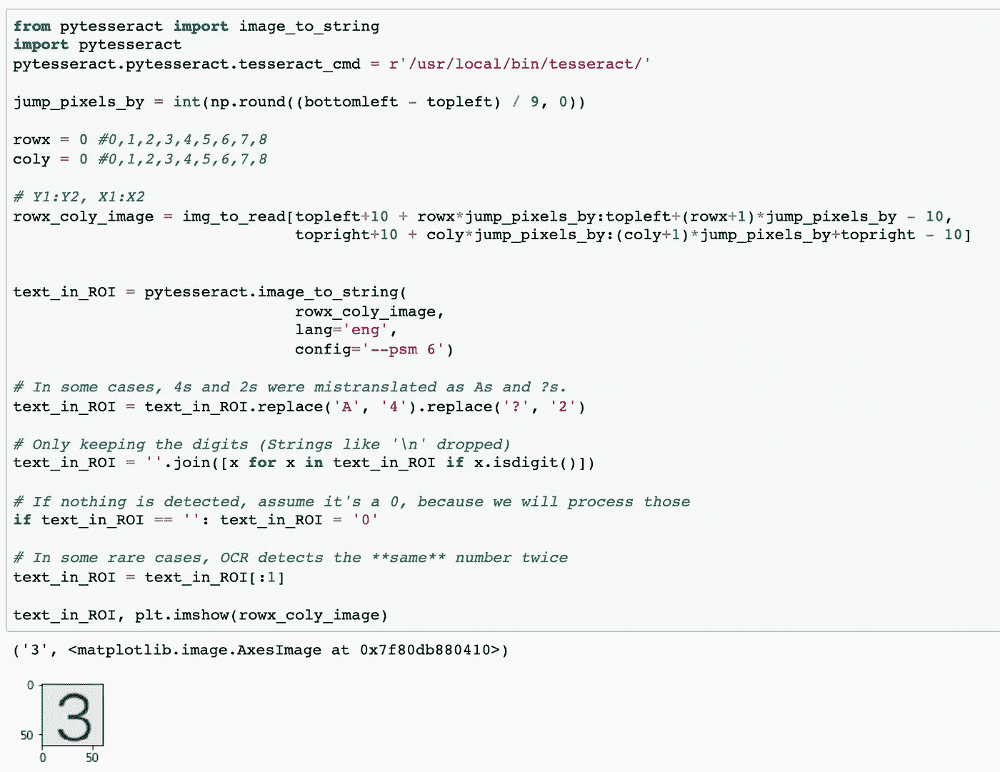
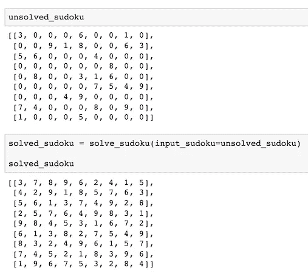
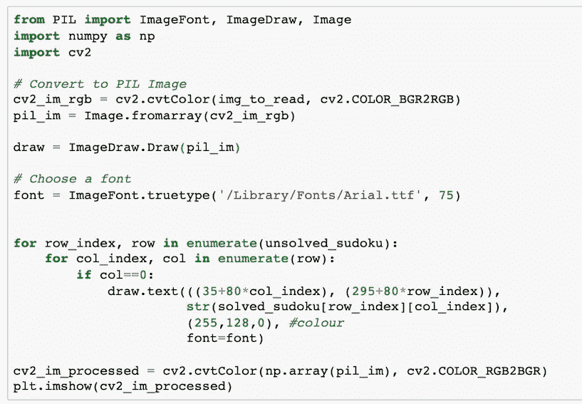
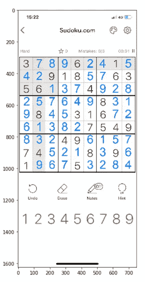
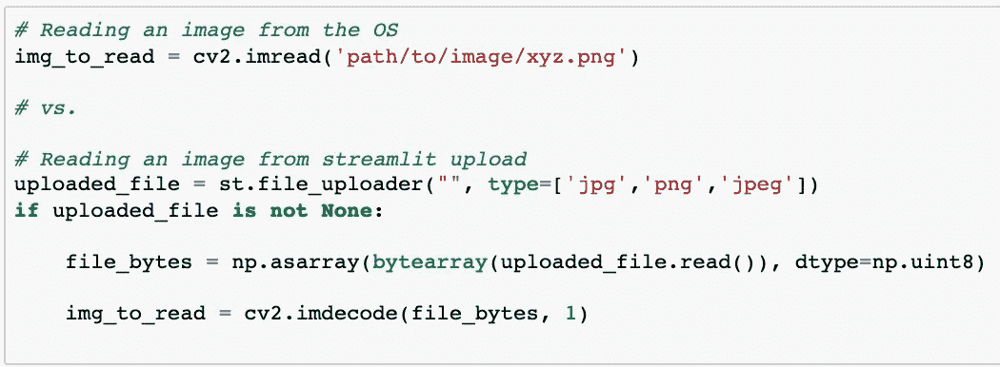

# 成为数独高手的 Pythonic 式方法

> 原文：<https://medium.com/geekculture/the-pythonic-way-of-becoming-a-sudoku-master-db8e6881bb87?source=collection_archive---------8----------------------->

## 使用 OpenCV、OCR、线性编程和 Streamlit

Photo by [Richard Bell](https://unsplash.com/@maplerockdesign?utm_source=medium&utm_medium=referral) on [Unsplash](https://unsplash.com?utm_source=medium&utm_medium=referral)

玩数独是为数不多的不受年龄、语言、文化、体能或地点限制的活动之一。它的规则很简单。然而，在某些情况下，根据难度的高低，需要全神贯注地完成一场游戏，即使没有错误，也很少出错。我发现人们在做高难度的数独游戏时倾向于做更多的猜测。这让我想到是否可以编写一个程序来立即解决数独难题。经过一些研究，我看到了下面这个由“ [Lakhsmi Ajay](https://lakshmi1212.medium.com/) ”写的帖子。我强烈推荐你看看她的帖子，这对以后的发展是一个很大的启发。

 [## 使用线性编程解决数独(Python-PuLP)

### 数独是一种典型的涉及到笔、纸和思维共同作用的游戏。当你想休息时…

towardsdatascience.com](https://towardsdatascience.com/solve-sudoku-using-linear-programming-python-pulp-b41b29f479f3) 

# 介绍

在这篇文章中，我将把 [L. Ajay](https://lakshmi1212.medium.com/) 的数独求解器与一个自动过程结合起来，该过程检测现有的和缺失的数字单元格，并在一个基于 web 的应用程序的输入屏幕截图上显示输出计算。请[点击这里](https://gist.github.com/mesutcanalkan/e5b6dfb94ff4c48bb4f49292d491d19e)查看这篇文章中使用的代码。

# 步骤:

[**第一步:**在手机上拍摄数独截图并读取(opencv/streamlit)](#af7c)
[**第二步:**定位感兴趣区域(ROI)(opencv)](#cf57)
[**第三步:**检测 ROI 中的数值(pytesserac)](#b7b4)
[**第四步:**将数独输入发送到线性规划求解器(pulp)](#d23b)

# **第一步:阅读输入截图**

输入图像将是从 iphone 上截取的截图。但是，如果这个图像在我们的本地驱动器上，我们应该是这样读取它的。

Image by author

因为我们对图像上显示的所有信息都不感兴趣，所以我们需要通过不同的 x，y 坐标对其进行裁剪。

# 步骤 2:定位感兴趣的区域

我们可以裁剪输入图像，只显示如下的谜题。

Image by author

现在我们知道了数独谜题对应的 X，Y 坐标，我们可以重新裁剪图像 81 次，这样我们就可以运行 OCR 来检测数字。我们将这 81 个子输入中的每一个称为感兴趣区域(ROI)。

# 步骤 3:检测数字单元格

请看下面的例子，找到写在第一行第一列正方形内的数字。宇宙魔方来拯救我们了。

Image by author

通过对每一行和每一列循环重复这一逻辑，我们可以创建一个数独字谜形状的列表，这样就可以解决线性规划问题。

# 第四步:解决数独

在 [L. Ajay](https://lakshmi1212.medium.com/) 的[数独解算器](https://towardsdatascience.com/solve-sudoku-using-linear-programming-python-pulp-b41b29f479f3)的帮助下，我们可以找到对应于每一行和每一列的值。

Image by author

# 第五步:写缺失的数字

在我们找到 unsolved_sudoku 数组中最初丢失的每个数字的行和列索引后，我们可以在输入图像上绘制已求解的 sudoku 数组值的文本。

Images by author

# 步骤 6:构建应用程序

网上有很多关于构建 streamlit 应用的例子。

然而，使这种逻辑起作用的关键部分如下:

我们将从电话图库中读取图像，而不是从本地路径中读取。

**源代码:**请参考这个 git repo 获取完整代码: [sudoku_app.py](https://gist.github.com/mesutcanalkan/e5b6dfb94ff4c48bb4f49292d491d19e)

这是演示:

Solution gif by author

# 结论

这篇文章展示了如何在 python 上构建一个简单的基于 web 的应用程序，该应用程序使用 OpenCV、OCR、线性编程和 Streamlit 处理 iphone 截图，在几秒钟内完成一个没有错误的数独游戏。

在自动检测任何截图/图像上数独谜题的左上角和左下角方面，仍有改进的空间。

希望你喜欢读它。