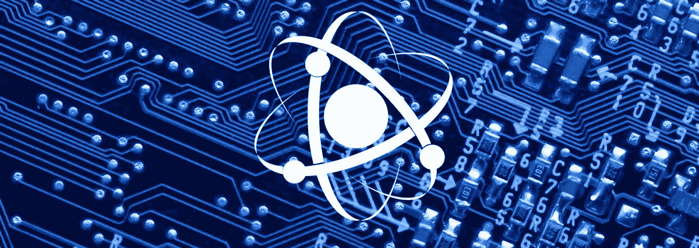

# 量子威胁

> 原文：<https://medium.com/geekculture/the-quantum-threat-e0a788b2cb41?source=collection_archive---------28----------------------->

互联网上的信任和安全是当今争论的一个重要领域。随着国家、消费者和公司越来越关注数据使用，对强大、有效的数据保护的需求也在增加。

如今，保护数据的主要方法是使用加密技术来防止未经授权的访问。然而，量子计算的兴起有可能破坏网络信任和安全的加密基础