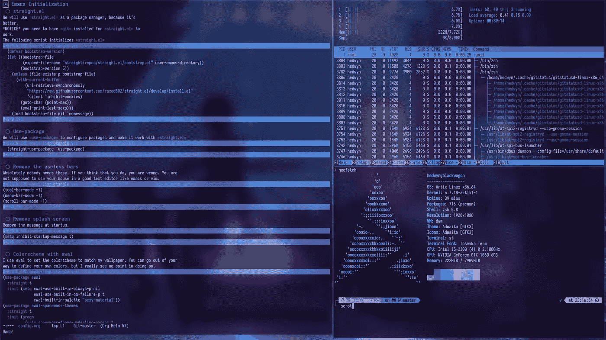
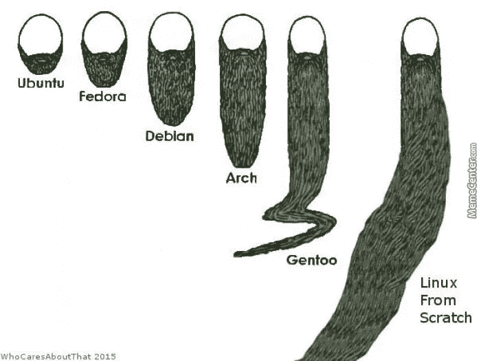

# 安装 Arch Linux 的快速简单的方法

> 原文：<https://medium.com/geekculture/the-quick-and-easy-way-to-install-arch-linux-70b9bfc35863?source=collection_archive---------0----------------------->

## 如何轻松安装 Arch Linux？

如果你已经在 Linux 社区呆了足够长的时间，你可能听说过 Arch Linux。您很可能想安装 Arch Linux。最后，您终于执行了安装。然而，当您安装操作系统时，您可能会遇到安装和软件配置方面的困难。

下面是如何在你的机器上轻松安装 Arch Linux 的指南。

## 设置环境

遵循现有的 Arch Linux 安装指南，直到预安装阶段结束。

 [## 安装指南

### 本文档是使用从安装介质引导的实时系统安装 Arch Linux 的指南，安装介质由…

wiki.archlinux.org](https://wiki.archlinux.org/title/Installation_guide) 

## 加载自动安装程序

您需要加载自动安装程序。最自动化的安装程序只需要一个互联网连接。以下是我推荐的一些自动化安装程序。

你有 LARBs T1，一个精简的 Arch Linux 桌面版本。以下是 Arch Linux 的一些特性。

*   Suckless 软件: [DWM](https://dwm.suckless.org/) (窗口管理器) [DWNBLOCKS](https://www.youtube.com/watch?v=UP2QpHmcgyk) (状态栏) [dmenu](https://wiki.archlinux.org/title/Dmenu) 等
*   键盘驱动程序: [Neomutt](https://neomutt.org/) 等
*   允许编写脚本的程序
*   ZSH 和许多剧本

而这里有一些 LARBS 定制版的截图。

Photo 1 from larbs.xyz

Photo 2 from larbs.xyz

您还可以运行 ArchFi，它为您提供了一个用于服务器的 Arch Linux 的最小工作版本。

## 有哪些好处？

使用自动化软件安装程序将保证不同设备之间的一致性。这也节省了你的时间，因为你不必记住所有你已经安装的软件包。不仅如此，您也不必为每台设备重新设置所有配置。

## 有哪些缺点？

大多数安装 Arch Linux 的人通常手动执行安装，因为他们想要完全的软件控制。所谓完全的软件控制，我的意思是你想选择使用什么样的[初始化系统](https://wiki.archlinux.org/title/Init)、[网络管理器](https://wiki.archlinux.org/title/Network_configuration)和[桌面环境](https://wiki.archlinux.org/title/Desktop_environment)。Windows、macOS 等主流操作系统不会允许这样。甚至一些 Linux 发行版，如 Debian 和 Ubuntu，会自动将您锁定在某些类型的 init 系统和桌面环境中。通过使用其他人的自动化安装脚本，您正在挫败使用 Arch Linux 和其他裸发行版(如 [Gentoo](https://www.gentoo.org/) 和 [Linux for Scratch](https://www.linuxfromscratch.org/) )的意图。

## 如何利用自动化安装程序？

手动安装 Arch Linux，了解设置 Linux 桌面版本所需的所有软件包和配置。这将提高您的系统管理员的技能，因为您将不得不调试软件并查看成堆的日志，以找出如何解决软件配置问题。

一旦您理解了 Arch Linux，我建议您使用您的包和配置派生自动安装脚本来部署您的 Arch Linux 版本。通过这样做，你将提高你的脚本技能。

## 最后

Photo 3 from [img.memecdn.com](https://img.memecdn.com/)

一旦你完成了 Arch Linux 的安装，你就可以通过[顺便提及你使用 Arch](https://www.quora.com/What-is-meant-by-btw-I-use-arch?share=1)来表明你对 Ubuntu 和 Fedora plebs 的优势。只是被 Gentoo 和 Linux 从头开始社区的人瞧不起，他们还在修改他们的使用标志和编译他们的软件。

IT 和工程领域是快速发展的领域。跟不上意味着你将被落在后面。跟上的最好方法是保持最新的新闻和教育内容。[订阅免费电子邮件列表，将你的职业生涯提升 10 倍。](/subscribe/@dretechtips)

**加入我们，因为 50 多名想要快速跟踪其职业生涯和知识基础的人已经注册。**

**相关内容:**

*   [如何在 Linux/BSD 中实现任务自动化？](/geekculture/how-to-automate-tasks-in-linux-bsd-91d0b0560f5?source=your_stories_page----------------------------------------)
*   [如何在 Linux 中安全删除文件？](/geekculture/how-to-securely-delete-files-in-linux-ce6ad1205922)
*   [如何在 Linux 中找到文件？](/geekculture/how-to-find-files-in-linux-6ed09a98c899)