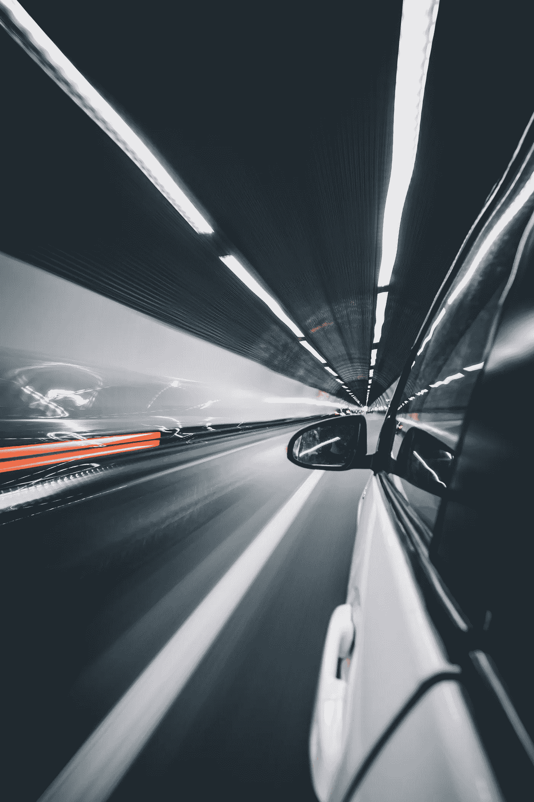

# 氢燃料汽车兴起

> 原文：<https://medium.com/geekculture/the-raise-of-hydrogen-fueled-car-33ccc473e009?source=collection_archive---------17----------------------->

获得最可持续的发动机的竞赛已经开始了一段时间，目前电动发动机处于领先地位。顺便说一下，它似乎将挑战一种新的汽车技术:**氢发动机**。

Photo by [Alessio Lin](https://unsplash.com/@lin_alessio?utm_source=unsplash&utm_medium=referral&utm_content=creditCopyText) on [Unsplash](https://unsplash.com/s/photos/hydrogen-car?utm_source=unsplash&utm_medium=referral&utm_content=creditCopyText)

> 我相信如果你要创新，你必须愿意被误解。