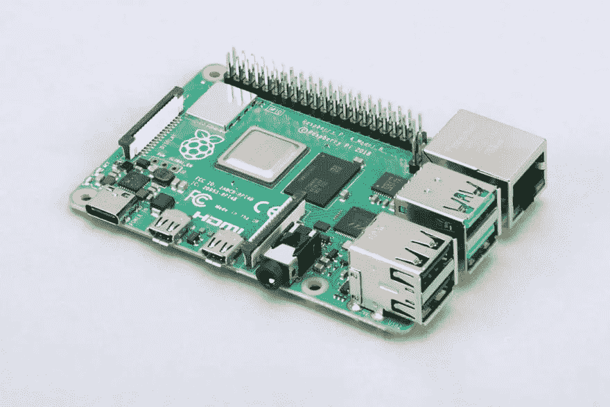
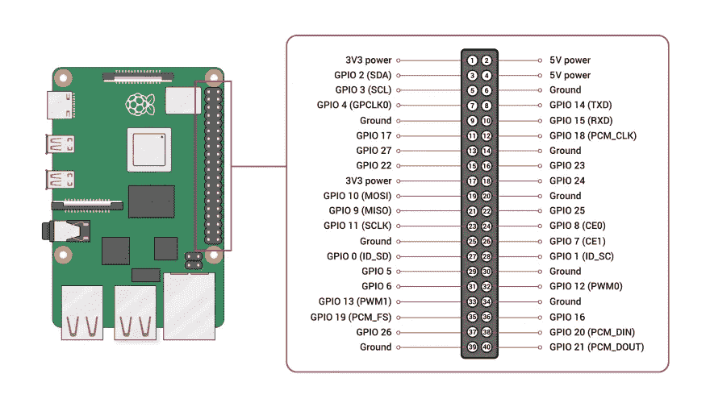

# Raspberry Pi 单板机:硬件和 GPIO 功能

> 原文：<https://medium.com/geekculture/the-raspberry-pi-single-board-computer-hardware-and-gpio-functions-5e6aff6c3f14?source=collection_archive---------27----------------------->

Raspberry Pi 是一台单板计算机，有 4 个版本和一个极简的零版本。它是不同项目的流行选择，因为它的体积小，有效的功耗，处理速度和它是一个完全基于 Linux 的计算机。

在本文中，我将解释 Raspberry Pi 模型 3 和 4 提供了哪些连接能力，以及它们本机支持哪些功能(即不需要额外 HATS 扩展的功能)。

*本文原载于* [*我的博客*](https://admantium.com/blog/micro03_raspberry_pi/) 。

# 树莓 Pi 规格

*来源:*[*wikipedia.org*](https://en.wikipedia.org/wiki/Raspberry_Pi)

树莓派 3B 有以下规格:

*   处理器:Cortex-A53 Arm v7 4xCores
*   SRAM: 1GB
*   时钟速度:1.4Ghz
*   GPIO: 26 个数字，0 个模拟

Raspberry Pi 4B 有一个新的处理器和更多的 RAM，而 GPIOs 保持不变。

*   处理器:Cortex-A72 ARM v8 4xCores
*   静态随机存取存储器:2–8GB
*   时钟速度:1.45 赫兹
*   GPIO: 26 个数字，0 个模拟

# 数字引脚

*来源:*[【raspberrypi.org】T21](https://www.raspberrypi.org/documentation/usage/gpio/)

Raspberry Pi 共有 24 个 GPIO 引脚。引脚可以用不同的库进行编程。在下面的解释中，将使用官方认可的 Python 库 [gpiozero](https://gpiozero.readthedocs.io/en/stable/) 来展示示例。

# 数字输入

默认情况下，GPIO 引脚根本不激活。您可以通过使用类`gpiozero.DigitalInputDevice`将它们配置为活动输入设备。要定义一个特定的管脚，使用`DigitalInputDevice(pinNumber)`。

使用 Gpiozero 库，您不能主动读取引脚状态，但是有两个事件处理程序来捕捉引脚逻辑状态的变化:`when_activated`将在引脚变为活动状态时被调用，而`when_deactivated`用于复合状态。您定义自定义函数并将它们传递给这些事件处理程序，以实现所需的行为。

# 数字输出

数字引脚默认关闭。要开始发射信号，你需要激活它们。

输出引脚用类别`gpiozero.DigitalOutputDevice`定义。要定义输出引脚，使用`DigitalOutputDevice(pinNumber)`。

数字引脚可以有两种状态:真或假，即施加 5V 或 0V 的高电压。这些状态通过使用`DigitalOutputDevice.on()`或`DigitalOutputDevice.off()`方法触发。

# 模拟引脚

Raspberry Pi 没有模拟引脚。要输出模拟数据，可以使用基于软件的 PWM。这将在“引脚功能”一节中介绍。

# GPIO 功能

Raspberry Pi3 和 Pi4 都提供这些功能:

*   UART: GPIO 10 (RX)和 GPIO 8 TX 可用于通过 [UART 协议](https://en.wikipedia.org/wiki/Universal_asynchronous_receiver-transmitter)直接连接两个设备，从而实现串行异步通信。
*   I2C:GPIO 2 SDA 和 GPIO 3 SCL 允许通过 [I2C 协议](https://en.wikipedia.org/wiki/I%C2%B2C)连接。I2C 与多达 128 台设备的多个服务器/客户端连接建立串行同步通信。
*   SPI:[SPI 协议](https://en.wikipedia.org/wiki/Serial_Peripheral_Interface)是一个服务器和几个客户端之间的同步串行通信，双方都可以主动发送数据。要进行 SPI 出站连接，需要 4 个引脚。Raspberry Pi 允许建立两个独立的服务器连接，或者一个服务器一个客户端连接。对于第一个 GPIO 子系统，使用 GPIO 9、19、11、8 和 16，对于第二个 GPIO 子系统，使用 GPIO 9、19、11、8 和 16.pwm
*   PWM: [脉冲宽度调制](https://en.wikipedia.org/wiki/Pulse-width_modulation)是一种信号技术，其中数字信号以一定的频率在高和低两种状态之间快速切换。Raspberry pi 没有对 PWM 的本地支持，但是有提供软件 PWM 的库，尽管与 Arduino 相比有一些限制。

# 引脚功能

使用废弃的库 [WiringPi](https://github.com/WiringPi/WiringPi) 可以定义基于软件的 PWM 信号。然而，[官方文档](http://wiringpi.com/reference/software-pwm-library/)陈述了各种限制:只应使用一个引脚来输出 100Hz 信号，任何其他情况都将导致非常高的 CPU 使用率和可能的频率下降，因为将库函数与操作系统中的其他函数一起调度。

# 结论

Raspberry PI 是一款强大的单板计算机，具有 26 个 GPIO 引脚。这些引脚支持通用标准，如 UART、I2C 和 SPI。为了对引脚的行为进行编程，可以使用许多库，大多数是用 C 或 Python 编写的。与 Arduino 的一个很大区别是，Raspberry Pi 上的所有引脚都是数字的。可以使用基于软件的 PWM，但是对实际的物理 PWM 有限制。如果你想处理或发送模拟信号，你需要一个专用的帽子扩展。