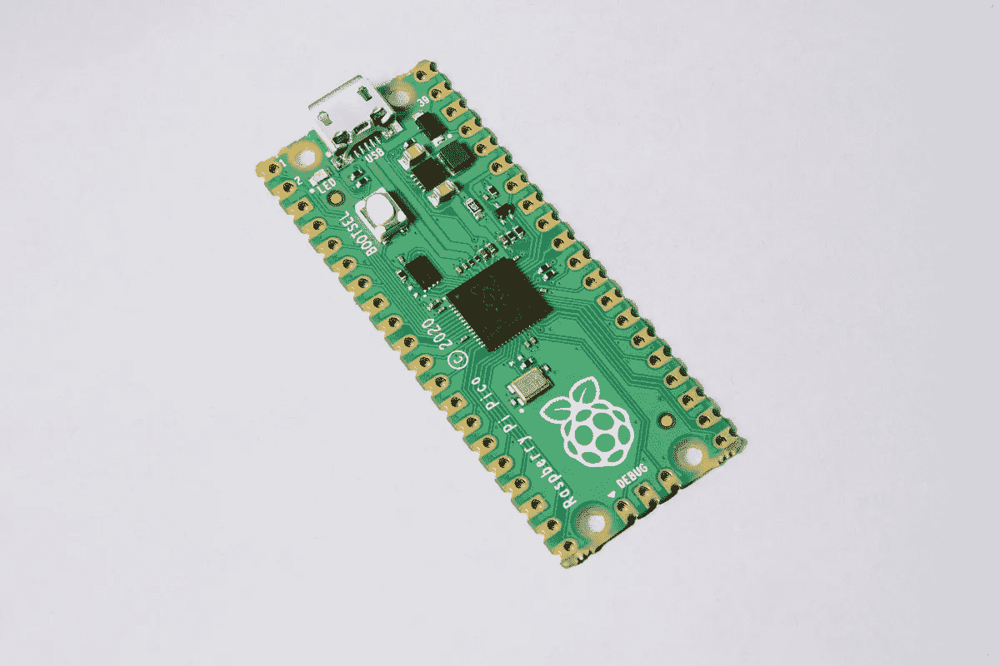
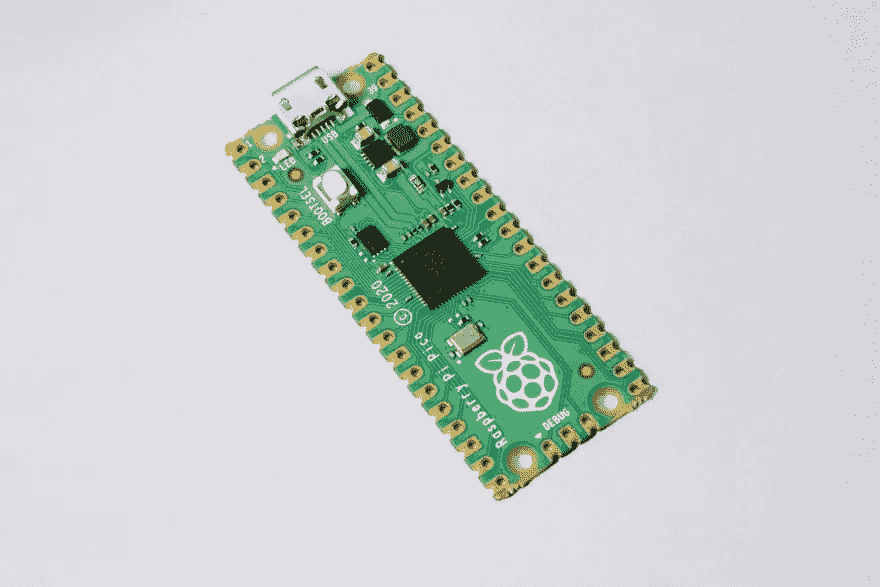
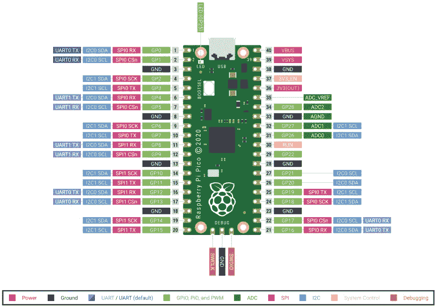

# Raspberry Pico 微控制器:硬件和 GPIO 功能

> 原文：<https://medium.com/geekculture/the-raspberry-pico-microcontroller-hardware-and-gpio-functions-7c1200ec5f4c?source=collection_archive---------12----------------------->



Raspberry Pi Pico，简称 Pico，是 Raspberry Pi 基金会的一款新型微控制器。从硬件方面来说，它提供了一个双核 ARM 处理器，2MB 的闪存和 26 个 GPIO 引脚。从软件方面来说，它提供了一个广泛的 C/C++ SDK 和一个 MicroPython 端口。

本文详细介绍了 Pico 的硬件、数字和模拟引脚，以及它提供的引脚功能。

*本文原载于* [*我的博客*](https://admantium.com/blog/micro04_raspberry_pico/) 。

# 微微



*来源:*[*raspberrypi.org*](https://www.raspberrypi.org/products/)

Pico 具有以下规格:

处理器:双核 Cortex M0+
闪存:2MB
SRAM: 264 KB
时钟速度:133Mhz
GPIO: 26 (22 个数字，3 个模拟，1 个内置 LED)

# 数字引脚



*来源:*[*koffler . info*](https://kofler.info/raspberry-pi-pico/)

共有 23 个数字 GPIOs，GP00 至 GP22。此外，如果需要，模拟引脚 GP26–28 可以用作数字引脚。

# 数字输入

默认情况下，输出数字引脚。为了明确地设置它们，语句`gpio_set_dir(pinNumber, GPIO_IN)`。二进制值分别解释为`1`和`0`。当前值可通过`gpio_get(pinNumber)`读取。

# 数字输出

通过执行`gpio_set_dir(pinNUmber, GPIO_OUT)`，可以将数字引脚配置为二进制输出。二进制值用`gpio_put(pinNumber, value)`写，这里`value`就是简单的`0`或者`1`。

# 模拟引脚

3 引脚——GP26、GP27 和 GP28 可用作 ADC——模数转换器。

从技术上讲，Pico 还有两个模拟引脚:GP28 / `ADC3`输出所有模拟引脚的基准电压，它可以用于微调 ADC 样本或强制电源进入 PWM 模式，减少 ADC 引脚的干扰。而`ADC4`，不存在分线引脚，可以用来测量处理器的温度。

# 模拟输入

模拟引脚需要用一系列语句进行配置。

首先，初始化 ADC——模数转换器——硬件。然后重置目标引脚，并将其配置为模拟引脚。最后，您可以读取 12 位模拟信号。

```
#include <hardware/gpio.h>
#include <hardware/adc.h>int main() {
  adc_init();
  adc_gpio_init(PIN_NUMBER);
  adc_select_input(PIN_NUMBER); //pin number 0-3
  uint16_t result = adc_read();
}
```

您还可以使用`adc_set_round_robin(bitPattern)`同时读取多个模拟引脚，其中`bitPattern`定义了您想要读取的特定引脚。

# 模拟输出

Pico 可以在多达 8 个两引脚模块中输出 12Hz PWM 信号，提供令人印象深刻的 16 引脚总输出容量。

配置输出引脚需要几个步骤。首先，将引脚定义为 PWM 输出。然后，您不直接配置这个管脚，而是配置它所属的“片”。PWM 的特性由每个脉冲的周期数和高低压输出之间的比例决定。最后，你涉及到 PWM 信号。

下面是一个完整的例子:

```
#include <hardware/pwm.h>gpio_set_function(PIN_NUMBER, GPIO_FUNC_PWM);
int SLICE_NUMBER =  `gpio_pwm_to_slice(PIN_NUMBER);pwm_set_wrap(SLICE_NUMBER, NR_OF_CYCLES); //Total number of cycles
pwm_set_chan_level(SLICE_NUMBER, PWM_CHAN_A, 1); // HIGH Output
pwm_set_chan_level(SLICE_NUMBER, PWM_CHAN_B, 5); // LOW Outputpwm_set_enabled(SLICE_NUMBER, true);
```

# GPIO 功能

Pico 提供了很大的灵活性:大多数 GPIO 功能和协议可以配置为支持不同的协议。在[官方文件的第 2.19.2 节中可以找到支持什么的确切细节。功能选择](https://datasheets.raspberrypi.org/rp2040/rp2040-datasheet.pdf)。

要设置特定功能:

```
#include <hardware/gpio.h>int main() {
  gpio_set_function(pinNumber, functionEnum)
}
```

`functionEnum`可以取下列任何一个值:

```
enum gpio_function { GPIO_FUNC_XIP = 0, GPIO_FUNC_SPI = 1, GPIO_FUNC_UART = 2, GPIO_FUNC_I2C = 3, GPIO_FUNC_PWM = 4, GPIO_FUNC_SIO = 5, GPIO_FUNC_PIO0 = 6, GPIO_FUNC_PIO1 = 7, GPIO_FUNC_GPCK = 8, GPIO_FUNC_USB = 9, GPIO_FUNC_NULL = 0xf }
```

*   XIP:通过[就地执行](https://en.wikipedia.org/wiki/Execute_in_place)功能，可以直接访问和修改非 RAM 数据，例如闪存卡或 SSD。
*   SPI:[SPI](https://en.wikipedia.org/wiki/Serial_Peripheral_Interface)协议是一种用于交换数据的全双工单服务器、多客户端协议。
*   UART:[UART](https://en.wikipedia.org/wiki/Universal_asynchronous_receiver-transmitter)异步串行通信标准通常被实现为 [RS-232](https://en.wikipedia.org/wiki/RS-232) ，它提供两个设备之间的直接连接。
*   I2C:[I2C](https://en.wikipedia.org/wiki/I%C2%B2C)协议是一种用于交换数据的同步、多服务器和多客户端协议。
*   PWM: [脉冲宽度调制](https://en.wikipedia.org/wiki/Pulse-width_modulation)是一种信号技术，在这种技术中，数字信号以一定的频率在高电平和低电平两种状态之间快速切换。有 16 个 PWM 通道可用。
*   SIO:访问内部 CPU 寄存器。
*   Pio 0 & PI01:[PIO 可编程 I/O 硬件子系统](https://datasheets.raspberrypi.org/pico/raspberry-pi-pico-c-sdk.pdf)允许编写高效代码来访问任何新硬件，类似于其他硬件架构中的 [FGPA](https://en.wikipedia.org/wiki/Field-programmable_gate_array) 和 [CPLD](https://en.wikipedia.org/wiki/Complex_programmable_logic_device) 。Pico 有两个 PIO 系统，当访问硬件时，可以设置引脚来“加入”这些系统。
*   GPCK:允许访问 Pico 的内部时钟。
*   USB:在撰写本文时，我还不知道如何使用这种模式。

除了许多功能外，您还可以使用`gpio_set_irq_enabled(pinNumber, eventsBitmask, 1)`设置引脚的中断级别，其中事件位屏蔽指的是`LEVEL_LOW`、`LEVEL_HIGH`、`EDGE_FALL`和`EDGE_RISE`。

# 结论

Raspberry Pico 提供独特的微控制器概念。GPIO 使用的灵活性以及新的 PIO 系统为连接许多不同形式的硬件提供了机会。看看开发者社区如何利用这些机会将会很有趣。