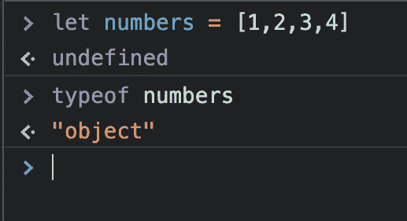
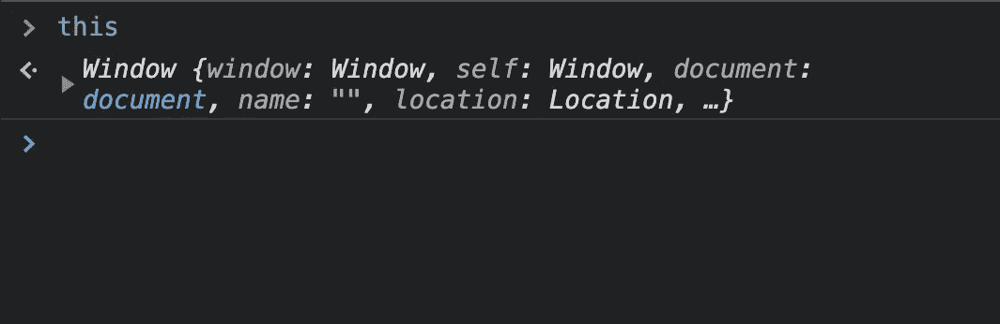
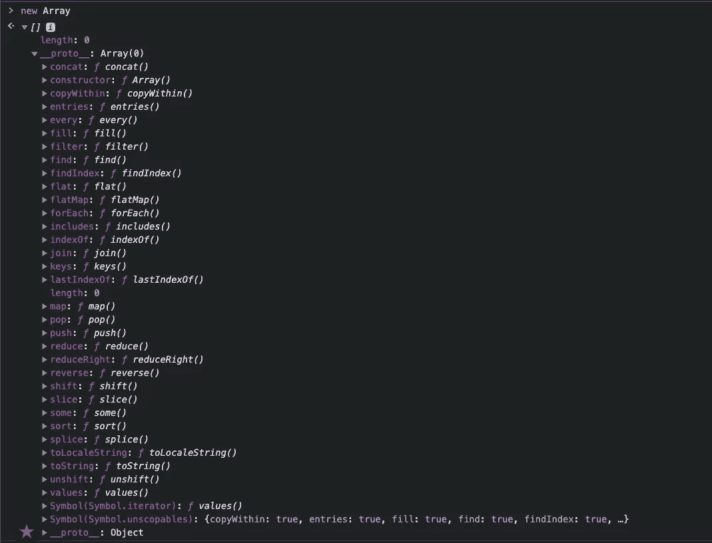
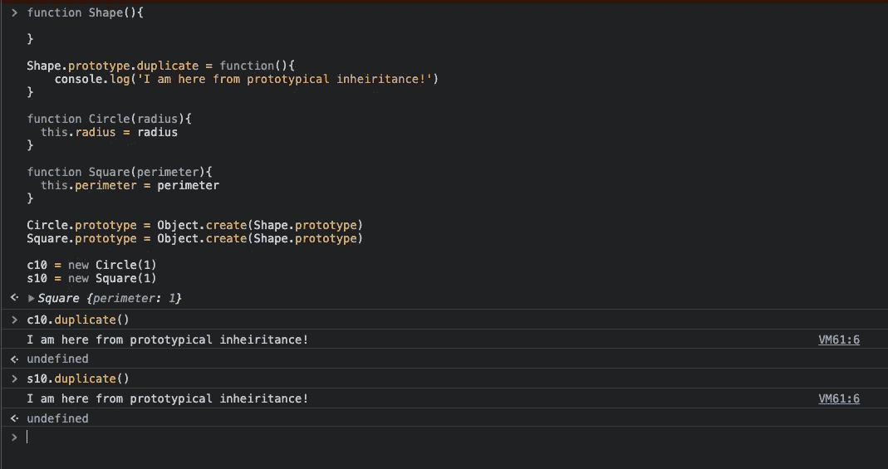

# 关系问题:Javascript 中的对象

> 原文：<https://medium.com/geekculture/the-relationship-question-objects-in-javascript-22640cd55319?source=collection_archive---------31----------------------->

训练营毕业生的古老故事是，只有当你完成了训练营，你才真正意识到你还有多少不知道的。在 Flatiron，他们把 HTML、CSS、Ruby、Rails、Javascript 和 React 塞进了 3.5 个月。聪明人只在其中一个科目上花费数年/职业生涯。在训练营，我们有 3 周的时间来“学习”javascript。这显然是不可能的，所以做出了让步。由于时间不够，牺牲了整个概念。或者由于缺乏时间而仅仅在非常基础的表面水平上处理一个主题。现在，我已经离开了训练营，回到 javascript 来更深入地研究一下，Flatiron 课程中涉及 javascript 的最大牺牲之一就是对象主题。在 Flatiron，我们被告知对象本质上是用{}卷毛男孩和房子键值对来定义的。键值对是无序的。大概就是这样…哦，JSON 只是一个大对象。虽然这一切都是真的，但它非常非常肤浅。我认为事情被有意地保持在表面，以保持程序向前发展和我们脆弱的大脑在机智。如果 Flatiron 告诉我们，从技术上讲，数组是 Javascript 中的一个对象，我可能会跳出窗口。

javascript 中的对象非常通用，在整个语言中有很多不同的用法。在许多方面，我现在将对象视为 javascript 的基础。prototype 对象()拥有 javascript 中所有最强大的方法/工具。真正理解“this”关键字就认识到“this”最基本的形式代表了基本的窗口对象。

一切都要追溯到一个对象！我们用它们来构建类。我们使用它们通过原型继承属性和方法。如果没有对象，数组就不是数组！

Technically and array is an object 😜

原型对象是 javascript 如何避开缺少的类。基于原型的编程或简称 PBP 是 javascript 模仿面向对象编程(OOP)语言的一种方式，但实际上并不是面向对象编程语言！继 Ruby 之后，Flatiron 教会了我们 javascript。在 Ruby 中，我们能够创建类并理解与 OOP 语言相关的蓝图。javascript 和 PBP 中对象的真正力量是通过原型继承释放出来的！这里我们有 3 个不同的构造函数对象。形状，圆形和正方形。因为圆形和方形都是形状，所以只有圆形和方形对象都继承形状属性才合适。

javascript 或任何 PBP 语言中的对象都是基础。一旦你理解了这个物体所扮演的角色，以及它有多么强大和灵活，PBP 实际上提供了很多清晰性。与传统 OOP 中的类相比，这种对对象原型进行快速简单更改的灵活性是一个积极的方面。当构造类时，程序员正在创建一个蓝图。需要与该类相关联的所有方法和数据都需要提前想好，而 PBP 的快速特性允许程序员在运行中进行更改。也就是说，如果不小心的话，你可能会在处理原型对象时遇到一些麻烦。从技术上来说，PBP 赋予了程序员改变基本 JS 对象的功能的能力，比如数组或对象(元😶).不需要太多的想象力，就可以想出一些方法，程序员可以通过改变像数组这样的结构化的东西的功能来引起很多问题。这让我想起了我从程序员 Mosh Hamedani 那里学到的一条规则“不要修改你不拥有的对象！”

对 javascript 中的对象有了更好的认识，这真的让我对这门语言有了更多的了解。我确实意识到为什么这次谈话在训练营中被完全避免了。对于一个新兵训练营的学生脆弱而疲惫的大脑来说，物体的范围有点太大了。