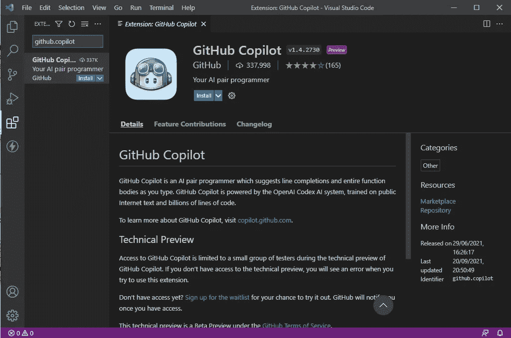
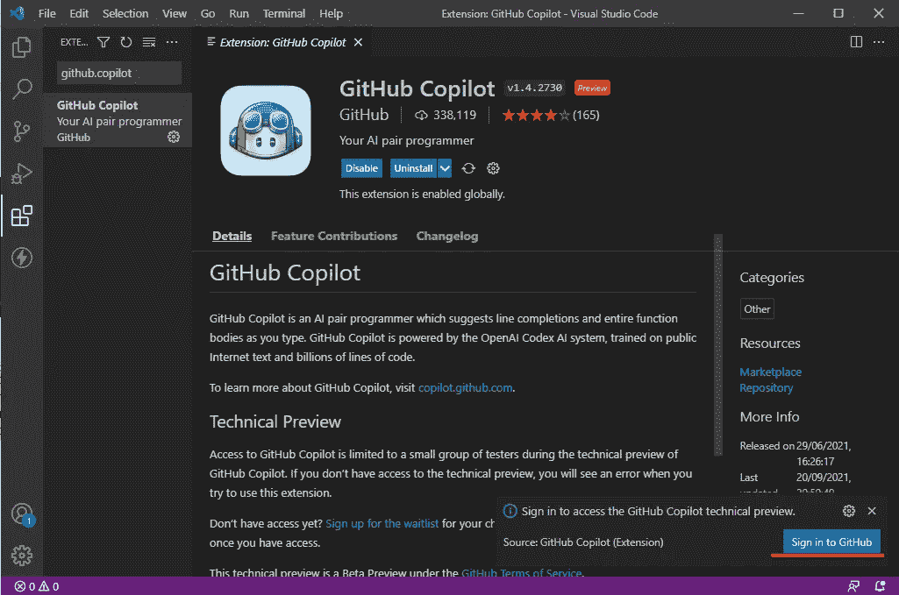
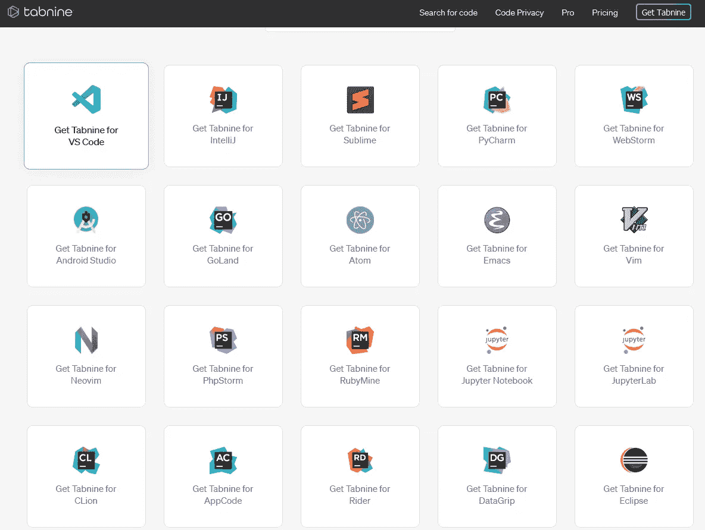
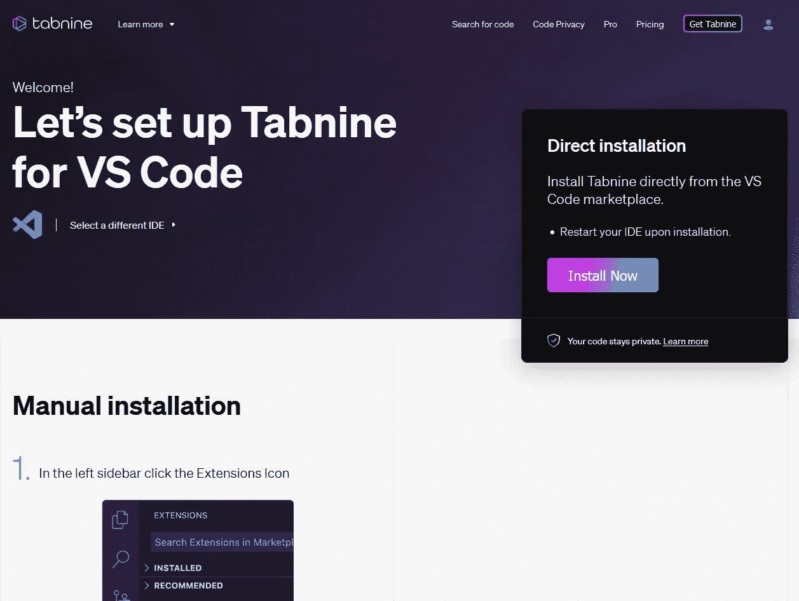

# 人工智能代码自动完成引擎的崛起——GitHub Copilot、Tabnine 和 Kite

> 原文：<https://medium.com/geekculture/the-rise-of-ai-code-autocompletion-engines-github-autopilot-tabnine-and-kite-6c4831bf5e5e?source=collection_archive---------4----------------------->

人工智能自动完成引擎绝不是一个新奇的东西。他们的目的过去和现在都很简单——让编程变得更简单，减少对人类记忆的依赖——人类记忆比计算机记忆更容易出错。

很多人误解了人工智能自动完成引擎的目的。它不是取代人类程序员，而是增强他们的能力，使代码更好。那些担心代码自动完成引擎会取代专业软件开发人员的人，我们有相当好的消息要告诉你——他们很可能不会，虽然可能很接近。如果你不相信，这些引擎的工作方式与查找文档和/或现实生活中的例子是一样的。唯一的区别是它是自动发生的，而不是必须打开一个新的浏览器标签。

现在你知道他们是来帮助你的，那么你有什么选择呢？主要有三个。

# GitHub 副驾驶

[GitHub 副驾驶](https://www.itmagination.com/blog/360deg-tech-check-2-linkedin-security-breach-kubernetes-spending-github-copilot-facebook-bulletin-arm64ec)，名单上的最新选项，似乎也产生了[最多的情绪](https://www.itmagination.com/blog/360deg-it-check-3-chinese-companies-face-an-important-dilemma-tiktok-scores-a-big-win-the-future-of-amazons-lumberyard-y-combinator-helps-founders-click-and-more)。它是微软和 OpenAI 合作的效果，基于一种叫做“Codex”的自然语言处理模型。在发布之前，神经引擎已经在公开可用的 GitHub 存储库上进行了训练(很可能现在仍然如此)，处理无数的项目和文件，以提供尽可能最好的自动完成选项。提议的选择确实很有希望。

这是它能做什么的一个小演示

# 支持的语言

“[一套]广泛的框架和语言。”然而，在技术预览版中，它被指定为与 [JavaScript](https://www.itmagination.com/open-jobs/NodeJSDeveloper-8050000012856481) 、 [TypeScript](https://www.itmagination.com/open-jobs/SeniorFrontendEngineerwithAngular-8050000009516936) 、 [Python](https://www.itmagination.com/open-jobs/BigDataEngineerwithPythonCloud-8050000012408152) 、Ruby 和 Go 配合使用效果最佳。

# 支持的编辑器

目前它只在 Visual Studio 代码中可用。

# 安装指南

*   在[https://github.com/features/copilot/signup](https://github.com/features/copilot/signup)注册技术预览

*   一旦您获得批准，就该为您的 VS 代码安装扩展了。在扩展视图中查找“github.copilot”
*   安装延伸部分

*   在右下角的弹出窗口中点击“登录 GitHub”

*   你已经准备好了！

# Tabnine(以前的 Codota)

*见 Tabnine 的原公告帖:* [*TabNine:一个所有语言的自动完成器，内置 Rust:Rust(reddit.com)*](https://www.reddit.com/r/rust/comments/9uhc1x/tabnine_an_autocompleter_for_all_languages_built/?utm_term=595392837&utm_medium=post_embed&utm_source=embed&utm_name=&utm_content=header)

Tabnine 最初是一个大学生的发明，后来变成了一个非常受欢迎的产品。付费和免费选项从一开始就可用，当你使用 Rust 工作时，所有功能都是解锁的。正如作者所说，这是“承认没有铁锈生态系统 TabNine 不可能存在的事实。”

自动完成选项并不像最近发布的 GitHub Copilot 那样引人注目，尽管它们确实让程序员的生活变得更加轻松。有一个实验性的选择来实现更长的完井，尽管记住它决不是完全的。

# 支持的语言

*   C
*   C++
*   C#
*   去
*   Java 语言(一种计算机语言，尤用于创建网站)
*   java 描述语言
*   科特林
*   其他(共 20+人)

# 支持的编辑器

*   VS 代码
*   基于 Intellij 的编辑器(Intellij Idea，Webstorm 等。)
*   原子
*   Emacs
*   精力
*   其他(共 15 人)

# 安装指南

*   选择您喜欢的编辑器

*   遵循公司网页上列出的说明

# 风筝

我们列表中的最后一个选项在历史上专门用于 Python 开发，因此，它为 Python 开发人员提供了最好的特性。由于“光标跟随”特性，您不仅能够快速搜索文档，而且引擎会自动为您查找。

Python 的创造者吉多·范·罗苏姆在推特上表示，他对助手的功能充满热情:

正如你所看到的，Kite 的目标市场是非常明显的，所以如果你主要是一个 Python 程序员，或者只是日常使用这种语言，目前没有更好的选择。

# 支持的语言

该公司声称支持 16 种语言，当然，如果 Python 是您的首选语言，建议您决定使用该引擎。

# 支持的编辑器

其中 16 个，包括最流行的 Python 编辑器:

*   皮查姆
*   Spyder
*   崇高的文本
*   VS 代码

# 安装指南

自 2021 年 9 月 22 日起，无法下载客户端。如果你想得到该应用可用的通知，请在[https://www.kite.com/kite-is-temporarily-unavailable/](https://www.kite.com/kite-is-temporarily-unavailable/)留下你的联系信息。
‍

# 结论

最后，所有上述引擎的能力仍然令人印象深刻。即使在 10 年前，我们仍然无法想象这样的能力，这表明了这个领域的发展速度有多快。

我们只能期待我们的智能助手变得更聪明。别担心——你的工作比你想象的更安全。你必须记住，人工智能不能想出任何新的东西，而且很可能永远不会。这是因为计算机不能以抽象的方式或创造性的方式思考。他们所做的只是处理已经存在的数据。

*最初发表于*[*【https://www.itmagination.com】*](https://www.itmagination.com/blog/rise-ai-code-autocompletion-engines-github-copilot-tabnine-kite)*。*