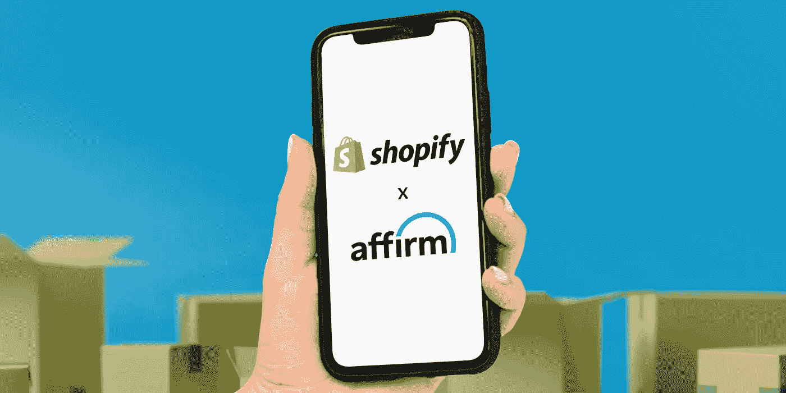

# “先买后付”的兴起

> 原文：<https://medium.com/geekculture/the-rise-of-buy-now-pay-later-83d7380ef5a7?source=collection_archive---------11----------------------->

## 人们已经深深爱上了每月订阅，他们现在使用这种模式进行购买

Photo via [Affirm](https://www.affirm.com/press/releases/affirm-to-power-shopify-shop-pay-installments)

你喜欢订阅，是吗？

毕竟，将一笔大额支付分成更小的每月支付部分是很好的。你不必 100%预付买房或买车的费用，这是有原因的。如果是这样的话…