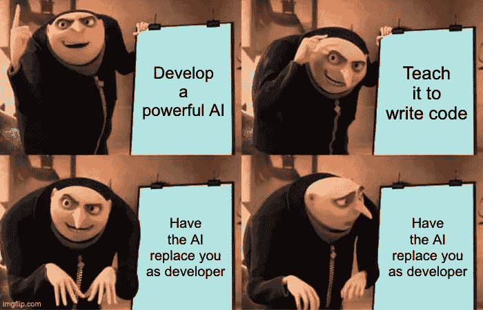

# ChatGPT 的崛起和软件开发者的没落——这是末日的开始吗？

> 原文：<https://medium.com/geekculture/the-rise-of-chatgpt-and-the-fall-of-the-software-developer-is-this-the-beginning-of-the-end-a48485e6da1b?source=collection_archive---------1----------------------->

## 我最近的文章是错的，我们正在寻找未来的替代者

最近[我发表了一篇文章，评估我们作为开发者是否应该害怕 ChatGPT](https://blog.bitsrc.io/i-asked-chat-gpt-to-build-a-to-do-app-have-we-finally-met-our-replacement-ad347ad74c51) 偷走我们的工作。