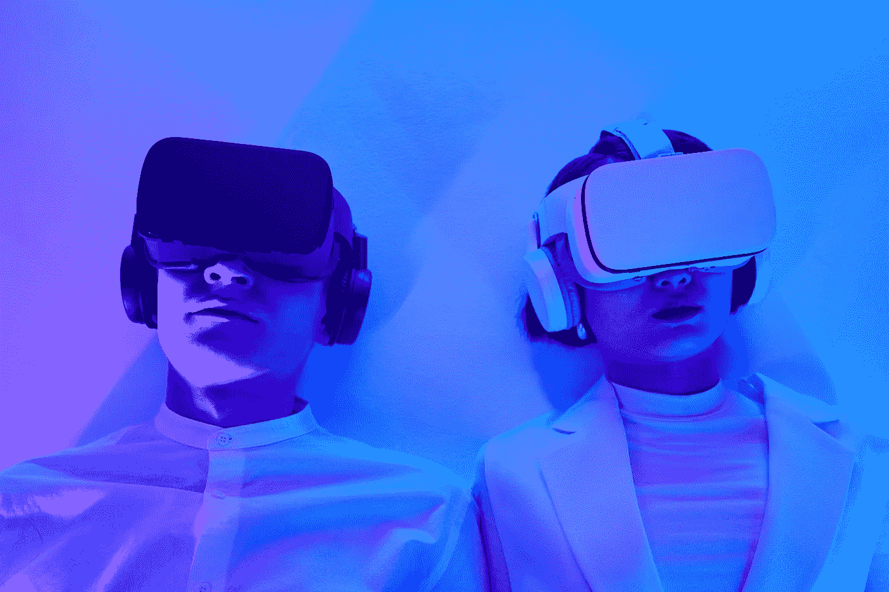
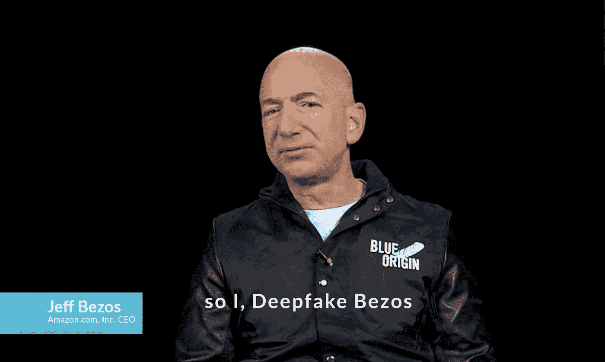
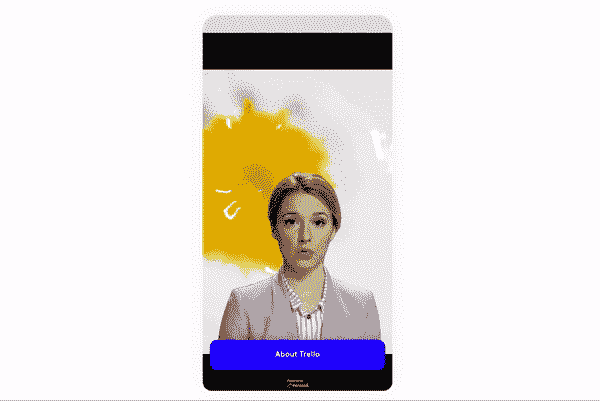

# 数字人类的崛起

> 原文：<https://medium.com/geekculture/the-rise-of-digital-humans-ca2e3f39a8f0?source=collection_archive---------12----------------------->

## 合成媒体驱动的机器人正在彻底改变在线业务

Photo by [Michelangelo Buonarroti](https://www.pexels.com/@michelangelo-buonarroti?utm_content=attributionCopyText&utm_medium=referral&utm_source=pexels) from [Pexels](https://www.pexels.com/photo/fashion-man-people-woman-8728560/?utm_content=attributionCopyText&utm_medium=referral&utm_source=pexels)

几年前，很难想象我们可以每天与数字人互动的世界。但是今天，你可以在一个网站的客户支持机器人中或者在你玩的游戏中遇到一个数字人，他是分层数字结构的一部分。只有当你无法区分机器人和真人时，你才会意识到人工人类互动的强度。

数字人有三种类型:

1.  一个基于文本的聊天机器人，从一端模仿人类对话
2.  像真人一样说话的卡通人物
3.  一个人工智能生成的人类，不仅看起来和说话像一个真实的人，而且模仿真实的面部表情。

如果这三种类型中的任何一种竞争真实人类的水平，那么这是因为超高质量的实时渲染模型的伟大执行，这将为数据带来生命。创建这种机器人的方法可以是大量的手动和脚本动画(包括动作捕捉)和数月的角色艺术**或**它可以是一个单一的**深度学习模型，在几分之一秒内做同样的事情。**

## Deepfakes 还是 Deepbots？

几乎每个上网冲浪的人都读过或看过 **Deepfakes** 。 **Deepfake** 这个词来源于“深度学习”和“假”这两个词。它是一种基于人工智能特定分支的视频或声音合成技术。我们一听到“ **Deepfakes** ”这个词，普遍的态度更倾向于敌视而不是乐观。但是，如果我们以某种方式将“假”的成分最小化，并将其引入立法领域，Deepfakes 技术可以转化为 Deepbots，它有许多应用程序，可以在日常生活中造福人类。

An example of how Deepbots can be used to present a product

# 合成媒体人(深度机器人)

当一个人工智能模型创建一个数字人类化身，像一个真实的人或像一个虚构的人一样互动和移动时，我们可以称之为合成媒体人或深度机器人。合成媒体人(Deepbots)是媒体市场的一个相当新的分支，从一开始就吸引了很多争议。一方面，合成媒体通过使其可扩展和负担得起来加速内容制作，并且它利用人工智能的力量来实现以前被认为不可能的想法。另一方面，合成媒体市场仍在努力定义其用例的道德边界。简而言之，两难的问题是，这项技术应该被大众化并为大众所用，还是只在制度层面加以限制。

[Source](https://www.synthesia.io/post/the-future-of-synthetic-media)

无论如何，深度机器人或合成媒体人正在通过为专注于**可扩展性**和**创新**的内容创作者创造积极影响，迅速改变媒体格局。在我们讨论合成媒体人类的一些隐藏见解之前，我们先来看看这些深度机器人的一些常见结果。

## 深度机器人的成果

技术的绝对性从来没有好坏之分；我们使用技术的方式决定了它的性质。Deepbot 技术的一些好结果是**操作可扩展性、知识可扩展性、可负担性、**和**视觉通信。**简单来说，如果我们举个例子:

1.  **运营可扩展性:**我们可以让品牌大使复活，为品牌的广告运营带来个性化的影响。
2.  **知识可扩展性:**我们可以创建可交互的虚拟人类专家，他们可以拥有与人类专家相同的知识。
3.  **经济实惠:**我们可以制作一个模特谈论你的产品的生产级视频，而不用担心摄像机、音响设备或模特的演示技巧。
4.  **视觉传播:**我们可以利用这种传播渠道(视频)的视觉模型，向我们的目标受众进行视觉传达。2013 年发表在《网络空间心理学研究杂志》上的研究表明，与基于文本的聊天相比，人类倾向于在视频互动中建立更强的情感联系。
5.  多语言交流:我们可以让一个 Deepbot 为同一文本说多种语言和口音。这有助于打破语言障碍。

A Deepbot Doctor that Speaks Multiple Languages — [Source](https://person8.ai)

然而，抛开 Deepfakes 即 Deepbots 的道德方面，即使我们照原样使用 Deepfakes，它也有多个积极的结果。例如，想象自己是新的复仇者联盟电影中的一张脸，或者想象自己是下一个黄金时间节目的主持人。世界各地的许多人都有这些愿望，如果使用技术可以满足一些人的这些愿望，技术的结果将变得更有成效而不是有害的。最近一个有争议的例子是比尔·波斯特的一些作品，他遵循批判性公共艺术的传统——像 [Deepfake Bezos](https://vimeo.com/362394611) 传播燃烧森林的环境意识信息。这表明 Deepfakes 如何被用来传播宣传的计算形式，并利用定义数字影响行业的相关架构。

Deepfake Bezos by Bill Poster — [Source](https://vimeo.com/362394611)

# 作为下一代聊天机器人的深度机器人

深度机器人是真实或虚构人类的虚拟复活，是为了在数字互动中支持一方而建造的。这是这项技术最容易管理和最道德的使用案例之一。

目前，我们可以在世界范围内找到多个基于这个用例的创业公司。一个这样的例子是 [person8.ai](https://person8.ai) ，它提供视频聊天机器人解决方案来自动化**客户支持**并增加网站的**参与度**。还有许多其他创业公司通过提供 Deepbot 视频开发解决方案专注于同一条线。所有这些初创公司的一个共同点是，它们在 B2B 层面上运营，这向我们表明，我们离看到这项技术被大众化还有多远。

A Synthetic Media Human Video Chatbot on a website — [Source](https://person8.ai)

然而，在这些发展中可以观察到一些有趣的模式:

1.  **生成式人工智能技术正在成为主流。它开启了一个全新的合成媒体微型产业，拥有颠覆其他相关产业的巨大能力。**
2.  **颠覆者正在被颠覆。我们看到聊天机器人是如何在过去几年里成为主流的。同样，我们也将看到视频聊天机器人在创纪录的时间内成为主流。**
3.  **下一代用户体验。**世界各地的产品制造商总是希望让他们的产品在竞争激烈的市场中领先一步。这可以通过改进您的临时服务系统或您的用户体验来实现。这就是视频聊天机器人解决方案最适合的地方。
4.  **向视频数据的转变。**在过去的几十年里，我们看到了互联网上从文本数据到图像数据的逐渐转变。但目前，一个普通的社交媒体用户一天中看到的视频内容比图片或文本多几分钟。

# 聊天机器人需要进化

客户使用聊天机器人的最大障碍是，许多人更喜欢与现实生活中的助手互动，而不是与机器互动。但是由于人类专业技能可扩展性的限制，这并不完全可能。在 [2018 年聊天机器人状况报告](https://chatbotsmagazine.com/chatbot-report-2018-global-trends-and-analysis-4d8bbe4d924b?gi=1d8671626145)中，约 43%的受访者停止了与聊天机器人的互动，因为他们想在聊天窗口上与现实生活中的人类打交道。

因此，我们面临两个重要问题:

1.  我们如何满足日益增长的对无限的人类互动的需求？
2.  我们如何推广自助文化，需要做些什么？

我们可以在这两个问题的交叉点上找到一个解决方案，也就是说，我们是否可以创建一个系统来代替一个真实的人(像一个真实的人一样交互)，以及该系统是否可以包含所有可能的场景，并根据支持请求向用户可视化地显示。这样就能比以前满足更多的用户。这就是**视频聊天机器人解决方案发挥作用的地方**。它们是目前基于文本的聊天机器人的进化版本，可以以更身临其境的方式在视觉上吸引用户，这样在交互中就有了一丝同情和共鸣。视频聊天机器人不仅满足了这种对更好客户体验的不断增长的期望，还为产品所有者提供了一种向用户可视化表达想法的方式。

Visual Communication by Deepbots — [Source](https://person8.ai)

为了支持我的说法，聊天机器人确实需要进化，我们可以看到 [2018 年聊天机器人状况报告](https://chatbotsmagazine.com/chatbot-report-2018-global-trends-and-analysis-4d8bbe4d924b?gi=1d8671626145)的数据，该报告称，约 62%的婴儿潮一代(老一辈)和约 55%的千禧一代(年轻一代)根本不喜欢聊天机器人的体验。这不仅为客户体验等重要指标设立了较低的基准，也显示了客户支持和体验行业的巨大空白。

## **基于 Deepbots 的视频聊天机器人能赢得用户的信任吗？**

用户的信任度不能用一个标准来量化，但是可以通过监测他们每次登陆你的网站时使用某个功能的一致性来衡量。正如我们在日常生活中评估信任一样，用户的信任可以通过多种方式进行评估。你相信银行会保护你的钱的安全，你相信医生对你健康的建议，你相信你的狗会守护你的房子。信任可以是认知上的或者情感上的*。*认知*信任主要基于对能力、可靠性和可靠性的信任——就像你对银行的信任。而情感信任是基于对情感纽带和关系的信任——比如你对家人和狗的信任。类似地，在用户的情况下，你的客户支持系统和你的用户之间的认知和情感信任是基于双方之间的人际关怀。如果你是一个非注册用户，信任在认知层面是有限的，但是一旦用户为你的计划付费，信任就简单地将其边界从认知层面转化为情感层面。*

**

*Deepbots engagement is immersive, creates an Affective Trust — [Source](https://person8.ai)*

*在视频聊天机器人的例子中，合成媒体人(深度机器人)是互动的一个根深蒂固的部分，用户应该像我们信任人类一样信任他们吗？老实说，我们不能像信任人类那样完全信任它们，但我们可以更加信任这些系统。我们经常看到或听到这样的案例，客户支持互动是如何粗鲁、冷漠和考验耐心的。但是对于数字人来说，任何不愉快的经历都不会发生。根据我们所指的客户支持的背景，我的观点很容易受到多方面的质疑。也许，在许多情况下，真人比数字人对用户更有帮助，但人类也遵循一个流程，在一定误差范围内向用户提供客户支持。使用数字人只会进一步减少误差。因此，可以有把握地说，最终，人们将与基于人工智能的数字人类建立这种程度的深度信任。然而，当我们步入这个由数字人类辅助的激动人心的新世界时，我们仍然需要自然地小心。*

# *数字人类交互应该有情感吗？*

*作为人类，我们在所有的互动中都会产生情感纠葛，不管这些情感背后的感觉是非理性的、不合逻辑的还是个人的。即使当你与基于文本的聊天机器人互动时，我们的潜意识中也会产生无声的情绪。如果聊天机器人无法帮助你，那种沉默的情绪会在几分之一秒内变成愤怒或失望。然而，如果你和一个真正的客户成功经理交谈，由于双方的情感交流，你不太可能生气或失望。因此，在数字人类的双向互动中，情感是绝对必要的。事实上，数字人类的面部和音频情感是他们区别于基于文本的机器人的关键特征之一。*

**

*Facial and audio emotions of digital humans make them stand out — [Source](https://peroson8.ai)*

*人们通过自己过去的经历和内心状态来过滤他们感知的世界，这是一个共识。如果你创造了一个对你的用户在情感上是负面的用户体验(字体，网站颜色)，他们就很难留在你的网站上。但是如果你创造了一种积极的情感体验，提升了安全感和信任感，你的用户就更有可能感受到情感信任的潜在影响。情感信任发展了一种个性化的感觉，在用户体验方面更有成效。类似地，当一个视频聊天机器人与你的用户交流时，数字人的面部和音频情感会给用户带来真正的亲密、共鸣和友谊感。这种感觉会为你的品牌催化强大的动力价值主张和客户保留。*

# *最后的想法*

*数字人类浪潮是一场不断发展的运动，正在塑造互联网的未来，尤其是我们在网站上消化的内容。如果你想在交互中检查一些数字人，一些例子是:*

1.  *基于数字人类的数字影响者 Lil Miquela*
2.  *基于数字人的视频聊天机器人 [person8.ai](https://person8.ai)*
3.  *麦当劳[数字人类](https://www.youtube.com/watch?v=RxudBDhuOpU&t=47s&ab_channel=QuHarrisonTerry)灵魂机器收银员*

*互联网上有更多的数字人。这些数字人最终出现在社交媒体和私人通信渠道上，因为互联网用户开始在人的层面上与这些机器人联系起来，并理解这些机器人如何在无人问津的情况下帮助他们。数字人类不仅被设计用于具体化和有意义的交互，而且他们还被设计用于接受构建社会信任的原则。只有当用户知道这项技术的起源及其背后的系统时，他们对数字人类体验的信任才会增长。*

*在这个不断发展的网络世界中，**数字信任**正成为一种难以获得又很快失去的全球商品。如果我们在开发和设计技术时牢记人类对联系的需求，我们就能随着时间的推移建立并保持信任。由于这种信任，我们可以利用这些合成媒体人的力量来创造数字解决方案，以我们刚刚开始推测的方式帮助人们。*

*我的博客反映了我所从事的工作，并简单地传达了我对这些话题的理解。我对这些话题的解释可以和你的不同，但我的解释只能和我一样无误。*

**