# 漫游 CSS 系统

> 原文：<https://medium.com/geekculture/the-roam-css-system-cefdf4917051?source=collection_archive---------9----------------------->

## Roam CSS 系统是一个模块化的、基于块的方法，用于改变 Roam 研究的外观和感觉。它经过精心设计，允许非技术爱好者的最终用户轻松定制。


> 8 月 7 日更新，关于新的可用主题 lesswrong 和其他内容。

# 背后的想法

[Roam Research](http://roamresearch.com) 是一个非常棒的工具，可以用来记笔记、联系想法、头脑风暴、组织主题——简而言之，它几乎包含了构建第二个大脑所需的一切。

虽然我们都喜欢这个应用程序的技术方面，但不是每个人都有相同的审美情趣。有些人更喜欢简约，有些人更喜欢多彩。一个人可能喜欢暗模式，而另一个人喜欢亮模式或希望主题在操作系统设置改变时自动改变。

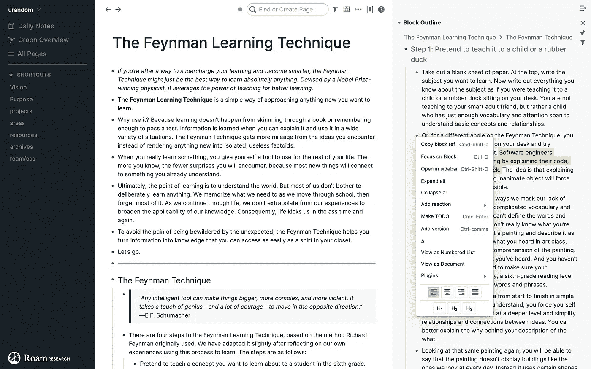

The default look of Roam Research

Roam Research 长期支持自定义 CSS，但每当应用程序的后台发生变化时，您都必须更新您的自定义设置。这可能是一个非常耗时的过程，每个想要更改 CSS 的用户都必须这样做。

这让我产生了一个想法，以一种普通的非技术用户可以在不知道所有细节的情况下专注于光学变化的方式来抽象底层技术。

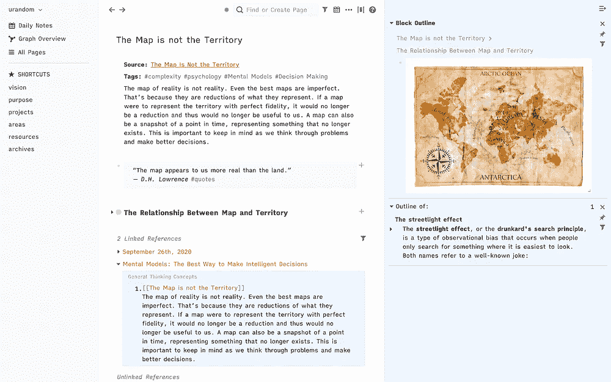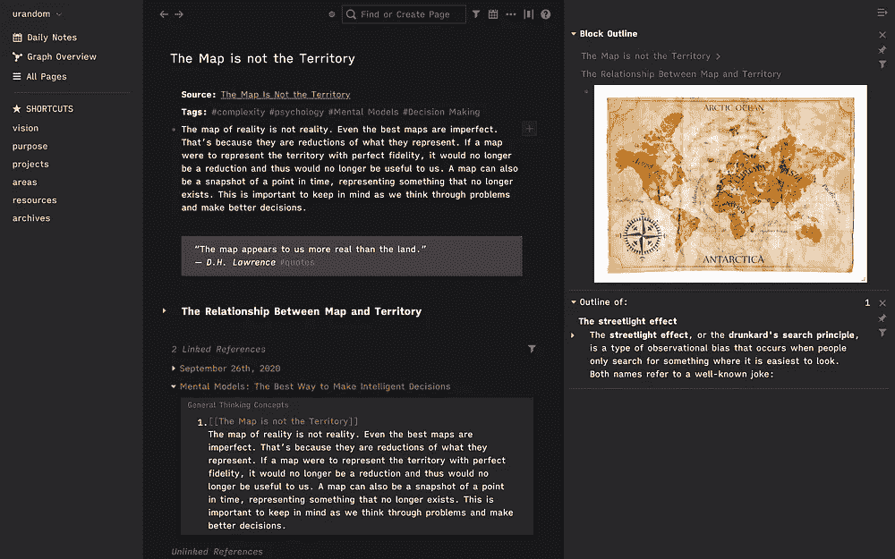

Roam Research with Quattro Theme in light and dark mode

# 快速启动

使用我的 CSS 系统相当容易。转到您的`roam/css`页面，添加一个新的 CSS 代码块，包含:

```
@import url('https://rcvd.github.io/roam-css-system/themes/quattro.css');
```

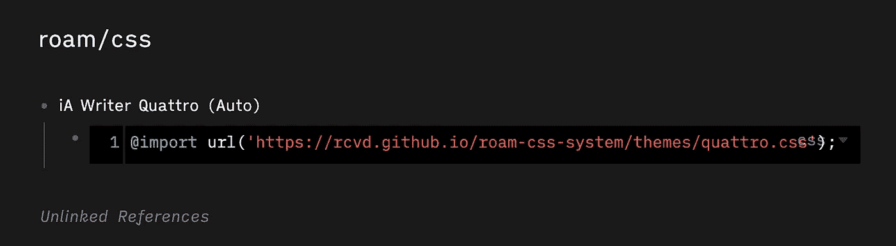

A roam/css page prepared for using the CSS System

您应该会看到新 CSS 系统的即时变化(基于您的操作系统设置为亮或暗)。如果您喜欢强制亮或暗设置，请选择

```
@import url(‘https://rcvd.github.io/roam-css-system/themes/quattro_light.css');
```

或者

```
@import url(‘https://rcvd.github.io/roam-css-system/themes/quattro_dark.css');
```

如果你已经对结果满意了，那你就完了。更多的主题将很快出现。

更新:有两个额外的主题可用。LessWrong(灵感来自他们的[牛逼网站](https://www.lesswrong.com))和[有教养的代码东西](https://culturedcode.com/things/)。

将此添加到您的`roam/css`页面，使用它们:

```
@import url('https://rcvd.github.io/roam-css-system/themes/lesswrong.css');
```

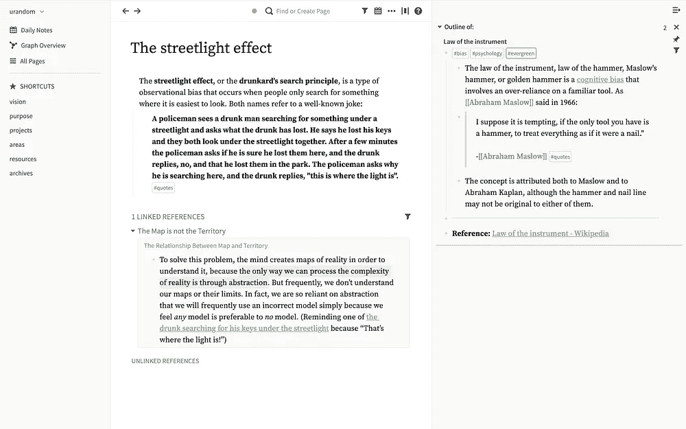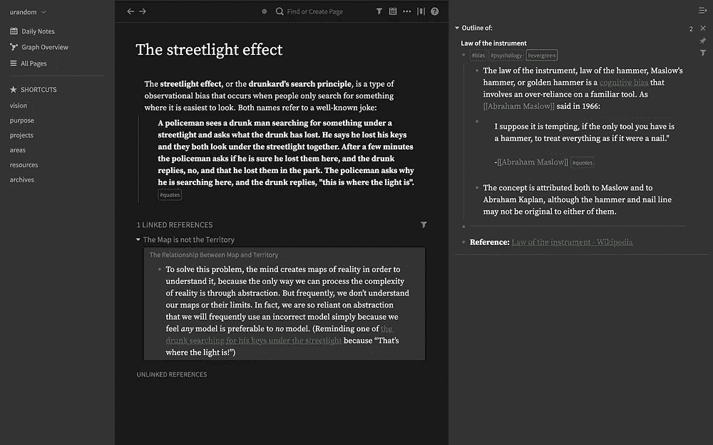

Roam Research with the LessWrong Theme (Light and Dark Mode)

```
@import url('https://rcvd.github.io/roam-css-system/themes/things.css');
```

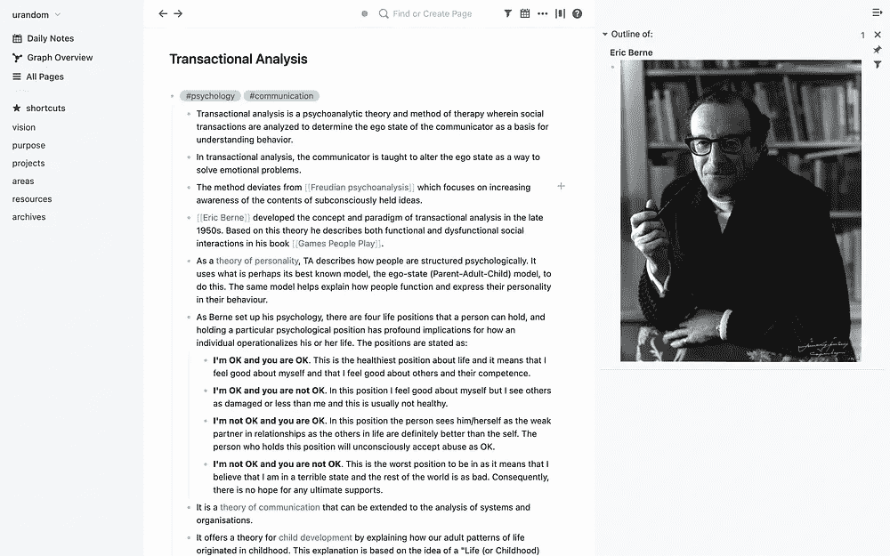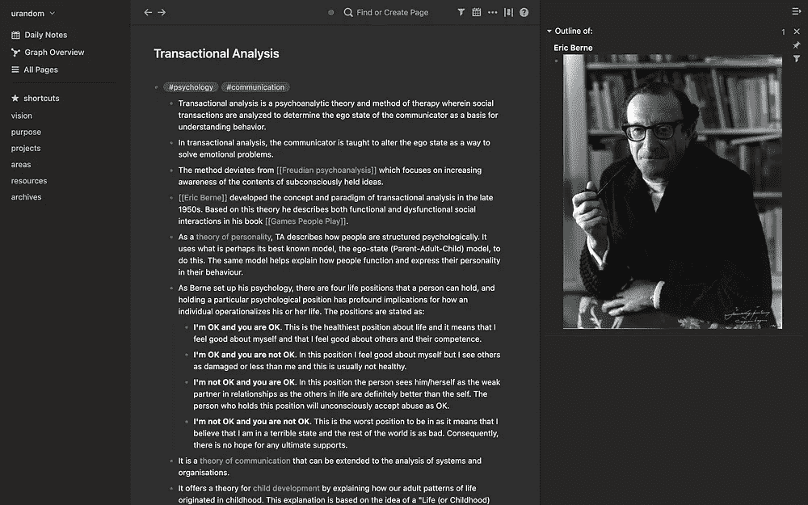

Roam Research with the Things Theme (Light and Dark Mode)

如果你想改变一些更特别的东西(例如，比起红色，你更喜欢绿色)，请继续读下去。

# 定制它

如果您想改变外观和感觉的某些方面，这比以往任何时候都容易。

CSS 系统已经提供了 700 多个变量来进一步定制细节。每当你改变一个变量并把它放在`roam/css`导入块下面，它就会覆盖主题的默认设置。

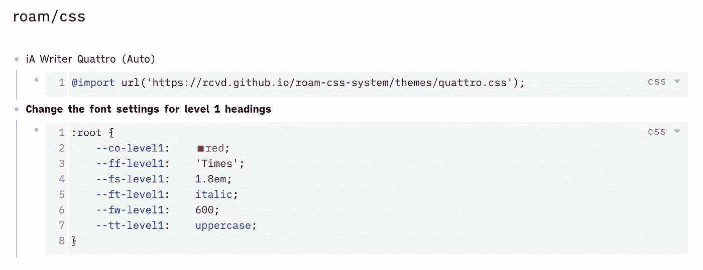

Example showing how to overwrite font settings for level 1 headings

您可以在这个[公共漫游研究图表](https://bit.ly/roam-css-sys)中找到更多详细的文档和所有变量的参考资料。

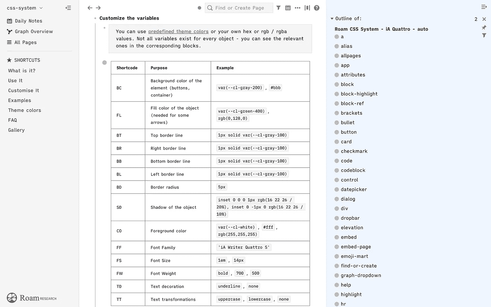

Screenshot showing the documentation for customizing the theme

我还在这里放了一些常见的例子来进一步向您展示这是如何工作的。

所有这些给你一个微创的方法来达到你想要的效果。

# 如果某些东西不起作用怎么办？

虽然 CSS 系统已经有了一个非常强大的基础，但我可能错过了一些主题化的对象。我可能还忽略了一些您想要更改的对象的属性。我的文档可能还是太短或不够精确，无法指导您完成整个过程。

无论如何，你可以通过 Medium 联系我，在 [Twitter](https://twitter.com/rcvd_io) 上，或者(这是我喜欢的方式)在 [GitHub](https://github.com/rcvd/roam-css-system/issues) 上发表一个问题。请放心，整个 CSS 系统将随着时间的推移而增长，并将添加更多的主题。

# 窗帘后面的一瞥

如果你是一个对这种工作方式感兴趣的科技通，让我们来看看这个系统的内部。

首先也是最重要的是 CSS 选择器和变量的分离。这保证了用户可以更改某些方面(下一个截图的下半部分),而不必关心底层技术(截图的上半部分),后者可以从 Roam Research 的一个版本更改到另一个版本。

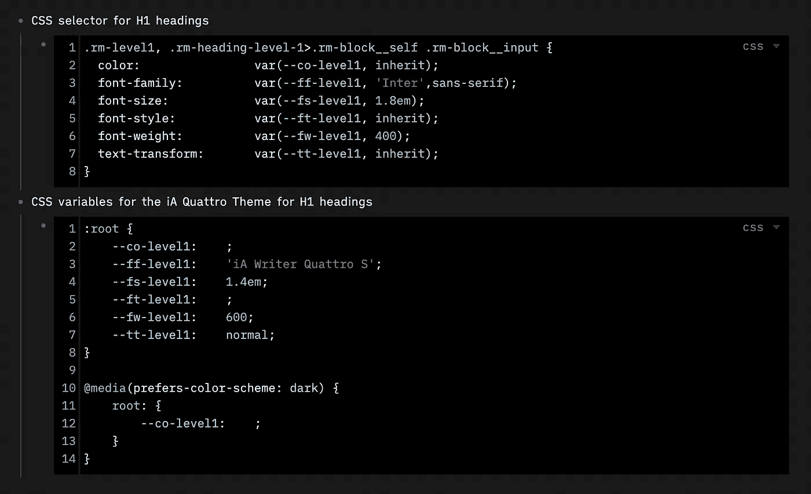

Showing how CSS selectors and Variables interact

我已经创建了一个包含相关 CSS 选择器(超过 240 个)和默认值的电子表格。我使用了基于 BEM(块、元素、修改器)的三级对象命名方案，该方案会持续一段时间。然后，我决定了哪些对象应该根据不同的方面进行定制(你看到那里的小十字了吗？)并在我的 iA Quattro 主题中放入我个人更喜欢的值。每当 CSS 选择器向上游改变时，我只需要更新电子表格中的一个单元格，而用户端几乎从不需要改变。每当我们发现一些我还没有主题化的东西，我必须添加一些额外的行。

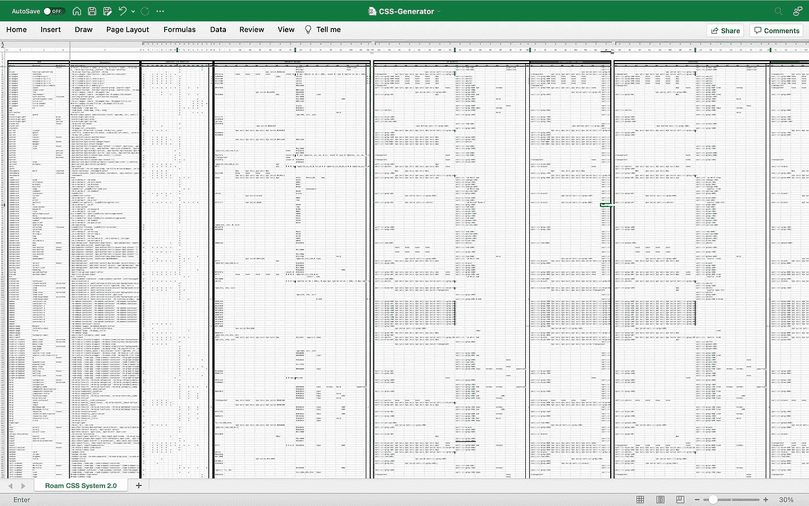

Maintaining all CSS Selector and settings in one big spreadsheet

为了在 Roam Research 图中创建变量的参考页面，我编写了一个脚本来自动创建一个用于导入的 JSON 文件。这将有助于始终有一个最新的参考。

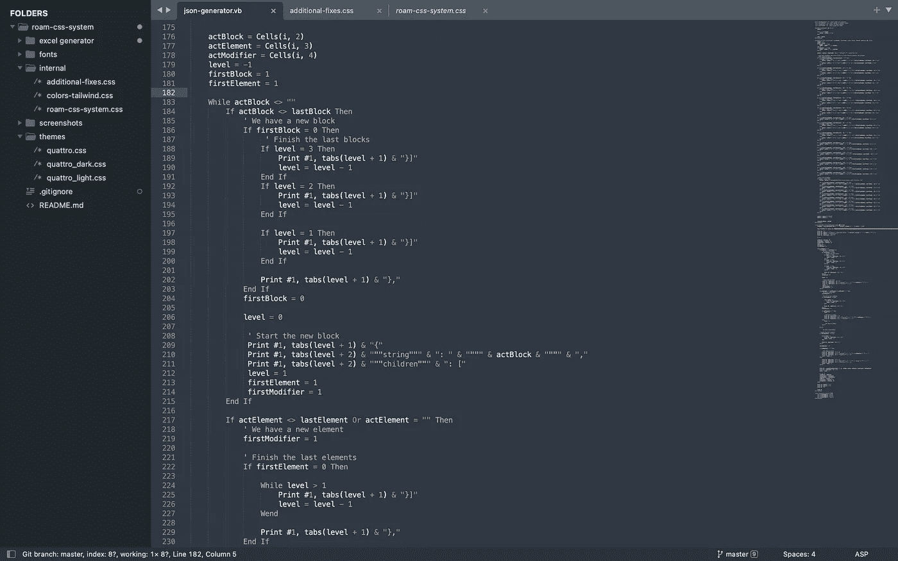

Development of the Roam CSS System

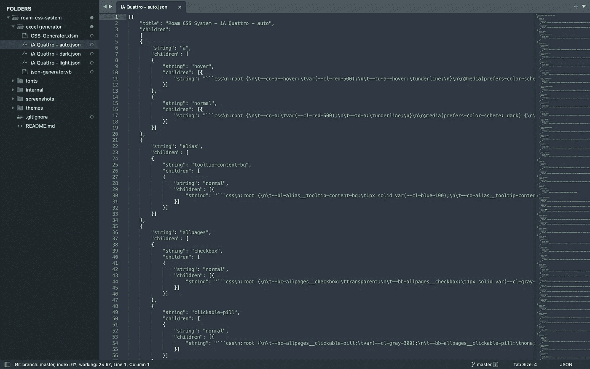

The final JSON file

如果你对更深入的方面感兴趣，请告诉我。

# 遗言

如果你喜欢我的作品，如果你能帮忙传播这个想法，我会很高兴。如果你真的想支持我，你可以在 [Flattr](https://flattr.com/@rcvd) 或 [PayPal](https://paypal.me/rcvd) 上这样做。

玩得开心#roamcult。