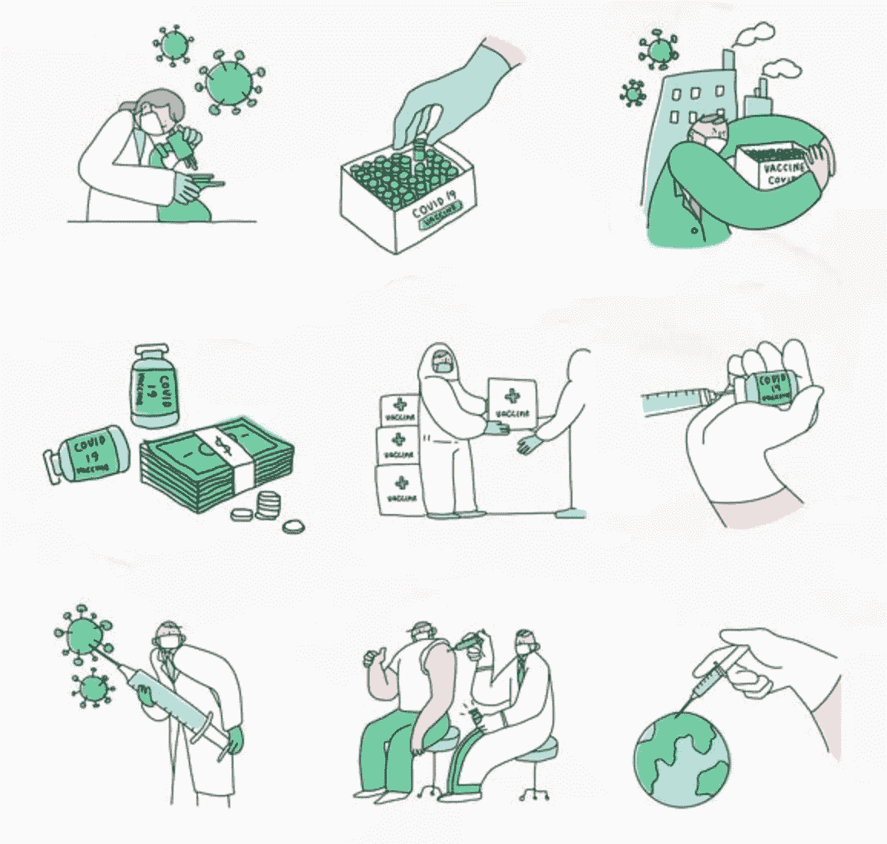

# 人工智能在疫苗分销中的作用。

> 原文：<https://medium.com/geekculture/the-role-of-ai-in-vaccine-distribution-c165f3a2a754?source=collection_archive---------26----------------------->

## 人工智能如何帮助疫苗分发。

# 介绍

人工智能在疫苗分发中的作用将在为全球人口接种疫苗以对抗任何未来的疫情方面非常关键。疫苗分配是最大的物流挑战之一，我认为人工智能可以用来帮助我们公平分配任何疫苗。

如果我们有高质量和准确的数据，疫苗分销面临以下挑战，人工智能可以提供帮助。

> *需求预测。
> 配送网络。
> 供应链管理。
> 接种重点。
> 减少废物。
> 不良事件监测。
> 漏洞映射*

# 请求预报

准确预测疫苗需求对疫苗分销尤为重要，这项工作有助于确定和建立这些疫苗有效推广所需的分销网络。我们希望在其他人之前，将适量的疫苗送到急需的人群手中。

需求预测可以通过识别最脆弱人群的正确参数来完成，这意味着整理影响疾病严重程度的共病状况的匿名数据。一旦我们掌握了这些信息，我们就可以在全球范围内公平地分配剂量，拯救更多的生命。这将有助于公平和最有效的分配。运行基于人工智能的算法来识别脆弱的患者和患者的临界质量对于有效的疫苗分发非常重要。

人工智能在疫苗分发中的作用不可低估，特别是如果我们希望疫苗以有效和高效的方式分发。如果我们有更好的全球疫苗分发需求预测，我们可以为疫苗分发做更好的准备。我们应该开始为未来的流行病收集匿名数据，这样我们才能做好更充分的准备。请记住，对疫苗的需求是一维的。因此，需要需求预测技术来确保疫苗提前到达特定人群。

从手机位置、邮政编码和人口统计数据分析的物联网和数据将打印出疫苗需求的清晰图像。因此，不同地区的药店和医院可以提供适量的剂量，以满足社区的需求。

数据也有助于追踪该地区接种疫苗的人数。至少 80-90%的人口需要接种疫苗以获得对任何疾病的免疫力。这将有助于我们快速应对任何肆虐的疫情病毒，并实时适应。

概率建模可以通知人工智能系统开发一个优先级列表。因此，帮助医疗专家和相关方加快和简化决策。

生成优先级分组不是一项简单的任务。它需要各种专家的时间和努力，比如数学家、临床医生和数据分析师。然而，在人工智能的帮助下，我们可以通过更简单的方法实现类似的结果。因此，节省时间和精力。

这些方法是通用的，这意味着它们可以应用于特定疫情之外的其他场景。此外，缺乏专业知识和数据的国家更容易采用简化的方法。

人工智能通过考虑疫苗接种人口统计、目标、经济和供应的复杂相互作用来优化决策支持。基本上，人工智能系统可以帮助解决两个关键瓶颈:

1.  疫苗分配的公平性。
2.  建设仓储设施网络。
3.  分销网络。

# 配电网

对于任何疫苗来说，确保效率都更加重要，因为最初的需求将远远超过供应，这使得每一剂疫苗都非常珍贵。当疫苗成为如此抢手的商品时，它就变得既珍贵又昂贵。在这些情况下减少浪费是非常有价值的。

根据需求预测，以分阶段的方式确定存储设施并将其设置在适当的位置，这将极大地有助于高效配送。这将有助于减少宝贵剂量的浪费。

一旦分销网络建立并运行，在供应链中跟踪它的运作和剂量是人工智能将发挥重要作用的另一个领域。

> ***阅读更多:*** [**医疗保健中的人工智能。**](https://www.aiplusinfo.com/blog/artificial-intelligence-in-healthcare/)

# 供应链管理

供应链是疫苗生产、分销和管理不可或缺的一部分。人工智能有能力提供自主供应业务。这是真的，尤其是在做出关于材料分配和疫苗分发的决定时，从现有的药物成分短缺到温度管理。

整个供应链中集成的算法和传感器确保了供应链性能的实时可见性，同时考虑了储量。因此，如果自然灾难事件影响了疫苗的供应，人工智能系统可以确定最有效的方式来增加药物的生产和销售。

现有的人工智能解决方案可以预防和调解全球疫苗短缺。它们还可以帮助节省资源和最大限度地提高疫苗接种的速度。

此外，供应链可见性和预测有助于确保疫苗生产和分配符合需求。

如今，可以部署人工智能、物联网和区块链来提高供应链效率、协作和准确性。此外，人工智能系统、区块链和其他技术使更智能的疫苗管理成为可能。他们通过提供近乎实时的跟踪和供应链可见性来实现这一目标。

人工智能系统还可以帮助进行质量控制——这是疫苗制造和供应链管理的核心部分。

> ***阅读更多:*** [***人工智能在医疗保健文档中的作用***](https://www.aiplusinfo.com/blog/the-role-of-artificial-intelligence-in-healthcare-documentation/)

# 接种优先级

人工智能可能是产生疫苗指数的引擎。该引擎可以使用以前大流行的医学、社会经济和经验数据来提出护理建议。其中一个建议是根据共发病数据确定接种优先级(这里可能存在隐私问题，但只要数据是安全和加密的)。

这种优先排序有助于阻止疫情病毒在我们社区的弱势人群中传播，也有助于根据疫情病毒在人类物种中的表现确定关键的超级传播者。

# 减少废物

人工智能可以帮助控制供应链端、制造端的浪费，并协调分销网络，确保每种疫苗只被运送到能够正确处理它的设施，并在分阶段人群的合理范围内。

在运输途中，物联网传感器可以监控疫苗的位置和温度，因此智能算法可以优化路线，以提高效率，避免可能影响运输的恶劣天气等潜在干扰。

识别与施用疫苗相关的失败将更加难以克服，但建立能够跟踪剂量的智能库存系统可以提供极大的帮助。各机构可以通过有针对性的外展活动来补充这些努力，这些外展活动的目标人群是根据这些社区内的历史使用情况确定的他们的通信偏好。一个跟踪代码可以帮助组织一个大型社区的疫苗使用和需求的故事。这需要复杂的算法协同工作，以及非常大的精确数据集。

# 不良事件监测

接种疫苗后，政府卫生机构和疫苗制造商将需要监测接种人群的异常副作用或独特的并发症。疫苗通常在数万人身上进行测试。然而，可能会有一些副作用，可能只有在数百万人接种疫苗后才会暴露出来。

许多政府要求疫苗制造商和卫生专业人员报告患者接种疫苗后出现的任何意外迹象和症状。即使是给一小群人用药，报告集也会很大，需要非常详细的分析。

通常报告的几种症状最终都是假警报，有些与疫苗无关。但有时，它们可能表明研究人员在早期临床试验中可能忽略的严重安全问题。人工智能可以帮助绘制这些症状和发生时间的地图，以帮助科学家描绘出人体对疫苗反应的清晰画面。

政府和药品制造商现在转向人工智能寻求帮助。AI 系统可以分析报告数据，识别指示安全问题出现的模式，并标记该问题。通过这种方式，专家可以进行进一步的研究，这也将减少任何疫苗的试验时间，如果我们能够减少时间并提高上市速度，这将带来 1000 倍的好处。

# 漏洞映射

除了破坏公共健康，每一次疫情都会增加或暴露全球的不平等。穷人饱受流行病之苦，同时还面临一些严重的金融挑战。社会经济贫困人口往往难以接触到。此外，他们是最后接受疫苗接种的人，然而他们是最脆弱的群体。

在大多数国家，贫困数据集来自通常在十年或更长时间后进行的人口普查和其他家庭调查。但是这些数据集不足以描绘一个国家内弱势群体的地图。除了穷人，弱势群体还包括老年人、病人、失业者、少数民族和少数族裔。

各国需要研究实验数据来源，以填补关于其弱势人口的缺失信息。实验数据可以作为易受攻击成员所在位置的代理。确保这些人在疫情期间尽快获得帮助至关重要。

人工智能系统可以将实验数据考虑在内，以更新漏洞地图来代表这些人群。

人工智能系统可以在健康的环境和社会决定因素的地图上增加另一层，包括粮食不安全、低收入工作和空气污染。人工智能更新的漏洞地图使识别需要优先考虑任何疫情病毒传播和控制的个人变得更加容易。

# 结论

大多数技术专家和健康专家认为，人工智能可以解决大多数流行病的疫苗接种挑战。它可以帮助组织更有生产力，使人们更有效率。

禽流感对寻找新冠肺炎治疗和开发疫苗的影响有限。但它将在对抗下一个疫情中发挥重要作用。我们还有很长的路要走，但人工智能将彻底改变疫苗接种的分布，为我们带来公平和效率，以便在下一次疫情来袭时采取主动。