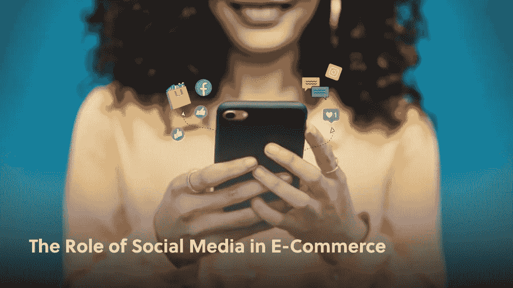
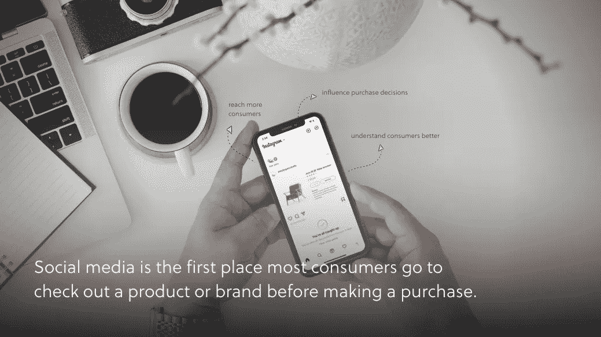
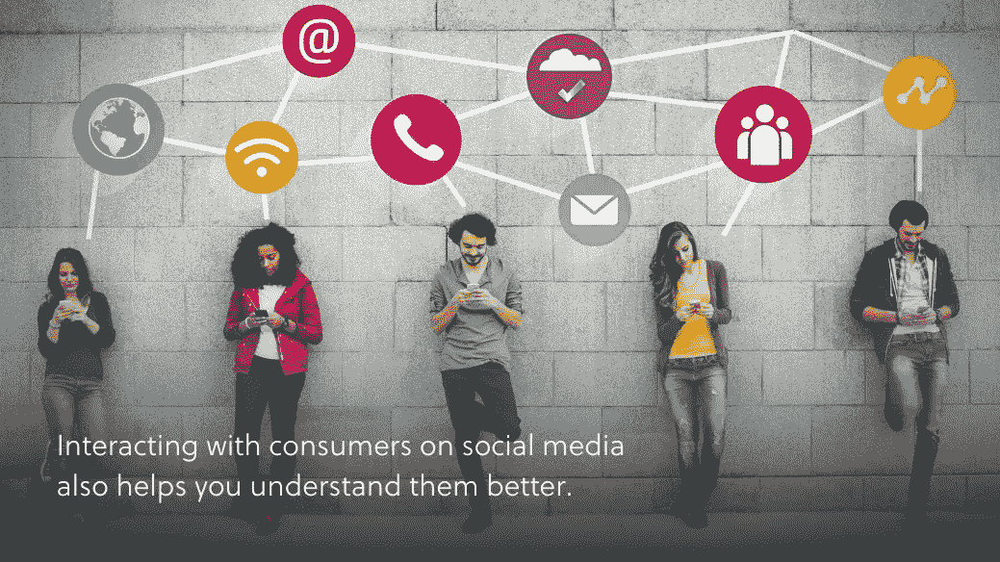
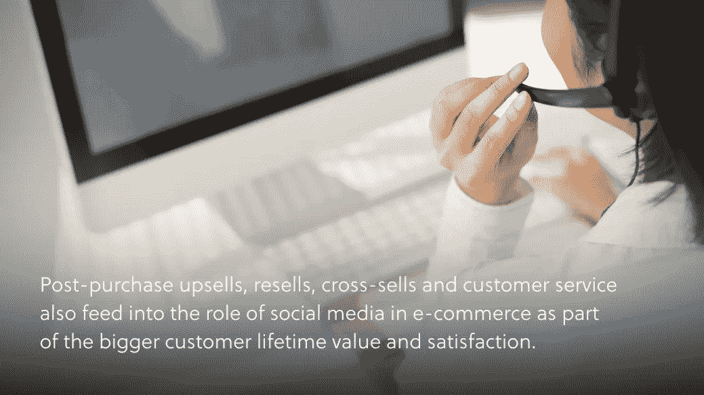
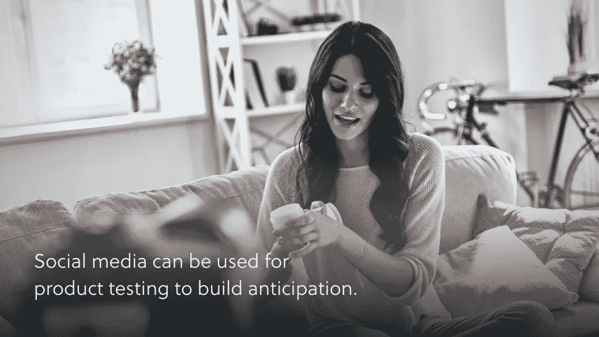

# 社交媒体在电子商务中的作用

> 原文：<https://medium.com/geekculture/the-role-of-social-media-in-e-commerce-98772c870607?source=collection_archive---------18----------------------->

## 品牌的电子商务战略

## 社交媒体如何定义电子商务中的营销和销售

这是我们许多人以前都做过的梦。也许你正走在街上，或者穿过学校的大厅，或者坐在餐馆里。一切都很平静——事实上，这个梦开始有点无聊。

然后，突然，你意识到你是完全赤裸的。

伴随着牙齿脱落和头发脱落的梦，我们意识到自己被意外暴露的噩梦是常见的重复出现的噩梦。

这些关于头发、牙齿和肉体的噩梦除了是一种特殊的困扰之外，还有什么共同之处吗？也许我们的虚荣心是罪魁祸首。

然而，并非所有程度的虚荣心都是不好的。保持我们所有的牙齿完整是一个合理的愿望，发现自己在公共场合裸体的尴尬是不舒服的，因为这是非法的。这些梦引起了虚荣心的共鸣，但这一事实并没有让我们变得不可理喻。当我们梦见自己处于这些情况中的任何一种时，我们感到屈辱的痛苦是正常的。这种健康的虚荣心让我们希望看到自己最好的一面——为了我们自己，也为了我们周围的人。

这就是我们从梦的心理学中得出的与电子商务的关键对比。如果你为任何在线销售的品牌工作，但你没有一个战略性的双管齐下的社交媒体战略，那么你的品牌在公共场合本质上是赤裸裸的。这是成千上万个品牌面临的一个反复出现的问题，但这一次它不是梦。

你会问，社交媒体的两个分支是什么？社交媒体在电子商务中的作用在于:

1.  社交媒体营销
2.  和社交媒体销售

如果你想通了其中的一个，而没有想通另一个，那就做噩梦吧，你会掉光牙齿或头发。这对你的品牌来说不太好。

这是你醒来的机会。请继续阅读，了解社交媒体如何定义当今的电子商务。

# 社交媒体在电子商务营销中的作用

当你用谷歌搜索“电子商务中的社交媒体”时，大多数弹出的结果都是关于如何利用社交媒体进行营销的文章。这很自然，因为它是社交媒体和电子商务的第一个交汇点。

这不再是电子商务和社交媒体相交的唯一方式，但它仍然是社交和电子商务相交的香榭丽舍大街。社交媒体上的产品付费广告只是一种营销途径。其他包括:

*   利用社交媒体影响购买决策
*   利用社交媒体接触更多消费者
*   利用社交媒体更好地了解消费者

# 对购买决策的影响

通过客户评论、影响者和用户生成的内容，社交媒体是建立消费者信心的最肥沃土壤。社交媒体是大多数消费者在购买前查看产品或品牌的第一个地方。

看看其他品牌如何在他们的社交内容中使用产品数据。

社交媒体上共享的信息包括品牌购买的信息(如广告、专有帖子和影响者内容)、品牌鼓励的信息(用户与品牌内容的互动)以及自发产生的信息(用户生成的内容)。

你的工作是掌握关于你品牌的所有内容，这样你就可以相应地调整你的内容和销售策略。

# 社交分享触及更多消费者

啊，强大的“分享”按钮。这个按钮对你的帖子的受欢迎程度的影响不亚于几百个“赞”随着可见性传播到新的网络，分享的内容或产品将获得更多的喜欢和分享。

影响者与用户生成的分享有各自独特的优势。务必研究[影响者与用户生成的内容](https://bettermarketing.pub/keep-up-with-the-fundamental-shift-in-marketing-from-igc-to-ugc-f80cee9b1c9e)。

# 更了解消费者

在社交媒体上与消费者互动也有助于你更好地了解他们。这是一个长期的、基于培养的营销方法的一部分。你越了解他们的需求、希望和愿望，你就能越好地用完美的产品或服务来回答他们。

当你回顾你的社交媒体报道时，问自己这样的问题:我的追随者对时间、内容结构甚至声音的明显偏好是什么？他们与什么互动最多？他们还追随谁？每个答案都将为创造更有效的营销提供非凡的见解。

# 社交媒体作为销售渠道在电子商务中的作用

社交销售让社交媒体不仅仅是另一个营销平台。从脸书的店面到 Instagram 上的在线购买产品，社交媒体销售正在成为电子商务品牌的一个高利润领域。

社交销售的便利无与伦比。Instagram 和 Pinterest 上的社交用户甚至不用留下他们的订阅，只需轻轻一点就可以获得必备的发现。从这些原生购物解决方案开始，睁大眼睛寻找更多，Snapchat 和 Shopify 等公司最近的合作为不久的将来提供了令人兴奋的承诺。

社交销售带来的不仅仅是购买。作为更大的客户终身价值和满意度的一部分，购后追加销售、转售、交叉销售和客户服务也融入了社交媒体在电子商务中的角色。

# 面向客户服务的社交媒体

社交媒体在购买后也很重要。

具体来说，社交媒体是客户服务咨询的一个重要渠道。社交媒体允许品牌在客户花费最多时间的平台上快速回复收到的信息。发送到客户的 Messenger 收件箱或 Instagram DMs 的回复几乎可以立即看到，并培养一对一的客户服务感觉，消费者发现这越来越重要。

# 用于产品测试的社交媒体

[社交媒体是产品测试的完美空间](https://www.amberengine.com/blog-content/test-market-new-product-social-media%20?utm_source=blog&utm_medium=referral&utm_campaign=medium-blogs)。你甚至选择对你最有意义的术语。例如，向你的脸书追随者进行一次试发布，会提升一种专属感和内部特权，同时也为你赢得时间，在与公众分享之前调整营销信息。

社交媒体可用于产品测试，以建立预期。如果某个产品的首版数量有限，那么社交平台就是谈论该产品并推广那些已经拥有该产品的少数幸运儿的用户生成内容的最佳场所。

# 销售细分的社交媒体

你也可以使用社交媒体来细分你的产品发布、营销和市场研究。即使使用不同的社交媒体平台也会帮助你有机地做到这一点，因为每个平台都吸引不同年龄、兴趣和在线倾向的用户。

在电子商务中使用社交媒体就像每天记得穿上衣服一样。这是必须的，但是不假思索地扔东西会导致灾难。你不想在街上被抓到一丝不挂，但你也不想被抓到穿着你蹒跚学步的孩子的连体衣。

一起制定计划:从[选择正确的关键绩效指标](https://www.amberengine.com/blog-content/how-to-pick-kpis-that-matter%20?utm_source=blog&utm_medium=referral&utm_campaign=medium-blogs)开始。在你意识到之前，你会看到社交媒体和电子商务的许多渠道进进出出的流量，合并到香榭丽舍大街的十字路口，你的品牌自信地位于拱门顶上。