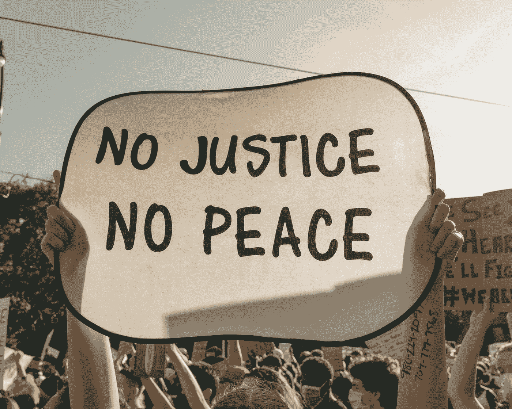
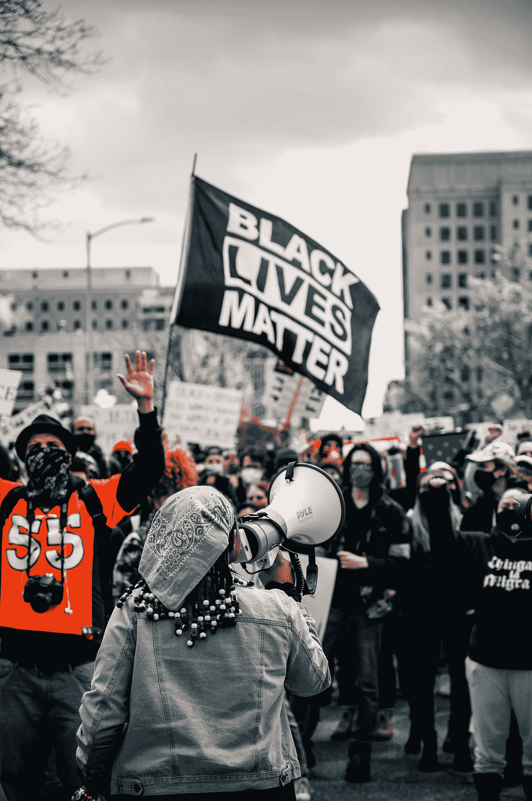
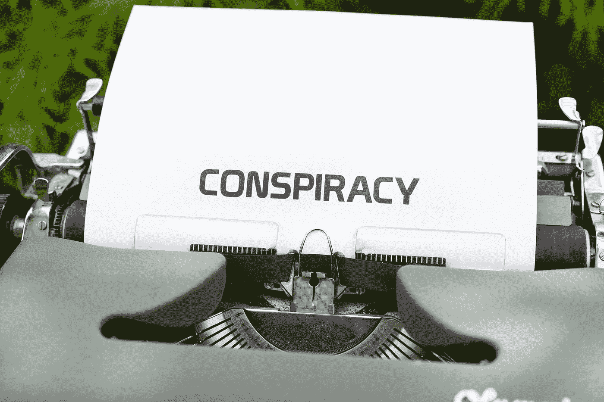

# 技术和媒体在社会变革中的作用

> 原文：<https://medium.com/geekculture/the-role-of-technology-and-media-in-social-change-6283e6cdd4e1?source=collection_archive---------16----------------------->

## 双刃剑

Photo by [Clay Banks](https://unsplash.com/@claybanks?utm_source=medium&utm_medium=referral) on [Unsplash](https://unsplash.com?utm_source=medium&utm_medium=referral)

# 简介:

今天，在我们这个在线社会运动和呼吁变革的时代，技术已经成为组织和获得公众意识的工具。只有少数人在社交媒体上成为变革的非正式领导者，并鼓励志同道合的个人表达自己，以改善社会。虽然#黑人的命也是命(BLM)和#MeToo 等运动的结果对社会产生了深远的影响，并推动了积极的社会变革，但近年来也引起了极大的关注。具体而言，对阴谋论和网上传播虚假信息的担忧也越来越多。本文将评估技术在社会变革中的作用，既考虑到#BLM 等成功的社会运动事件，也考虑到在全球范围内获得牵引力的流行阴谋论的出现。

# #BLM:

Photo by [Colin Lloyd](https://unsplash.com/@onthesearchforpineapples?utm_source=medium&utm_medium=referral) on [Unsplash](https://unsplash.com?utm_source=medium&utm_medium=referral)

BLM 是一个抗议警察暴行和种族暴力的社会运动。这场运动是一个由公民和利益集团组成的广泛联盟，团结在固有的歧视性司法制度的不公正背后。虽然这场运动始于 2013 年的某个时候，是为了应对非洲裔美国青少年特雷万·马丁(Trayvon Martin)被枪杀的事件，但它在 2020 年全球乔治·弗洛伊德(George FLoyd)抗议活动期间开始受到国际关注。据估计，美国有 1500 万至 2600 万人参加了 2020 运动，BLM 成为刑事司法改革和打击警察暴力的关键点。然而，如果没有一个关键因素，这场运动不会获得如此多的关注:社交媒体和用电影捕捉不公正时刻的能力。社交媒体为活动家提供了开展宣传活动和与其他抗议者联系的工具。此外，散列标签的发明增加了数字连接的感觉，这允许大规模运动的建立。虽然有人认为网络在线行动只是懒汉行动主义(几乎不需要承诺的行动)，但人们可以认为社交媒体仍然是一个强大的工具，因为它使人们能够向他们的网络发送文化信号。例如，当你改变你的脸书个人资料以支持 LGBTQ 时，这些符号是社会变革的一部分，并有助于更广泛的变革网络。无论是技术在 BLM 发挥的作用，还是标签的发明，社交媒体无疑都有助于进一步推进社会正义事业，如果没有社交媒体的帮助，你很可能不会在未来看到一场运动。

# 阴谋论的兴起:

Photo by [Markus Winkler](https://unsplash.com/@markuswinkler?utm_source=medium&utm_medium=referral) on [Unsplash](https://unsplash.com?utm_source=medium&utm_medium=referral)

虽然技术促进了社会变革，但它也是一把双刃剑，让各种各样的人和观点走到一起并联系起来。这些观点可能是仇恨和危险的，并且经常以阴谋论的形式出现。诸如“疫情是一个骗局”和“政客是农民的孩子”这样的标题是最令人愤慨的阴谋论之一。在阴谋论越来越多的情况下，一个被称为 QAnon 的特殊群体最近成为了关注的焦点。QAnon 是阴谋主义者的总称，他们相信这个世界是由一群崇拜撒旦的恋童癖者操纵的。卡侬的追随者强烈认为，拜登总统、希拉里·克林顿、奥巴马、汤姆·汉克斯、奥普拉·温弗瑞和教皇弗朗西斯都是猥亵儿童并吃掉受害者以提取延长生命的化学物质的名人。曾经被大多数人嘲笑的边缘人，QAnon 已经成为主流。2020 年，支持者涌入关于新冠肺炎的社交媒体，并传播关于 BLM 和总统选举的虚假信息。QAnon 的支持者也参与了美国致命的国会大厦暴乱，该组织的成员被指控绑架甚至谋杀。QAnon 也在政治中表现出来，他们是 2020 年美国大选被特朗普偷走的理论的最大支持者之一。随着 QAnon 的出现，很明显，社交媒体不仅团结了利益集团促进社会变革，还允许右翼极端分子自由竞选和传播他们的信息和意识形态。

# 结论:

虽然社交媒体作为一种工具可能是中立的，但它正越来越多地被各政治派别的强大行为者和公民使用和利用。BLM 和 MeToo 等社会运动有力地证明了社交媒体的好处，因为它们为改善社会实现了有意义的变化。然而，社交媒体也可以被用作以阴谋论的形式传播虚假信息的载体，QAnon 在政治上的一些最大争议中起了带头作用。由于社交媒体使得人们很难区分讽刺、虚假声明和真实新闻，这一切都取决于全球公民如何利用社交媒体来推进他们的事业。

参考资料:

k . roose(2021 年 6 月 15 日)。什么是 QAnon，病毒式的亲特朗普阴谋论？纽约时报。检索于 2021 年 8 月 12 日，发自 https://www.nytimes.com/article/what-is-qanon.html

Tufekci，Z. (2021 年)。*推特和催泪瓦斯:网络抗议的力量和脆弱性*。耶鲁大学出版社。