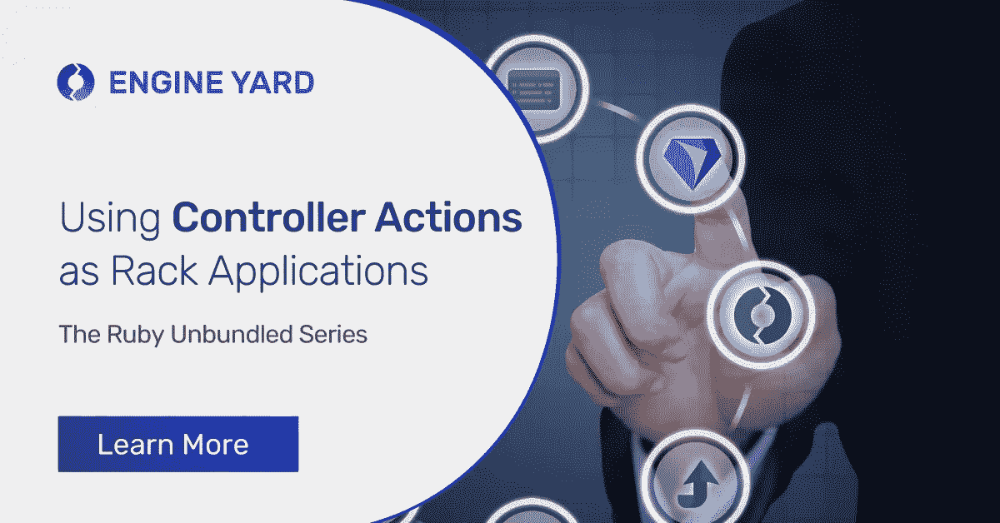
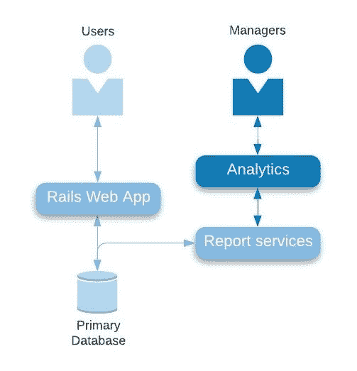
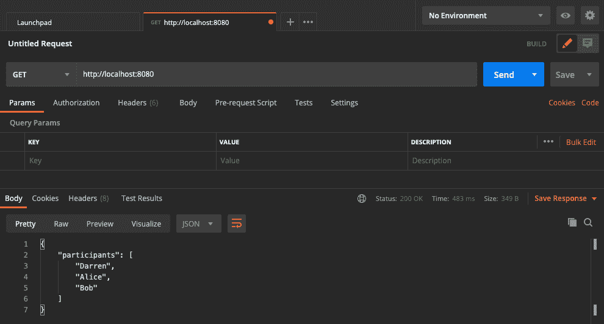

# Ruby Unbundled 系列:在几分钟内为你的 Rails 应用添加微服务

> 原文：<https://medium.com/geekculture/the-ruby-unbundled-series-add-microservices-to-your-rails-app-in-minutes-8a939e4744af?source=collection_archive---------5----------------------->



Rails 是让您的 web 应用程序快速启动并运行的出色框架。许多创业公司已经成功地用它来启动他们的网站。也就是说，如果你不小心的话，你也可能落入软件整体陷阱。在 Rails 项目存储库中，许多关注点可能会纠缠在一起。一旦确定了这个场景，重构就成了一两个 sprint 的焦点，但是随着其他业务优先级的出现，重构通常会失去动力。

本文研究了一种简单的技术，您可以用它来扩展 Rails 应用程序，并向面向服务的架构风格发展。使用 Rails，您可以基于现有的代码库以最少的工作量托管微服务。这可以为企业带来快速的成功，并为整个应用程序的持续重构奠定基础。

正如古训所说，“罗马不是一天建成的。”目标是让你的应用在每次冲刺时都不那么庞大。

当你已经在一段代码中工作时，重构是有好处的。它允许你在这个过程中交付价值，这反过来又激发了对更多重构的持续投资。涉及的环境转换较少，可以利用总体规模经济。

# 扩展 Ruby 问答应用程序

[Ruby quick](https://github.com/engineyard/ruby-quiz/tree/microservice)是一个简单的 Rails 应用程序，向用户提出五个问题。它在每个问题后提供反馈，并在最后向用户显示他们的总分。问题存储在同名的数据库表中，结果记录在尝试表中。网页如下所示。


假设管理层希望查看参加测验的用户的指标。测验是太难还是太容易？平均分是多少？大多数用户都完成了整个测验吗？

理想的架构是添加一个报告数据库和一个新的 web 前端，使经理能够执行这种分析。Rails 可以用来快速启动一个新的报告 web 应用程序，但是建立一个报告数据库比一个 sprint 需要做更多的工作。

因此，决定添加新的报告服务来公开数据。基于服务的方法避免了新的 web 应用程序必须从同一个数据库中读取数据，从而避免了任何数据库争用。我们的目标架构如下所示。



# 几分钟内的微服务

我们希望快速添加查询数据库并从尝试表返回数据的 REST 服务。此表列出了参加测验的每个参与者的结果。理想情况下，新的 reporting services 将使用与我们当前的测验应用程序相同的尝试模型类。

我们已经有了一个包含相关逻辑和代码的 QuizController，但是我们希望为我们的服务提供一个单独的端点。将服务放在新的 DNS 条目之后，可以让我们更加灵活地向前发展。随着我们构建更大的报告能力，它为我们的未来做好了准备。

这就是 Rails 可以帮忙的地方。每个控制器动作方法本身就是一个逻辑服务端点。当我们向 routes.rb 文件中添加条目，并且相应的请求被发送到指定的控制器时，通常会发生这种情况。

然而，我们可以更进一步。控制器动作方法本质上是它们自己的[框架应用](https://github.com/rack/rack)来响应 HTTP 请求。Rack 是位于 Rails 和 web 服务器之间的中间件。我们可以使用 rackup 文件来启动将端点直接连接到我们编写的控制器方法的过程。使用这种方法允许新的微服务利用现有的模型类以及 CI/CD 管道。

这可能不是我们的长期做法，但这是朝着正确方向迈出的一步。这个微服务应该在不同的容器或应用程序中运行吗？代码应该移动到它自己的存储库中吗？也许吧，但是你可以推迟这些决定，直到你收集到更多的数据。继续构建您的目标架构的其余部分，并关注您的服务指标。

让我们首先添加一个微服务，它返回参加测验的参与者列表。为了简单起见，一开始不需要任何参数。该服务只返回用户名列表。一个新的参与者方法被添加到 QuizController 中，如下所示。

```
class QuizController < ApplicationController # Other controller methods omitted here
def participants  # This is our new service method
 response = {} 
 response[ "participants" ] = Attempt .all.map { | attempt | attempt.taker } 
 render :json => JSON [response] 
end 
end
```

注意，我们甚至没有为这个方法添加路由。这是为什么呢？因为我们将域和端口绑定直接连接到控制器动作。rackup 文件是奇迹发生的地方。除非指定， [Puma web 服务器](https://github.com/puma/puma/blob/61c6213fbab/lib/puma/configuration.rb#L10)寻找 config.ru 文件。该文件默认版本中的重要一行运行整个 Rails 应用程序。

```
run Rails.application
```

对于新的微服务，会创建一个单独的机架备份文件 config_svc_participant.ru。现有的 config.ru 文件将被保留以供 web 应用程序使用。新的 rackup 文件告诉 Rack 基于控制器的 participant 方法运行应用程序。

```
# This file is used by Rack-based servers to start the application.
require_relative 'config/environment' 
run QuizController .action(:participants)
```

以下命令指定此 rackup 文件，并在端口 8080 上运行服务，以避免与默认的 web app 端口 3000 冲突。

```
bundle exec puma -b tcp://0.0.0.0:8080 config_svc_participant.ru
```

为了测试，假设我们让 Darren、Alice 和 Bob 参加测验。使用 Postman 调用 API，我们得到如下结果，显示了我们的三个参与者。



同样，我们可以添加一个汇总微服务来返回平均分和高分。这方面的代码如下。

```
def summary
 sum_of_correct_answers = 0 
 high_score = 0 
 attempts = Attempt .all 
 attempts.each do | attempt | 
# Maintain the sum so we can calculate the average later 
 sum_of_correct_answers = sum_of_correct_answers + attempt.number_correct 
# Check if this is the new high score 
if attempt.number_correct > high_score 
 high_score = attempt.number_correct 
end 
end  response = {} 
 response[ "number_of_participants" ] = attempts.size 
 response[ "average_score" ] = (sum_of_correct_answers.to_f / attempts.size.to_f).round( 2 ) 
 response[ "high_score" ] = high_score 
 render :json => JSON [response] 
end
```

我们还为这个微服务创建了一个 rackup 文件，并在端口 8081 上运行它。如果三名参与者的分数分别为 3、5 和 3，则服务返回以下数据。

```
{
"number_of_participants" : 3 , 
"average_score" : 3.67 , 
"high_score" : 5 
} 
Hope you found this useful and let us know what micro-applications you are able to build on Rails.
```

# 利用容器实现可伸缩性

使用容器作为部署机制有很多很好的理由。就本主题而言，可伸缩性是一个主要因素。我们只是添加了一些将由同一个应用程序提供的服务。从逻辑上讲，它们表现为不同的微服务，但我们使用相同的应用程序让它们快速启动并运行。

在许多情况下，您的 web 应用程序和服务将有不同的伸缩需求。使用模式和资源利用率会有所不同。容器为这些不同的用例提供了一个灵活伸缩的好方法。

我们之前用来为每个服务运行应用程序的不同命令变成了 Dockerfile 的 CMD 语句。对于您部署的每个服务，只需要更改域/端口绑定和机架备份文件

我希望您发现这种模式很有用，并期待看到您构建的优秀服务！

*最初发表于*[*【https://blog.engineyard.com】*](https://blog.engineyard.com/ruby-unbundled-add-microservices-to-rails-app)*。*