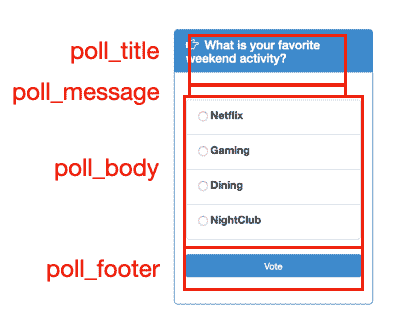
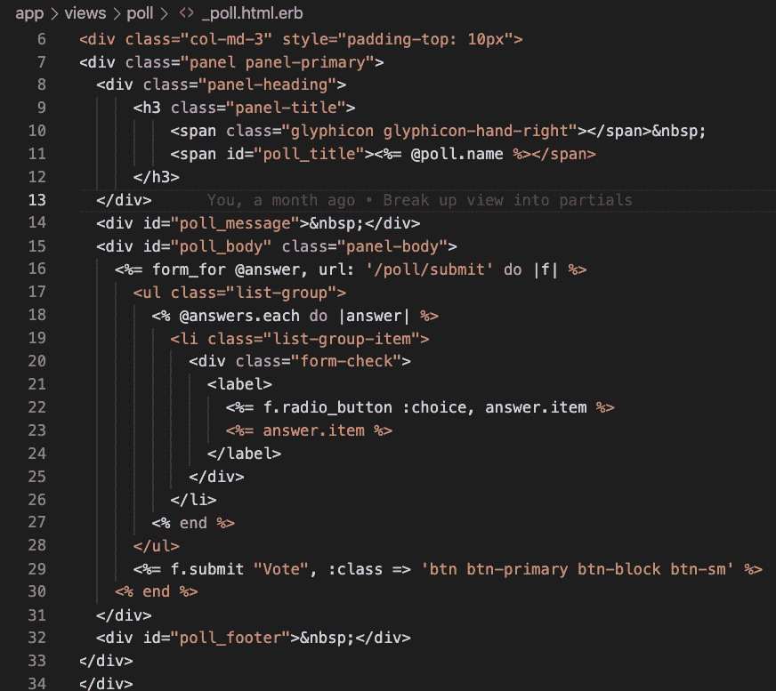
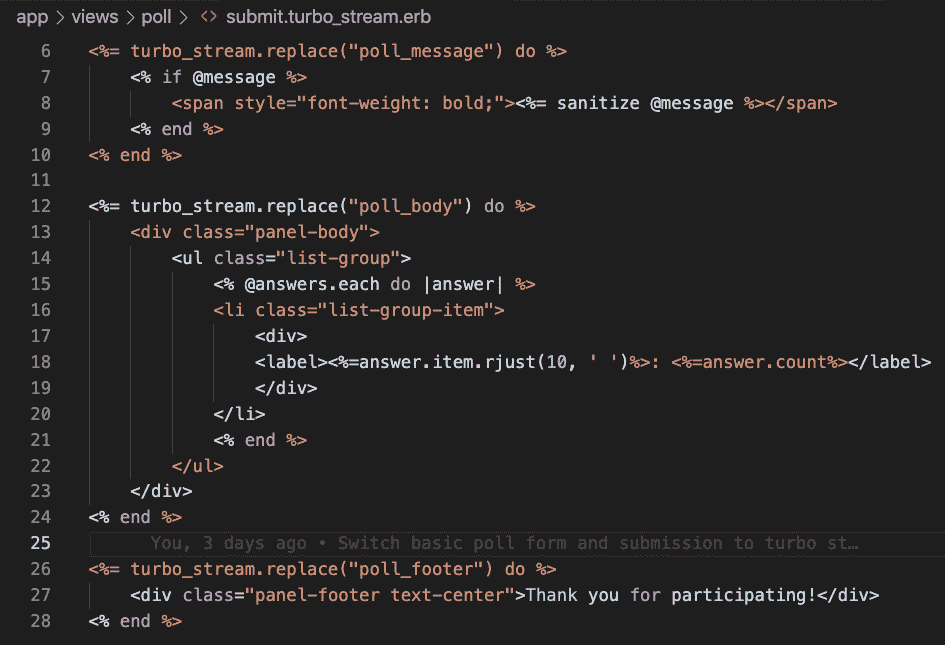
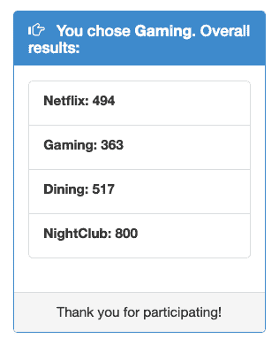

# Ruby Unbundled 系列:为什么你现在应该看看 Hotwire

> 原文：<https://medium.com/geekculture/the-ruby-unbundled-series-why-you-should-check-out-hotwire-now-da34088db2c7?source=collection_archive---------18----------------------->

Hotwire 是 Ruby on Rails web 应用程序开发的真正变革者。原因如下。


埃里克·麦克林在 [Unsplash](https://unsplash.com/s/photos/steal-car?utm_source=unsplash&utm_medium=referral&utm_content=creditCopyText) 上的照片

从前，我可以用 Ruby 和 Rails 写代码。生活很美好。然后，单页应用程序(SPA)或渐进式网络应用程序(PWA)的暴政开始了，我被迫加入 JavaScript 框架。现在，我面对的是两个不同的世界。问题是我不想离开我的 Ruby 世界。我在那里很开心。

团队需要更多的技能。曾经我们用一种技术来统治他们，现在有两种了。实际上，不止两个。这个月的 JavaScript 框架随着时间而变化。我记得我第一次使用 AngularJS。这是势不可挡的，我想，这就是 web 开发的现状？一定有更好的方法。

React 和 Vue.js 是边际改进，但没有动针。JavaScript 本身没有任何问题，但是正如[拉胡尔·苏布拉马年](https://youtu.be/0pWILPpTcOs)如此雄辩地指出的那样，我为什么要离开我的“Ruby 和 Rails 幸福泡泡”呢？

为什么首先要使用 JavaScript？因为我们需要一个页面事件来动态更新我们的内容，而不需要刷新整个浏览器。嗯， [Hotwire](https://hotwire.dev/) 的基本前提是在 Ruby 中通过网络调用这些 HTML 的服务器来完成这个任务(Hotwire 这个名字的基础)。JavaScript 库提供了管道，我们继续在我们的 Rails 幸福泡泡中编码。

听起来很棒，对吧？100%同意。因此，在过去一周 RailsConf 2021 的一些会谈的激励下，我决定乘坐 Hotwire 兜一圈。

# 一个热线安装惊喜

Hotwire 网站列出了组成框架的三个组件，但是 Turbo Frames 和 Turbo Streams 是您将主要使用的组件。对于那些仍然需要 JavaScript 的场合，Stimulus 将帮助您做到这一点。将这一行添加到您的 gem 文件中可以获得这些组件。

```
gem 'hotwire-rails'
```

Strada 是第三个组件，但目前还没有太多关于它的信息。它将支持移动应用程序开发。

有两个安装命令需要运行。首先是标准捆绑安装，然后是特定的热线安装。

```
bin/bundle install
bin/rails hotwire:install
```

如果您正在迁移一个现有的应用程序，至少在我的情况下，我在这一点上遇到了意想不到的惊喜。Hotwise 安装后，表单提交立即停止工作。我对此感到惊讶，但发现对默认应用程序布局的更改修改了它，因此默认情况下请求会得到 Turbo Streams 响应。

我的应用程序仍然像以前一样返回相同的有效 HTML，但是还没有 Turbo Frames 或 Streams 标签。因此，客户端基本上忽略了返回给它的完全有效的内容。

在最初的恐慌消退后，我适应了，并能够毫不费力地迁移我的应用程序。

# 30 秒后启动热线

使用 Hotwire 需要理解的关键概念是:

1.  控制器响应针对由 Turbo 帧或流元素标识的页面的命名片段。
2.  Turbo Frame 是页面的一个部分(想想 Rails 管理的 iframe ),它维护自己的导航上下文。相比之下，Turbo Streams 响应可以包含许多片段，用于更新页面的多个任意部分。

因此，最简单的应用程序迁移是将每个现有的 html.erb 封装在 Turbo Frame 标签中。这有点类似于涡轮驱动，我之前没有列出这一组件，因为我怀疑它会被用得太多。它将您的整个页面视为一个逻辑框架，因此当您消除页面重新加载闪烁时，您仍然总是重新生成整个 HTML 内容以通过网络发送。

Turbo 帧和流更符合 AJAX 模型，在 AJAX 模型中，您可以请求一些数据并更新相关的页面元素。不同之处在于，在 Hotwire 中，Rails 服务器会返回 HTML 片段，库会为您动态更新这些片段，而不是在 JavaScript 中自己管理这些片段。

# 回到我的幸福泡泡里

“游戏规则改变者”这个词在这个行业被过度使用了。现在我觉得有趣的是，它经常不必要地出现，因此我发现自己在寻找它的出现。但我确实觉得热线范例是一个游戏改变者。我为什么这么说？

主要使用 Ruby/Rails 编写响应性 SPA/PWA 的能力是惊人的。从整个页面的控制器响应到片段的控制器响应是一个轻微的心理转变，但是一旦你相应地对你的动作建模，再次创建 web 应用程序真的是非常容易和有趣的。不需要处理 JavaScript 框架是我最喜欢的部分。但我更喜欢从另一个角度来看。能够在构建现代 web 应用程序的同时留在 Ruby 中是值得的。

这感觉像是一个新的框架/库/组件，它将真正提高生产力，而不是增加许多项目最终成为的技术膨胀。这是一个革命性的变化。有时候少即是多，这就是一个很好的例子。

# 让我们看一些实际的代码

这是我的[即时投票应用程序](https://github.com/engineyard/eyk-app-templates/tree/webapp-features)的一个截屏，上面标注了将由 Turbo Streams 更新的命名 div。



此页面最初是使用轮询部分呈现的。



表单提交通常由 PollController 处理，但是使用了新的 poll/submit，turbo-streams.erb，而不是呈现页面的 poll/submit.html.erb，请注意，它为我们命名的 div 提供了更新的 html。它不仅更新了表单起源的 div，还更新了另外两个 div。因此，Turbo Streams 为您提供了最大的灵活性。



这是控制器请求的响应。

```
<turbo-stream action="replace" target="poll_title"><template>
 &nbsp;You chose <span style="font-weight: bold">Gaming</span>.
 Overall results:<br/>
</template></turbo-stream>
<turbo-stream action="replace" target="poll_message">
 <template></template>
</turbo-stream>
<turbo-stream action="replace" target="poll_body"><template>
 <div class="panel-body">
 <ul class="list-group">
 <li class="list-group-item">
 <div><label>Netflix: 494</label></div>
 </li>
 <li class="list-group-item">
 <div><label>Gaming: 363</label></div>
 </li>
 <li class="list-group-item">
 <div><label>Dining: 517</label></div>
 </li>
 <li class="list-group-item">
 <div><label>NightClub: 800</label></div>
 </li>
 </ul>
 </div>
</template></turbo-stream>
<turbo-stream action="replace" target="poll_footer"><template>
 <div class="panel-footer text-center">Thank you for participating!</div>
</template></turbo-stream>
```

由于 Hotwire 库，动态页面更新完成后，结果是这样的。



我还在关于这个示例应用程序的文章下面添加了一个评论部分，使用 Turbo Frame 来展示这两种方法之间的区别。我的投票页面更改是本地化的，因此可以很容易地使用任何一种机制来实现。您可以想象带有购物车总额或其他信息的横幅与使用 Turbo Streams 更新的表单元素完全分离。

我再说一遍，我不会轻易使用这个术语。Hotwire 确实是一个游戏改变者，我鼓励你现在就去看看，

我们将在以后的文章中探讨刺激措施。在 Twitter @ Darren broemmer 上关注我，这样你就不会错过 Ruby Unbundled 的任何一集。享受这些热线应用程序的乐趣！

*最初发表于*[T5【https://blog.engineyard.com】](https://blog.engineyard.com/the-ruby-unbundled-series-why-you-should-check-out-hotwire-now)*。*