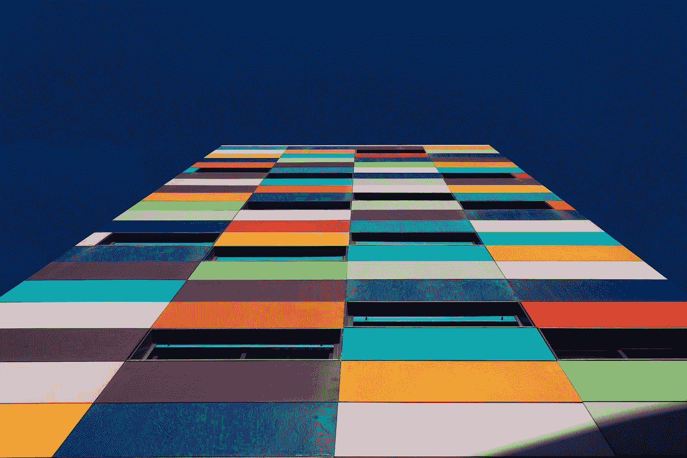

# UX 调色板背后的科学

> 原文：<https://medium.com/geekculture/the-science-behind-color-palettes-in-ux-c0b34e29ccb9?source=collection_archive---------9----------------------->

UX 色板背后的科学是迷人的，在设计过程中不应该被忽视。在网站上使用不同的颜色有可能在用户的潜意识中产生积极或消极的反应。下面是三种颜色理论:原色、二次色和补色。知道在网站上使用哪种调色板有助于你为你的目标受众和网站选择正确的调色板。

Photo by [Victor](https://unsplash.com/@victor_g?utm_source=medium&utm_medium=referral) on [Unsplash](https://unsplash.com?utm_source=medium&utm_medium=referral)