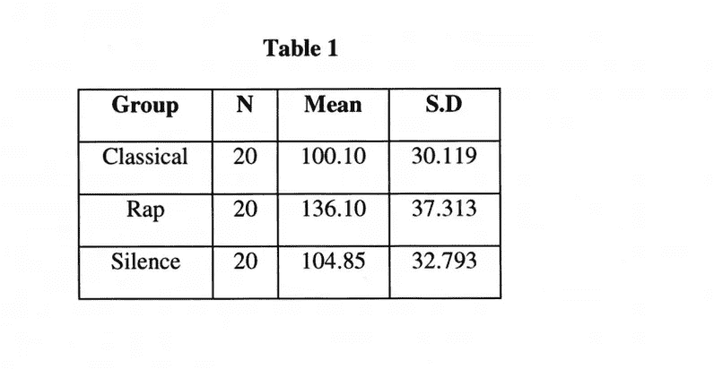
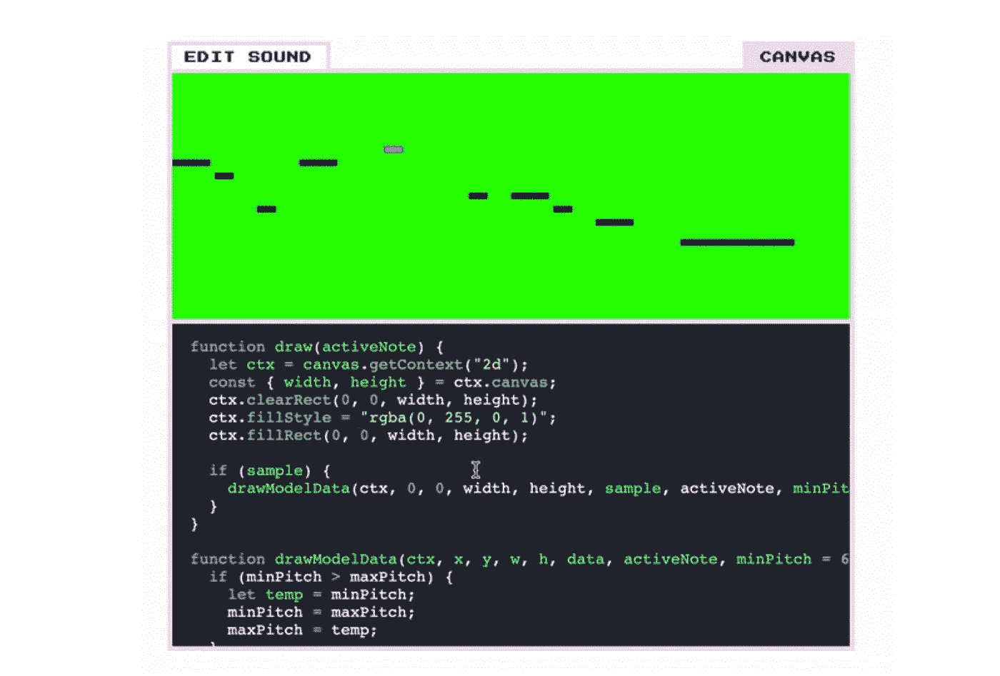

# 音乐背后的科学:编码版

> 原文：<https://medium.com/geekculture/the-science-behind-music-coding-edition-151cf66bb6cc?source=collection_archive---------59----------------------->

正如亚里士多德一句著名的名言所说，音乐“使人们的心灵愉悦:因此，仅在这一点上，我们就可以假定年轻人应该接受音乐训练。”

毫无疑问，关于音乐对人类心理的影响，已经有了大量的研究，尤其是在过去的 40 年里。特别是，研究人员一直对确定音乐在多大程度上影响创造力、理解力和记忆力感兴趣。

如果你什么都不记得，让这篇博客说服你，我的读者，把音乐融入你的编码生活只会有好处。就像在机器学习模型中一样，大量的变量使得科学家很难确定音乐与其有希望的效果之间的直接影响。然而，这项研究充满希望:

1.  音乐提高理解力。

众所周知的莫扎特效应和唤醒情绪假说认为听背景音乐可以促进学习，

德国的一项研究得出结论:“*由于莫札特效应，理解会直接受到背景音乐的正面影响”。*

2.它甚至可以提高记忆力。

*“目前缺乏关于听背景音乐和工作记忆容量之间相互作用的研究:“*”(Lehmann，Seufert 2017)

哦，不。我的整个理论就这么飞出窗外了吗？嗯，科学界流传着一个非常流行的理论，认为音乐对记忆有负面影响。然而，Lehmann 和 Seufurt 在这里指出，不仅对音乐和记忆的直接影响的研究很少，而且已经发表并指出负相关的研究在很大程度上未能区分不同类型的音乐。

幸运的是，有大量的研究已经纠正了这个问题。特雷维卡拿撒勒大学的科学家们进行了一项研究，调查了两种音乐类型——古典和说唱——对记忆的影响。受试者被分成三组，古典音乐组、说唱音乐组和无声音乐组，然后让他们完成一项记忆任务。

有两种假设。

a)假设 1:预测三个组(古典、说唱和沉默)在记忆任务分数上有差异。第一个假设得到了支持。

使用单向 ANOVA 测试对数据进行分析，结果显示各组之间存在显著差异，p 值为 0.02。

b)假设 2:预测古典音乐条件将在记忆中产生最佳表现。这一假设也得到了支持。

听古典音乐的那一组在完成记忆任务时比其他组翻得少。

所以，很明显，音乐类型的不同很重要。不幸的是，尽管古典音乐已经被证明是有益的，但它在年轻一代中并不是一个非常受欢迎的流派。幸运的是，有一种音乐类型有很好的反馈。

3.音乐可以改造你的环境，使之更有利于你的编码体验；见见低保真。

Lofi 音乐:

*   Lo-fi →低保真度音乐
*   用专业术语来说，Lo-fi 指的是低质量的音乐，最常见的是指在录音过程中通常被视为“错误”的不完美之处。
*   很模糊
*   示例:低沉的噪音、背景效果、舒缓的天气声音
*   柔和的节奏在 70 到 95 bpm 之间

Lo-fi 已被用于音乐治疗:

*   蒙特克莱尔州立大学的音乐治疗师迈克尔·维埃加在紧张的环境中用高保真度的节拍来帮助他的病人。他关于使用低保真度音乐来帮助的研究*“人们在个人、社区、文化和精神层面上实现高保真和清晰的存在”*，链接如下。
*   维耶加将通常被认为是压力源的噪音、熙熙攘攘的城市声音、熙熙攘攘的护士站、医疗机器的嘟嘟声转化为一种微妙的声音，当与背部按摩结合时，这种声音足以令人怀旧。

## 高保真音乐的根源:

*   虽然低保真度音乐可以跨越所有流派，但它的基础植根于嘻哈音乐。
*   这种类型实际上比 Youtube 存在的时间更长。

既然我们已经研究了音乐的好处——特别是高保真——它与编码的关系，以及它的起源，让我们看看(最好是听听)一些例子！

好吧，如果你想创造你自己的高保真节拍:见见 Magenta！

*   **洋红色**
*   一个可定制的 LoFi 播放器，由谷歌的 TensorFlow 系统提供支持。
*   Github 上 Magenta 的源代码
*   点击心情中的对象，根据你怀旧的心情定制等级和节奏

Magenta’s customizable source code

但是，如果你想直接进入，这里有一些 LoFi 播放列表:

有关更多信息，请查看以下内容:

https://scholar.utc.edu/cgi/viewcontent.cgi?article=1214&语境=国会议员

 [## 不同理论观点下背景音乐对学习的影响…

### 本研究从三个不同的理论角度探讨了背景音乐对学习的影响

www.frontiersin.org](https://www.frontiersin.org/articles/10.3389/fpsyg.2017.01902/full)  [## 环境模式下的倾听:音乐治疗实践和理论的启示

### 这篇理论论文探讨了听和创造环境音乐的功能、结构和经验

声音不](https://voices.no/index.php/voices/article/view/2228)  [## 环境模式下的倾听:音乐治疗实践和理论的启示

### 环境模式下的聆听观:音乐治疗实践和理论的意义

声音不](https://voices.no/index.php/voices/article/view/2228/1983)  [## 高保真播放器

### 欢迎使用高保真播放器！通过与房间中的元素进行交互，您可以构建自己的定制音乐室。你可以…

magenta.tensorflow.org](https://magenta.tensorflow.org/lofi-player)