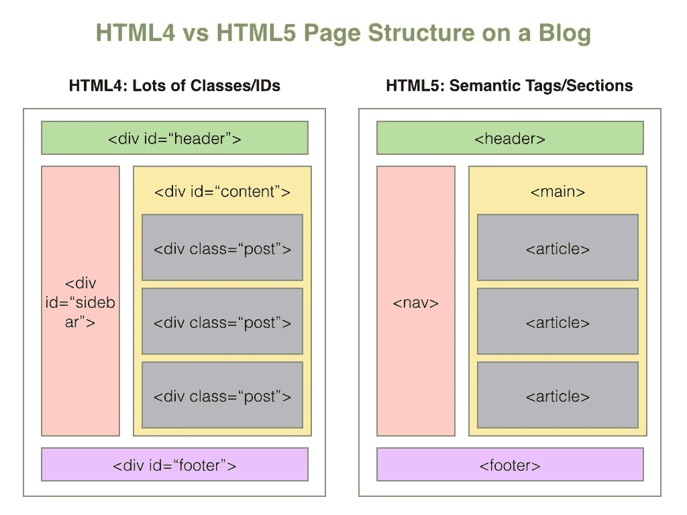
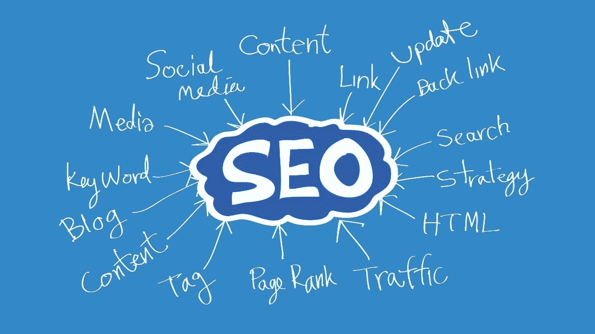

# 语义 HTML 的科学

> 原文：<https://medium.com/geekculture/the-science-of-semantic-html-c66fda24f105?source=collection_archive---------33----------------------->

*为什么在命名 HTML 元素时应该更具描述性*

每个程序员都曾陷入一大碗 **< div >** 汤。只使用 div 标签在彼此内部嵌套元素。当然你可以用一个 **<跨度>** ，但是这仍然不能告诉我们它的内容。它可能会起作用，但是我们应该努力做更多的描述，而不是和功效一起工作。

## HTML 简介

HTML 告诉浏览器如何呈现内容。从技术上讲，它不是一种编程语言，而是一种帮助组织互联网内容的标记语言。HTML**的每一个新版本**都带来了新的特性，有助于更好地组织内容。它还能帮助互联网搜索变得更加精确，质量更高。

早在 1999 年，HTML4 的发布为开发者提供了对内容呈现速度和顺序的更多控制。然而，它的标签仍然是千疮百孔的 div 和属性并没有像现在这样彼此不同。

# 语义 HTML

随着 **HTML5** 的发布，出现了语义标签和部分，这些标签和部分对内容的真实内容进行了更具描述性的评估。不用使用类名或 id 来区分，您已经可以对标记名本身有所了解。

简单地说，语义学的定义是对意义的研究。对于语义 HTML ，这意味着尽可能多地使用正确的元素来达到正确的目的(含义)。如果你需要一个按钮，那么使用 **<按钮>** 元素代替可怕的 **< div >** 或 **< span >** 。

如果我自己这么说的话，这是一个非常恰当的名字！

## 易接近

随着越来越多的人每天使用互联网，认为越来越多的残疾人也在使用互联网是合理的。在更新到**语义 HTML** 之前，残障人士与互联网的交互相当困难。

现在，我们有了屏幕阅读器，可以大声朗读页面内容，或者转换为盲文和仅键盘导航，让用户可以在键盘上而不是鼠标上的按钮之间切换。

随着年龄的增长，我看电视或电影时越来越依赖字幕。如果这些字幕没有准确地描述节目的真实内容，我会非常沮丧。**语义 HTML** 得一分。

## 可维护性

回到代码块并立即理解发生了什么的能力是非常宝贵的。在试图编写代码时，可维护性应该是一直在考虑的事情。

语义 HTML 可以通过快速浏览代码识别来提高可维护性。更容易看到一个 **<标题>** 或一个 **<文章>** 标签并知道它的内容，而不是一个常规的 **< div >** 。事实证明，这种交流方式更加清晰易读。

谈到样式，如果认真使用语义元素，在 **CSS** 中直接引用它们应该没有问题。您可以快速、轻松地设计风格，无需太多思考！

## 搜索引擎优化

众所周知，SEO 可以提高网站在搜索引擎中的可见性，可以帮助网站获得更多的关注。复杂的算法梳理整个网站，并根据其包含的属性进行排名。如果算法不能正确读取这些属性，它可能会被标记为劣质或低质量。

因此，它在谷歌搜索列表中一路向下。没人想在 13 号被发现。

例如，谷歌把优先权放在可访问的网站上。通过使用语义 HTML**提供可访问性，反过来从搜索引擎获得优先权，一举两得。**

# 总结一下…

语义 HTML 不仅使代码更加清晰和易于维护，而且很有意义。它的包容性更强，在搜索引擎优化方面也有回报。如果这还不是你的习惯，我强烈建议你养成一个习惯。

感谢阅读，我希望你喜欢的内容。请随意查看我的其他博客或在我的 LinkedIn 上与我联系！

 [## Jamon Dixon -全栈开发者-熨斗学校| LinkedIn

### 全栈式 web 开发人员，对事物的工作原理充满好奇，并具有解决问题的能力。拥有强大的…

www.linkedin.com](https://www.linkedin.com/in/jamondixon/)