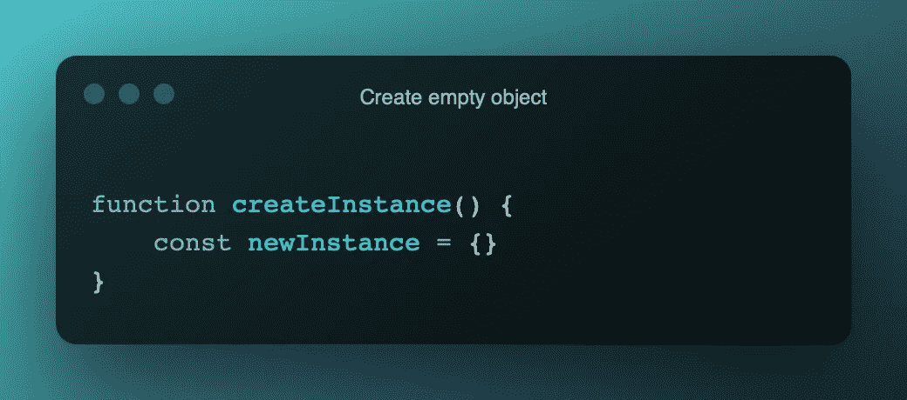
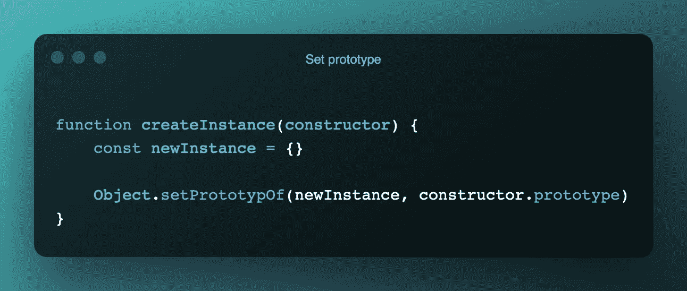
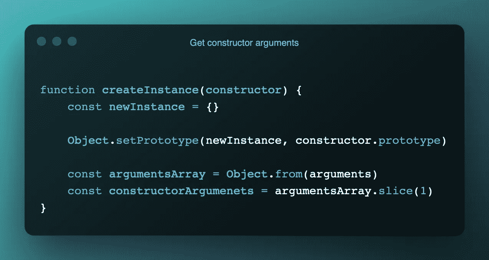
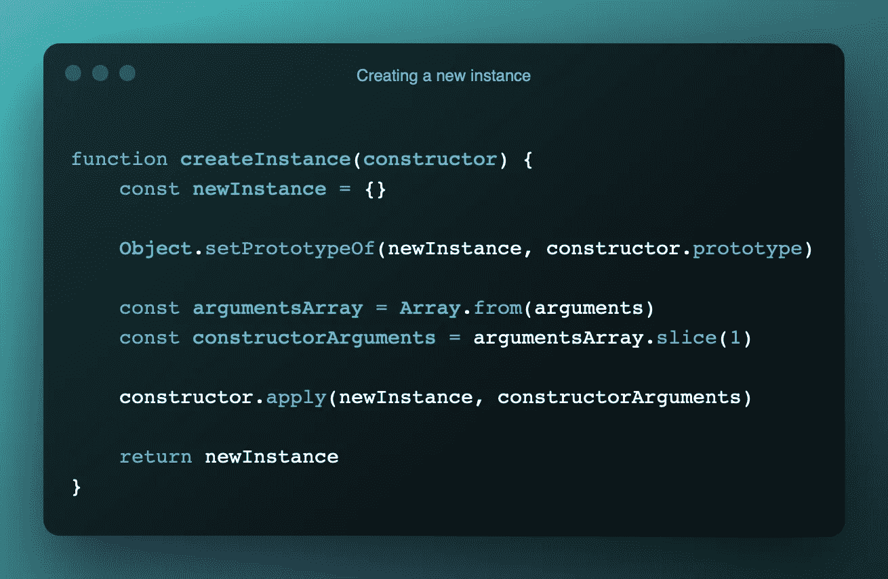
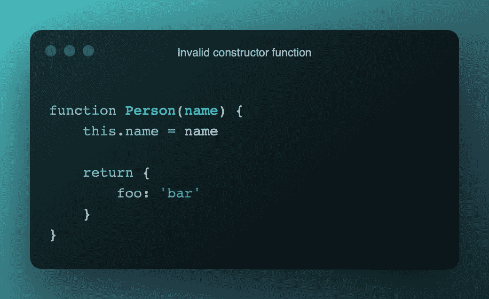
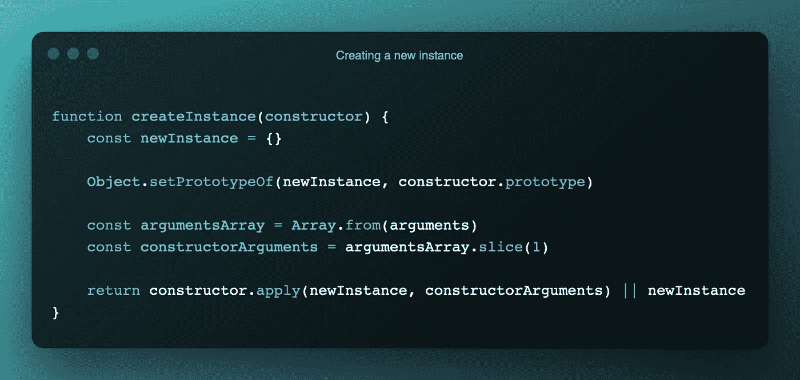
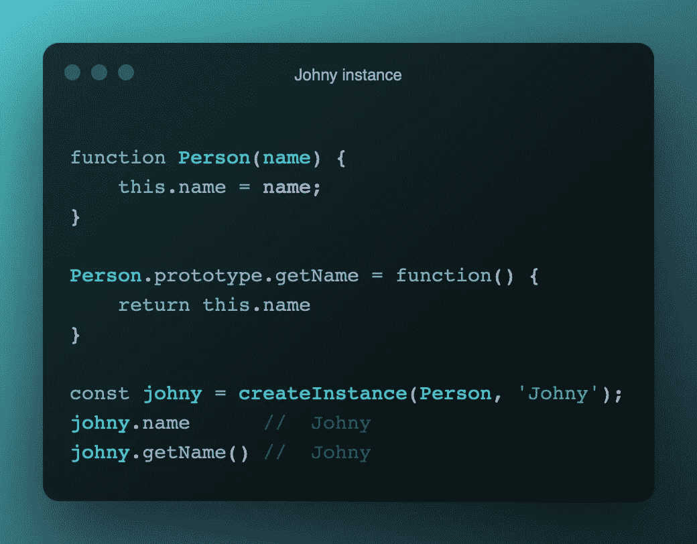

# JavaScript 中“新”运算符的秘密

> 原文：<https://medium.com/geekculture/the-secret-of-new-operator-in-javascript-eafc0e98996?source=collection_archive---------15----------------------->

如果您喜欢 JavaScript，并且对幕后没有语法糖的事情如何工作感兴趣，那么您来对地方了！

Javascript 中的运算符允许开发人员实例化用户定义的对象。

为了理解**如何**和**什么**是在 JavaScript 中实例化对象的步骤，我们将实现`new`操作符。

因为`new`关键字是 javascript 中的保留字，我们不能使用它，所以我们必须实现一个将返回实例化对象的`createInstance()`函数。

# 1.创建空对象

这个很简单。

在我们的`createInstance()`函数中，我们简单地创建了一个名为`newInstance`的**空**对象，它后来成为了我们的新实例。就是这样。

Create empty object

# 2.设置原型

在这一步中会发生两件事:

1.  我们将`constructor`参数传递给`createInstance()`函数。
2.  `constructor`参数是我们计划实例化的**构造函数**(由于各种原因，它不能是 a)。
3.  为了访问由`constructor`参数定义的**属性**和**方法**，我们借助内置函数`Object.setPrototypeOf()`将`newInstance`对象的原型设置为引用一个`constructor`原型。

Set prototype

# 3.获取参数

在实例化一个对象时，我们可能会向它传递任意数量的参数，所以我们需要在我们的参数中获取这些参数。

在 JavaScript 中，每个函数的主体中都有可用的`arguments`对象。

`arguments`是一个类似数组的对象，这意味着它可以访问`length`属性，但是没有任何我们知道并且喜欢的数组方法(即`map`、`reduce`、`filter`...).

因为`createInstance()`函数的第一个参数是对`constructor`函数的引用，所以我们必须从用于实例创建的参数中省略它。

我们为实例构造创建`constructorArguments`数组，如下所示:

1.  在内置的`Array.from()`的帮助下，我们将一个`arguments`对象转换成数组。
2.  我们使用`Array.method.slice()`来删除第一个参数。

Get arguments for instance construction

# 4.返回一个新实例

最后，我们必须调用`constructor`(别忘了这只是一个函数)并传递给它我们自己的`this`和上一步的参数并返回它

*   在我们的例子中，应用于`constructor`的`this`是我们的`newInstance`对象。
*   在内置`Function.prototype.apply()`的帮助下，我们可以使用自定义`this`和参数数组`constructorArguments`调用`constructor`函数。

在理想的世界里，应该是这样。但是在 JavaScript 中，构造函数不应该返回值。

Invalid constructor function

在上面提到的情况中，`new`操作符简单地返回`constructor`函数的返回值，并且定义的属性将不可访问。

所以在 JavasScript 中完全模拟一个`new`操作符，我们必须检查`constructor`函数的返回值。

如果`constructor`函数只返回`undefined`，那么我们可以返回我们的`newInstance`。

Emulated new operator in JavaScript

# 结论

就是这样！我们实现了自己的`new`操作符，所以你现在可以测试和使用它。

Johny instance :D

我希望我发现了 Javascript 的一些神奇之处，我们每天都在使用它，而没有进一步思考，你也从中学到了一些东西。😊

祝您愉快！🌻