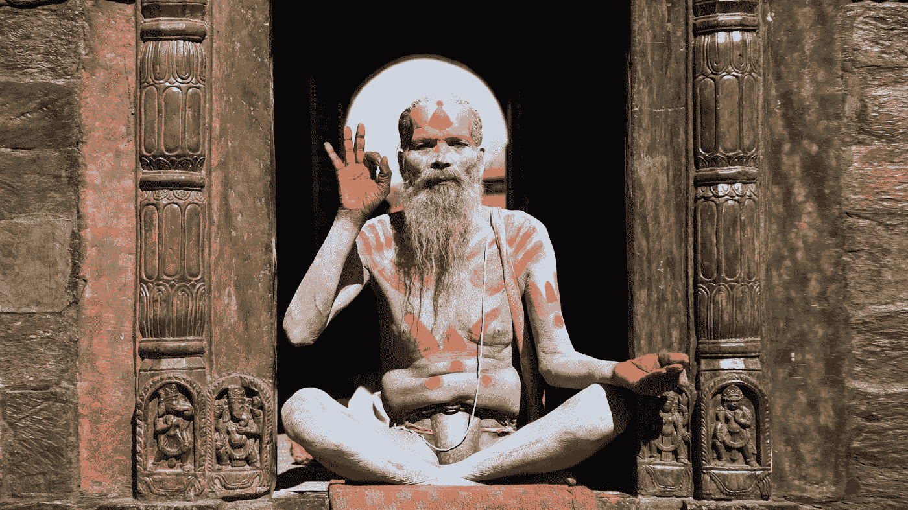

# 自学成才的开发者的圣经

> 原文：<https://medium.com/geekculture/the-self-taught-developers-bible-1979284caf9e?source=collection_archive---------19----------------------->

## 你在这次旅程中需要的东西。

Photo by [Ashes Sitoula](https://unsplash.com/@awesome?utm_source=unsplash&utm_medium=referral&utm_content=creditCopyText) on [Unsplash](https://unsplash.com/@annadayadev/likes?utm_source=unsplash&utm_medium=referral&utm_content=creditCopyText)

> 它没有要求我成为天才或数学奇才，但它一直问我‘你就这点本事吗？’。

> 我对这首曲子倾注了我的心，祝你旅途顺利。我支持你。