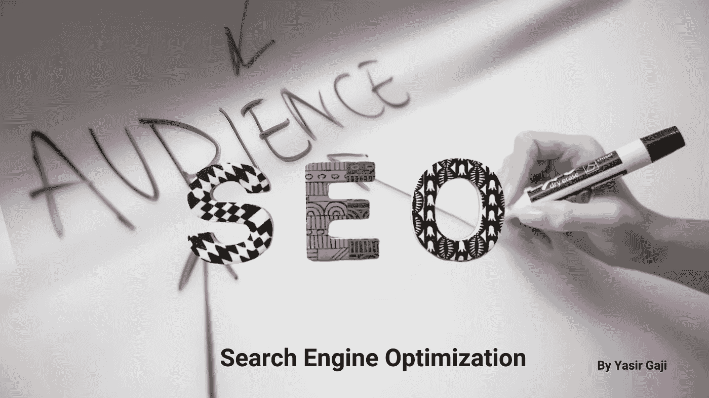

# Yasir 的 SEO 指南(第 1 部分)

> 原文：<https://medium.com/geekculture/the-seo-guide-by-yasir-part-1-889501fd773f?source=collection_archive---------8----------------------->

# 搜索引擎优化

**一个谜？**

我不这么认为，这是一个过程，就像其他所有可以学习和管理的事情一样，需要一步一步的指导。在这一系列文章中，我将提供关于 SEO 知识的全面指导。因此，没有任何进一步的或做的，潜入。

The SEO Guide Image By [**Yasir Gaji**](https://yasirgaji.com)

# **什么和为什么**

## **什么是搜索引擎？**

一个用来进行网络搜索的系统。他们以系统的方式在万维网上搜索在文本网络搜索查询中指定的特定信息。搜索结果通常呈现在一行结果中，通常称为搜索引擎结果页面。

## **什么是搜索引擎优化？**

这是一个从搜索引擎的结果页面吸引特定类型的流量到网络上的产品的过程。

## SEO 对你的产品有什么作用？

应用 SEO 技术将有助于你的产品在搜索结果中排名靠前。

## **为什么需要优化搜索引擎？**

很简单，提高一个产品在网络上的转化率。

# **该怎么做**

## 如何优化搜索引擎？

通过研究 Yasir 的 SEO 指南，😀😆。是的，你没看错，因为在这个系列中，你将学习 SEO 策略，你将理解搜索引擎如何对产品、排名因素和反向链接进行排名。

那么“**如何？**“你说，这个过程包括两种类型；非技术优化和技术优化。

## **非技术优化**

这个过程包括内容创建和优化，获得反向链接，优化语音搜索和关键字搜索。

## **技术优化**

这包括提高产品页面速度、图像加载时间以及产品的网站/软件/应用程序架构。

**在系列的这一部分让我们来看看；**

# **非技术优化**

在创建和优化内容时，您应该有三个优先事项:

*   确保产品的网站/软件/应用程序易于访问和抓取。
*   高质量的关键词驱动内容。
*   从高权威网站获取反向链接。

曾经，这三个是你最重要的优先事项，并存档。请放心，你的产品在有机搜索排名中的位置会飙升到搜索引擎列表的前 10%。

## 第一优先

产品的网站/软件/应用程序应该易于访问和搜索引擎抓取，每个搜索引擎使用不同的算法，因此他们的结果推迟。但是，众所周知，有一些共同因素会影响所有搜索引擎的搜索排名，这些因素是:

权威机构:搜索引擎决定他们抓取的内容是否可信，是否与搜索者相关。为了分配一个权威排名，搜索引擎会衡量你的产品从可信网站获得了多少反向链接。相关网站的反向链接越可信，该产品在搜索引擎权威排名中的排名就越高。

**相关性**:搜索是为了寻找特定主题的信息，因此搜索引擎会向搜索者提供与搜索词内容最相关的页面。因此，在为产品创建内容时，要确保它是关键字驱动的。

**有用性**:如果搜索引擎给你的内容很高的权威性和相关性，在它出现在搜索结果之前，他们仍然需要检查它的有用性。所以如果搜索引擎没有发现你的内容有用，他们不会给你的产品打高分。这显示了你的内容有用是多么重要。

那么，一个人如何实现这些因素才能跻身前 10%呢？

第一个"**结构":**内容必须组织良好，使用清晰的语言，并使用副标题来分解大块的文本。这种方式保证了内容从搜索引擎获得高有用性分数。有了适当的内容结构，即使产品没有高质量的反向链接，它仍然会排在搜索结果的前 15%。

这是因为搜索引擎遵循用户体验信号，这是通过基于用户/消费者如何与它交互来测量有用因子。因此，组织、结构和清晰度是决定用户体验是正面还是负面的关键因素，这反过来又会决定产品在搜索引擎上的排名。

# 结论

花时间正确地组织、构建和阐明你的内容，同时确保它的交互性，这将提高用户体验信号的评级。因为当搜索引擎搜索它们的站点索引以发现用户/消费者喜爱的内容时，它们测量网络上内容的用户体验信号。

所以，这证明了非技术搜索引擎优化中最重要的事情是用户对你的内容的体验。分清轻重缓急！

我期待问题的澄清。请批评指正。分享谢谢。

## 注释和参考

产品——可以是网站、web 应用程序、移动应用程序、桌面应用程序、服务，甚至是社交媒体帐户。

来自[谷歌](http://google.com)的搜索引擎定义。