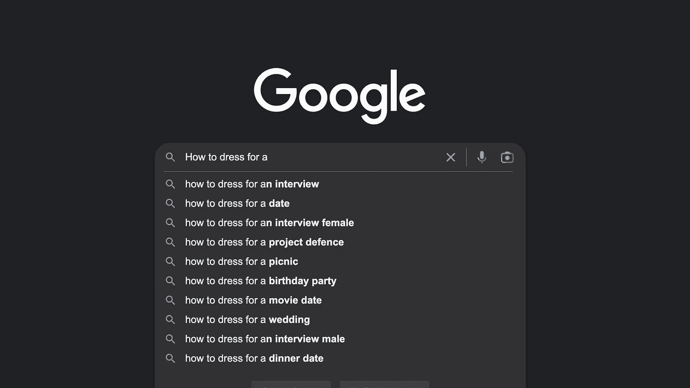

# Yasir 的 SEO 指南(第 2 部分)

> 原文：<https://medium.com/geekculture/the-seo-guide-by-yasir-part-2-c736fd2f6f62?source=collection_archive---------15----------------------->

# 研究

确定你的目标受众是搜索引擎优化中最重要的一步，在实施本系列第一部分提到的的[优先级之前，最好知道你的产品想要吸引的访问者类型。这样，将你的内容剪裁到最大的吸引力会容易得多。](/geekculture/the-seo-guide-by-yasir-part-1-889501fd773f)

Customers And Keywords Research Image By [**Yasir Gaji**](https://yasirgaji.com/)

# 客户

大多数公司、组织和个人都错误地认为目标受众识别只在创建产品时才重要，而没有意识到它在产品创建后对于 SEO 的成功同样重要。

**那么，我如何确定我的目标受众呢？**你说。

显然，你大概知道谁是你的目标受众，尤其是如果你已经在网上创收，或者通过博客或社交媒体账户在网上出现。这些人已经直接或间接地与你的产品互动了。

但是，如果你想确认你的目标受众的实际人口统计，请遵循以下几个步骤:定义他们的年龄组，他们的性别(他们主要是女性，男性，还是混合)，以及他们的兴趣。通过这种方式，您已经起草了客户角色并确定了您的受众。

现在，**他们会搜索什么**以及**他们会如何**搜索？

👇🏼👇🏼👇🏼

# 关键词

现在已经为你的产品找到了合适的目标受众，是时候调整你的内容以获得最大的吸引力了，这就把我们带到了关键词研究。客户在网上搜索的方式主要有两种:搜索产品和搜索信息。

以某时尚电商平台为案例。

产品搜索关键字的示例包括:

*   男士高领 t 恤
*   包括免费送货在内的定制西装外套
*   [高街](https://wearhighstreet.com)运动服

信息搜索关键词的例子包括:

*   约会之夜如何着装
*   适合面试的服装
*   一双运动鞋如何搭配西装？

为了进行适当的优化，将这两种类型的关键字集嵌入到内容中，这样可以确保无论目标受众如何在网上进行搜索，一个人的产品都会出现在搜索结果的前 10%。

**现在，我如何进行更好的关键词研究？**你说。

我使用的一个技巧是，在我的浏览器上，当我在搜索栏中输入任何内容时，都会出现一些建议。这些是实时人物角色已经搜索过的与我的内容相关的最佳关键词和短语。

Image Representation Of The Search Bar Instance By [**Yasir Gaji**](https://yasirgaji.com)

但是有几个自动完成工具可以生成更好的关键词，比如 PEMAVOR、Ubersuggest、Answer the public 和 Google auto-complete & Keyword Planner tool。举几个例子。使用这种方法和工具，您可以找到可用于您的内容的实时相关搜索词。

# 结论

客户和关键词研究将帮助你学习和理解你的目标受众在搜索什么。你会发现他们搜索时使用的精确短语。

我期待问题的澄清。请批评指正。分享谢谢。

# 注释和参考

如果你想有效地优化搜索引擎，定义你的客户角色是非常重要的。